# 30. Sql Error Handling
- error ek event hai,jise aap exception bhi keh sakte hai.
- Error/Exception ke wajah se aap ka pgm ka execution terminate ho jata hai.
- To handle this we have try-catch block.
- we can create custom error/message via Throw block.
- ***REMEMER : Return Error Info slide*** eg Error_Number() yadi aap catch block ke bahar use karte hai to return null.

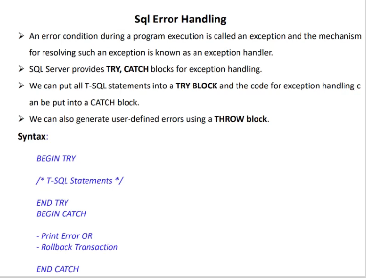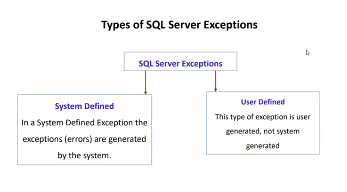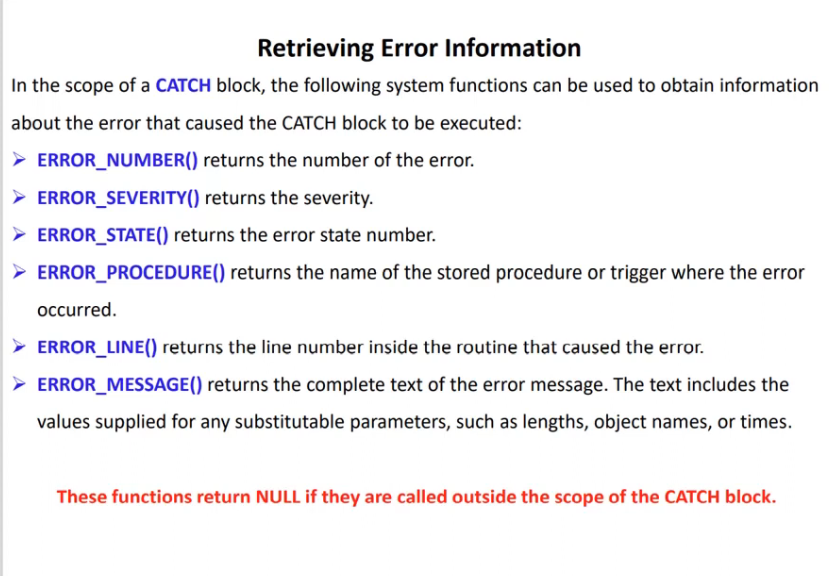
```sql
use  MyDatabase;
/*
	Type of Sql Server Error/Exception
		1) System Defined Error:
			In a System Defined Exception the exceptions(errors) are generated by 
			  the system.
*/
Declare @val1 Int;
Declare @Val2 Int; --Declaration of variables val1 and val2

Begin Try  -- Try block beggining
	
	Set @val1 = 8;
	Set @Val2 = @val1 / 0 ; --Divide by 0 leads to exception
	Print 'Line1';
	Print 'Line2';
	Print 'Line3';

End Try  -- Try block end
Begin Catch -- similar for catch block

	Print 'Inside Catch block';
	Print  Concat('Error message = ',Error_Message());
	Print  Concat('Error Line = ',Error_Line());
	Print  Concat('Error Number = ',Error_Number());
	Print  Concat('Error Severity = ',Error_Severity());
	Print  Concat('Error state = ',Error_State());
	Print  Concat('Error Procedure = ',Error_Procedure());

End Catch
/*
Inside Catch block
Error message = Divide by zero error encountered.
Error Line = 7
Error Number = 8134
Error Severity = 16
Error state = 1
Error Procedure = 
*/
```
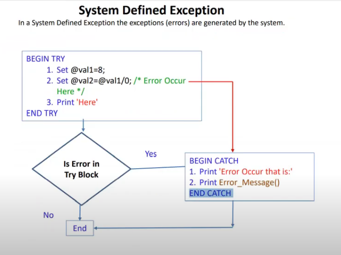
```sql
Declare @val1 Int;
Declare @Val2 Int; 

Begin Try  
	
	Print 'Inside Try block';
	Set @val1 = 8;	
	Print 'Line1';
	Print 'Line2';
	Set @Val2 = @val1 / 2 ;
	Print 'Line3';

End Try  
Begin Catch 

	Print 'Inside Catch block';
	Print  Concat('Error message = ',Error_Message());
	Print  Concat('Error Line = ',Error_Line());
	Print  Concat('Error Number = ',Error_Number());
	Print  Concat('Error Severity = ',Error_Severity());
	Print  Concat('Error state = ',Error_State());
	Print  Concat('Error Procedure = ',Error_Procedure());

End Catch
/*
Inside Try block
Line1
Line2
Line3
*/
```
### User Defined Error
- kabhi kabhi requirement ke hisab se hume error ko explicitly throw karna hota hai, in that case we defined the custom error.
- for this we use Throw keyword
- isme 3 parameter hote hai ==> errorNumber,errorMessage and errorSeverity
- ***Remeber*** ErrorNumber aapka 50000 se start hota hai
- kyuki 50000 ke niche ki value sql ke apne error number ke liye reserve hai.
```sql
/*
	Type of Sql Server Error/Exception
	  2) User Defined Error:
		The Throw statement in sql Server raises an exception and transfers the control
			to a Catch block.
		Syntax :
			Throw @errorNumber,@errorMessage,@errorSeverity

		Error No --> 50000 to 2147483647

		Error Severity :
			13 --> Indicate transaction deadlock errors.
			14 --> Indicate security related errors, such as permission denied.
			15 --> Indicate syntax errors in a Transact-Sql statement.
			16 --> Indicate generals errors that can be corrected by the user.

Target:
  Yadi Age 40 se jyda hai, to error throw ho jave
   and age 40 se kum hai tab error skip.
*/
Declare @Age Int; 

Begin Try  

	Print 'Inside Try block';
	Set @Age=60;	
	Print 'Line1';
	Print 'Line2';
	If @Age > 40
		--Throw @errorNumber,@errorMessage,@errorSeverity
		  Throw  50000,'Age is greater than 40',16;
	
	Print 'Line3';
	Print 'Line4';

End Try  
Begin Catch 

	Print 'Inside Catch block';
	Print  Concat('Error message = ',Error_Message());
	Print  Concat('Error Line = ',Error_Line());
	Print  Concat('Error Number = ',Error_Number());
	Print  Concat('Error Severity = ',Error_Severity());
	Print  Concat('Error state = ',Error_State());
	Print  Concat('Error Procedure = ',Error_Procedure());

End Catch
/*
Inside Try block
Line1
Line2

Inside Catch block
Error message = Age is greater than 40
Error Line = 11
Error Number = 50000
Error Severity = 16
Error state = 16
Error Procedure = 

What happen, jab aap Throw statement naal
  ErrorNumber less than 50K use karo toh
*/
Declare @Age1 Int; 

Begin Try  

	Print 'Inside Try block';
	Set @Age1=60;	
	Print 'Line1';
	Print 'Line2';
	If @Age1 > 40
		  Throw  40000,'Age1 is greater than 40',16;
	
	Print 'Line3';
	Print 'Line4';

End Try  
Begin Catch 

	Print 'Inside Catch block';
	Print  Concat('Error message = ',Error_Message());
	Print  Concat('Error Line = ',Error_Line());
	Print  Concat('Error Number = ',Error_Number());
	Print  Concat('Error Severity = ',Error_Severity());
	Print  Concat('Error state = ',Error_State());
	Print  Concat('Error Procedure = ',Error_Procedure());

End Catch
/*
Inside Try block
Line1
Line2

Inside Catch block

Error message = Error number 40000 in the THROW statement is outside the valid range.
				Specify an error number in the valid range of 50000 to 2147483647.

Error Line = 10
Error Number = 35100
Error Severity = 16
Error state = 10
Error Procedure = 

Output: mein Error message aa gya hai
   jo bol raha hai, u must specify the valid range of user defined error
*/
```
### Raiserror
- You can also use raiseerror instead of throw statement
- Diff is that Raiserror aapka without try-catch use kiya ja sakta hai
- but throw statement ke liye aapko try-catch mandatory hai.
- Syntax mein bhi diff hai
- Raiserror(errorMessage,Severity,errorState)
- jabki throw(errorNumber,errorMessage,errorSeverity)
- yadi aapko Begin try use nhi karna hai to go for Raiserror
#### Raiserror kab use hota hai?
- aap kisi application se koyi falana procedure ko call kar rahe hai.
- aur us falana procedure se koyi message yadi aapko calling application ko pahuchana raha 
- us case mein u use raiserror.
```sql
Declare @Age2 Int; 

Begin Try  
	Print 'Inside Try block';
	Set @Age2=60;	
	Print 'Line1';
	Print 'Line2';
	If @Age2 > 40
		RAISERROR('Age2 is greater than 40',16,3);	
		-- Throw  50000,'Age2 is greater than 40',16;		 		
	
	Print 'Line3';
	Print 'Line4';
End Try  

Begin Catch 
	Print 'Inside Catch block';
	Print  Concat('Error message = ',Error_Message());
	Print  Concat('Error Line = ',Error_Line());
	Print  Concat('Error Number = ',Error_Number());
	Print  Concat('Error Severity = ',Error_Severity());
	Print  Concat('Error state = ',Error_State());
	Print  Concat('Error Procedure = ',Error_Procedure());
End Catch
/*
Inside Try block
Line1
Line2
Inside Catch block
Error message = Age2 is greater than 40
Error Line = 10
Error Number = 50000
Error Severity = 16
Error state = 3
Error Procedure = 
*/
```
# 31. Sql Dirty Read in Concurrent Transaction
#### What is Transition?
- sequence of operation 
- mane multiple sql statement(data ko write/update/delete etc)
- jab ye sare multiple operation as a single unit execute hote hai ussse kehete hai transition.
- 1 transition mein multiple or single operation i.e sql statement ho sakte hai
- Transition ki property hoti hai
- ya to sare statements execute honge tab transtion save/success ie. commit.
- or ek bhi statement execute nhi hua tab transition fail/cancel i.e Rollback

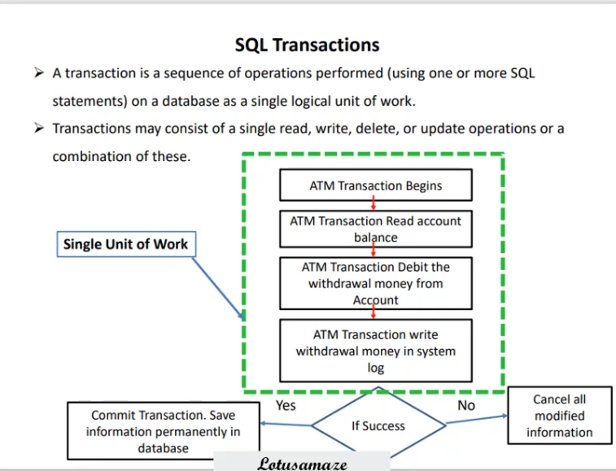
### What is Dirty read?
- aapke sql server par yadi multiple transaction execute ho rahi hai, tab dirty read ki probability badh sakti hai.
- In dig, apne pass 2 transaction hai
- yadi 2no transaction db mein same table ko update aur read kar rahe hai.
- figure out dig, transaction 10 hai aur sala 9 read kar liya ho gya dirty read.
- i.e transaction 1 ka data rollback hone ke pehle transaction 2 ne data read kar liya called as dirty read.

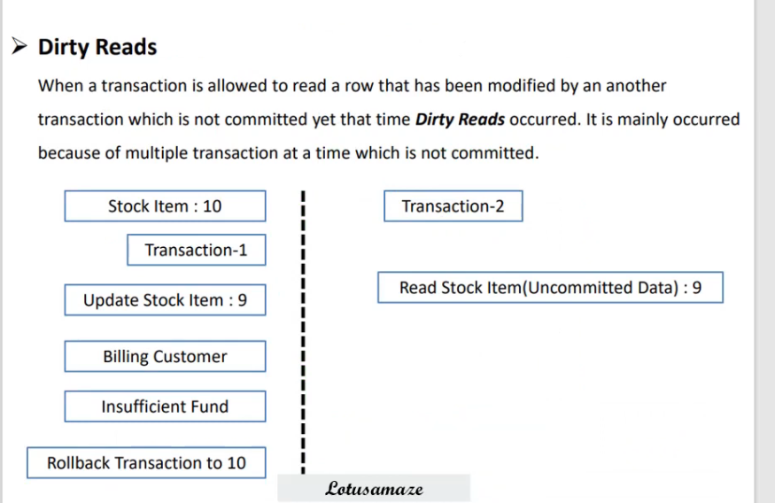
### What is Isolation level?
- ye ek property hai sql transaction ki.
- Yadi koyi transaction data ko write/update karti hai to dusri transaction us data ko tabhi read kar pavengi 
- jab pehli transaction usse commit kar de.
- dig mein level di gyi hai isolation level
- by default hamara read committed hota hai.

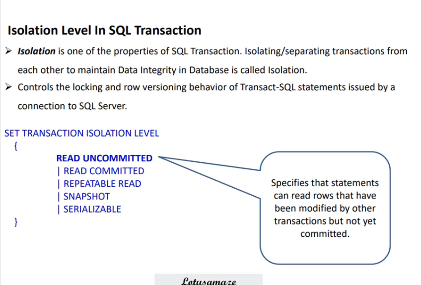
### Transaction in 1st window 
```sql
-- Transaction 1
use MyDatabase;

select salary,* from Employee1;
/*
3000	1001	2020-09-24 12:11:30.233	John	Yang	1		3000	2021	1		1
4000	1002	2020-04-11 11:12:35.233	Smith	Ting	2		4000	2020	3		2
6000	1003	2020-03-03 09:11:30.233	King	Amaze	4		6000	2019	2		4
5500	1004	2020-02-22 09:11:30.233	Millia	King	7		5500	2021	5		8
5500	1005	2020-01-15 12:11:30.233	Linda	Reina	4		5500	2022	5		6
5500	1006	2020-05-09 09:11:30.233	Tony	Blele	2		5500	1990	3		4
7800	1007	2020-09-12 12:11:30.233	Joshep	Desuja	5		7800	2020	4		8
2100	1009	2020-09-11 06:11:30.233	Alice	Rocky	6		2100	2021	6		3
2200	1009	2020-09-12 05:11:30.233	Mangu	Desa	6		2200	2022	8		7
1100	1010	2020-09-12 04:11:30.233	David	Kulum	7		1100	2022	2		7
NULL	NULL	2020-09-12 06:11:30.233	NULL	NULL	NULL	NULL	NULL	NULL	NULL

Lets Update the salary
Eg : of Dirty Read
 ek transaction mein aap update kar rahe hai
 uske baad wo rollback hone se pehle 
 15 second wait karenga.
*/
Begin Tran
	Update Employee1 Set Salary= 4500 where empId=1001;
 WaitFor Delay '00:00:15'  -- wait for 15 seconds delay
 RollBack Tran -- after delay rollback the transaction
 -- 1 row affected
```
###  Transaction in 2nd window 
```sql
-- Transaction 2

use MyDatabase;

--Now read in this transaction
Select salary,* from Employee1 where empId=1001;
/*
3000	1001	2020-09-24 12:11:30.233	John	Yang	1	3000	2021	1	1

isne 15 min delay kiya,
jab transaction in 1st window commit hua 
 after than isne chalaya apna transaction.

 or
*/
Set Tran Isolation level Read Committed
Select salary,* from Employee1 where empId=1001;
/*
3000	1001	2020-09-24 12:11:30.233	John	Yang	1	3000	2021	1	1

same description as above 

ye isolation level Read committed by default hota hai.
*/
```
#### by default tranasction ki property read committed rehti hai.
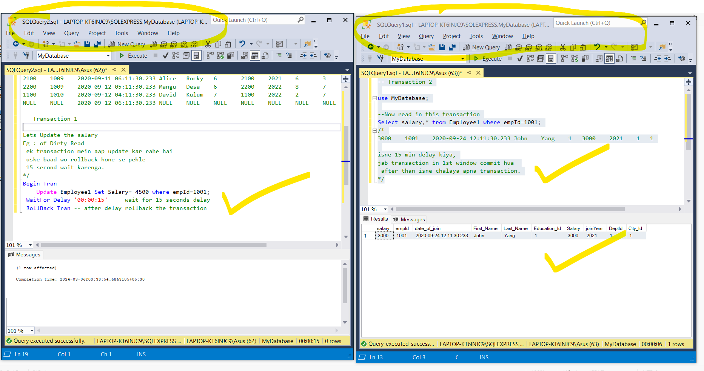
### If you change the isolation level to Read Uncommitted then
```sql
-- Transaction 1
use MyDatabase;

select salary,* from Employee1;
/*
3000	1001	2020-09-24 12:11:30.233	John	Yang	1		3000	2021	1		1
4000	1002	2020-04-11 11:12:35.233	Smith	Ting	2		4000	2020	3		2
6000	1003	2020-03-03 09:11:30.233	King	Amaze	4		6000	2019	2		4
5500	1004	2020-02-22 09:11:30.233	Millia	King	7		5500	2021	5		8
5500	1005	2020-01-15 12:11:30.233	Linda	Reina	4		5500	2022	5		6
5500	1006	2020-05-09 09:11:30.233	Tony	Blele	2		5500	1990	3		4
7800	1007	2020-09-12 12:11:30.233	Joshep	Desuja	5		7800	2020	4		8
2100	1009	2020-09-11 06:11:30.233	Alice	Rocky	6		2100	2021	6		3
2200	1009	2020-09-12 05:11:30.233	Mangu	Desa	6		2200	2022	8		7
1100	1010	2020-09-12 04:11:30.233	David	Kulum	7		1100	2022	2		7
NULL	NULL	2020-09-12 06:11:30.233	NULL	NULL	NULL	NULL	NULL	NULL	NULL

*/
Begin Tran
	Update Employee1 Set Salary= 4500 where empId=1001;
 WaitFor Delay '00:00:15'
 RollBack Tran 
```
### Transaction 2
```sql
-- Transaction 2

use MyDatabase;

Set Tran Isolation level Read UnCommitted
Select salary,* from Employee1 where empId=1001;
/*
4500	1001	2020-09-24 12:11:30.233	John	Yang	1	4500	2021	1	1

	- Data commit hone se pehle isne uncommit data ko read kar liya.
	- This is the eg of Dirty read
*/
```

### Ab 1st window ka transaction 15 second delay hone ke baad roll back ho gya, yadi hum phir se Read Uncommitted wala command cahlaye tab.
```sql
-- Transaction 2

use MyDatabase;

Set Tran Isolation level Read UnCommitted
Select salary,* from Employee1 where empId=1001;
/*
3000	1001	2020-09-24 12:11:30.233	John	Yang	1	3000	2021	1	1

Ab ye commit hone ke baad - data proper de raha hai
*/
```
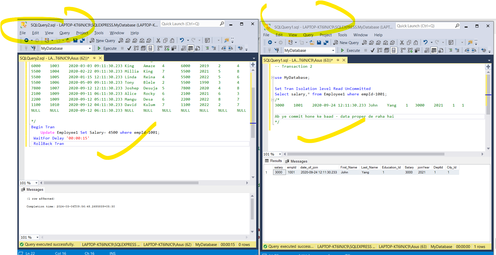
### No Lock ye bhi Read Uncommitted ka kam kar deta.
```sql
-- Transaction 2

use MyDatabase;


Select salary,* from Employee1(NoLock) where empId=1001;
/*

4500	1001	2020-09-24 12:11:30.233	John	Yang	1	4500	2021	1	1

or
Abhi hum isolation level committed kar rahe hai
 yani aap window 1 ka transaction jab commit honga tab ye output denga
work with NoLOck
*/
Set Tran Isolation level Read Committed
Select salary,* from Employee1(NoLock) where empId=1001;
/*
4500	1001	2020-09-24 12:11:30.233	John	Yang	1	4500	2021	1	1

koyi delay nahi
*/
```
#### Window 1 ke query same hai
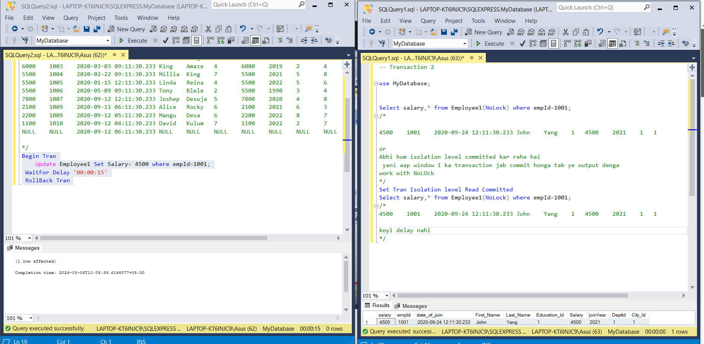
- ye bhi dirty read hai
- rollback hone ke baad normal execute karnege

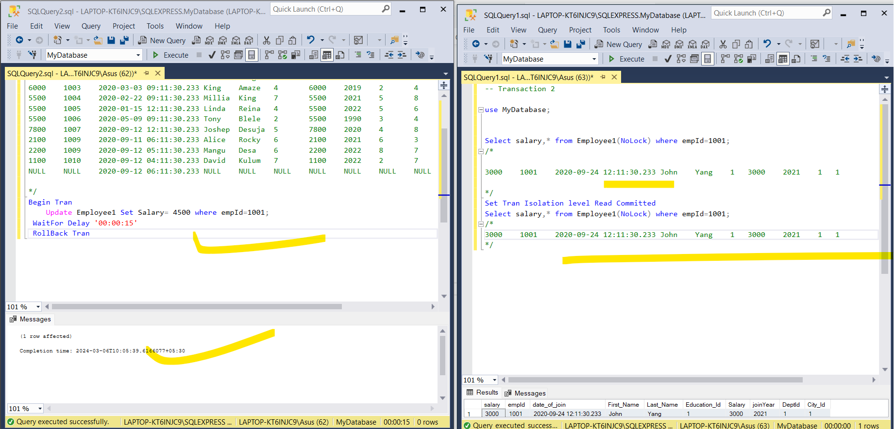
# 32. ACID properties


