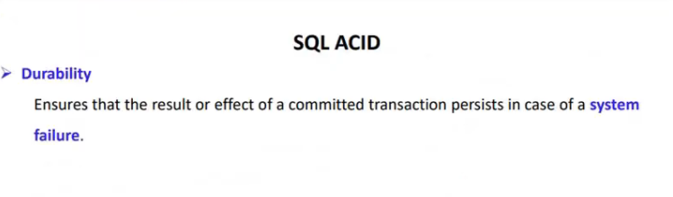
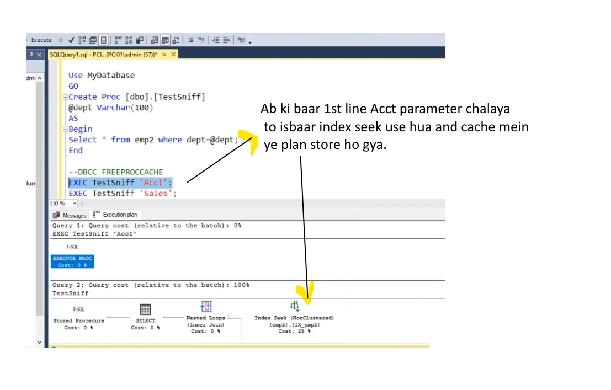
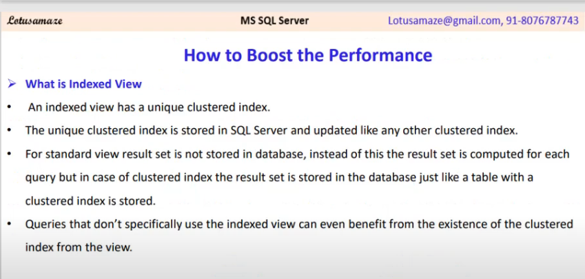
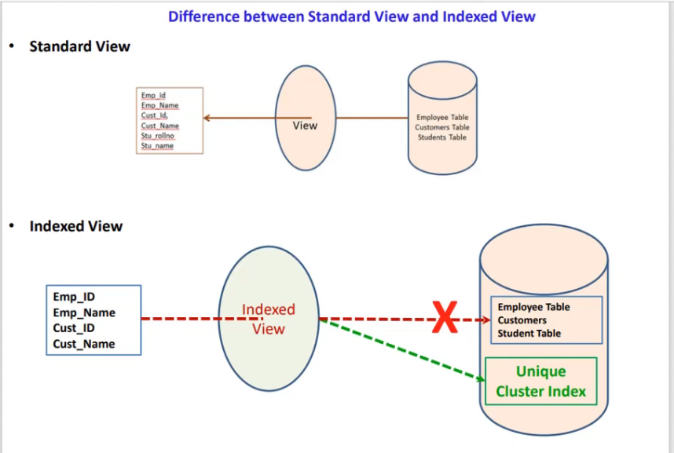

# 30. Sql Error Handling
- error ek event hai,jise aap exception bhi keh sakte hai.
- Error/Exception ke wajah se aap ka pgm ka execution terminate ho jata hai.
- To handle this we have try-catch block.
- we can create custom error/message via Throw block.
- ***REMEMER : Return Error Info slide*** eg Error_Number() yadi aap catch block ke bahar use karte hai to return null.


```sql
use  MyDatabase;
/*
	Type of Sql Server Error/Exception
		1) System Defined Error:
			In a System Defined Exception the exceptions(errors) are generated by 
			  the system.
*/
Declare @val1 Int;
Declare @Val2 Int; --Declaration of variables val1 and val2

Begin Try  -- Try block beggining
	
	Set @val1 = 8;
	Set @Val2 = @val1 / 0 ; --Divide by 0 leads to exception
	Print 'Line1';
	Print 'Line2';
	Print 'Line3';

End Try  -- Try block end
Begin Catch -- similar for catch block

	Print 'Inside Catch block';
	Print  Concat('Error message = ',Error_Message());
	Print  Concat('Error Line = ',Error_Line());
	Print  Concat('Error Number = ',Error_Number());
	Print  Concat('Error Severity = ',Error_Severity());
	Print  Concat('Error state = ',Error_State());
	Print  Concat('Error Procedure = ',Error_Procedure());

End Catch
/*
Inside Catch block
Error message = Divide by zero error encountered.
Error Line = 7
Error Number = 8134
Error Severity = 16
Error state = 1
Error Procedure = 
*/
```

```sql
Declare @val1 Int;
Declare @Val2 Int; 

Begin Try  
	
	Print 'Inside Try block';
	Set @val1 = 8;	
	Print 'Line1';
	Print 'Line2';
	Set @Val2 = @val1 / 2 ;
	Print 'Line3';

End Try  
Begin Catch 

	Print 'Inside Catch block';
	Print  Concat('Error message = ',Error_Message());
	Print  Concat('Error Line = ',Error_Line());
	Print  Concat('Error Number = ',Error_Number());
	Print  Concat('Error Severity = ',Error_Severity());
	Print  Concat('Error state = ',Error_State());
	Print  Concat('Error Procedure = ',Error_Procedure());

End Catch
/*
Inside Try block
Line1
Line2
Line3
*/
```
### User Defined Error
- kabhi kabhi requirement ke hisab se hume error ko explicitly throw karna hota hai, in that case we defined the custom error.
- for this we use Throw keyword
- isme 3 parameter hote hai ==> errorNumber,errorMessage and errorSeverity
- ***Remeber*** ErrorNumber aapka 50000 se start hota hai
- kyuki 50000 ke niche ki value sql ke apne error number ke liye reserve hai.
```sql
/*
	Type of Sql Server Error/Exception
	  2) User Defined Error:
		The Throw statement in sql Server raises an exception and transfers the control
			to a Catch block.
		Syntax :
			Throw @errorNumber,@errorMessage,@errorSeverity

		Error No --> 50000 to 2147483647

		Error Severity :
			13 --> Indicate transaction deadlock errors.
			14 --> Indicate security related errors, such as permission denied.
			15 --> Indicate syntax errors in a Transact-Sql statement.
			16 --> Indicate generals errors that can be corrected by the user.

Target:
  Yadi Age 40 se jyda hai, to error throw ho jave
   and age 40 se kum hai tab error skip.
*/
Declare @Age Int; 

Begin Try  

	Print 'Inside Try block';
	Set @Age=60;	
	Print 'Line1';
	Print 'Line2';
	If @Age > 40
		--Throw @errorNumber,@errorMessage,@errorSeverity
		  Throw  50000,'Age is greater than 40',16;
	
	Print 'Line3';
	Print 'Line4';

End Try  
Begin Catch 

	Print 'Inside Catch block';
	Print  Concat('Error message = ',Error_Message());
	Print  Concat('Error Line = ',Error_Line());
	Print  Concat('Error Number = ',Error_Number());
	Print  Concat('Error Severity = ',Error_Severity());
	Print  Concat('Error state = ',Error_State());
	Print  Concat('Error Procedure = ',Error_Procedure());

End Catch
/*
Inside Try block
Line1
Line2

Inside Catch block
Error message = Age is greater than 40
Error Line = 11
Error Number = 50000
Error Severity = 16
Error state = 16
Error Procedure = 

What happen, jab aap Throw statement naal
  ErrorNumber less than 50K use karo toh
*/
Declare @Age1 Int; 

Begin Try  

	Print 'Inside Try block';
	Set @Age1=60;	
	Print 'Line1';
	Print 'Line2';
	If @Age1 > 40
		  Throw  40000,'Age1 is greater than 40',16;
	
	Print 'Line3';
	Print 'Line4';

End Try  
Begin Catch 

	Print 'Inside Catch block';
	Print  Concat('Error message = ',Error_Message());
	Print  Concat('Error Line = ',Error_Line());
	Print  Concat('Error Number = ',Error_Number());
	Print  Concat('Error Severity = ',Error_Severity());
	Print  Concat('Error state = ',Error_State());
	Print  Concat('Error Procedure = ',Error_Procedure());

End Catch
/*
Inside Try block
Line1
Line2

Inside Catch block

Error message = Error number 40000 in the THROW statement is outside the valid range.
				Specify an error number in the valid range of 50000 to 2147483647.

Error Line = 10
Error Number = 35100
Error Severity = 16
Error state = 10
Error Procedure = 

Output: mein Error message aa gya hai
   jo bol raha hai, u must specify the valid range of user defined error
*/
```
### Raiserror
- You can also use raiseerror instead of throw statement
- Diff is that Raiserror aapka without try-catch use kiya ja sakta hai
- but throw statement ke liye aapko try-catch mandatory hai.
- Syntax mein bhi diff hai
- Raiserror(errorMessage,Severity,errorState)
- jabki throw(errorNumber,errorMessage,errorSeverity)
- yadi aapko Begin try use nhi karna hai to go for Raiserror
#### Raiserror kab use hota hai?
- aap kisi application se koyi falana procedure ko call kar rahe hai.
- aur us falana procedure se koyi message yadi aapko calling application ko pahuchana raha 
- us case mein u use raiserror.
```sql
Declare @Age2 Int; 

Begin Try  
	Print 'Inside Try block';
	Set @Age2=60;	
	Print 'Line1';
	Print 'Line2';
	If @Age2 > 40
		RAISERROR('Age2 is greater than 40',16,3);	
		-- Throw  50000,'Age2 is greater than 40',16;		 		
	
	Print 'Line3';
	Print 'Line4';
End Try  

Begin Catch 
	Print 'Inside Catch block';
	Print  Concat('Error message = ',Error_Message());
	Print  Concat('Error Line = ',Error_Line());
	Print  Concat('Error Number = ',Error_Number());
	Print  Concat('Error Severity = ',Error_Severity());
	Print  Concat('Error state = ',Error_State());
	Print  Concat('Error Procedure = ',Error_Procedure());
End Catch
/*
Inside Try block
Line1
Line2
Inside Catch block
Error message = Age2 is greater than 40
Error Line = 10
Error Number = 50000
Error Severity = 16
Error state = 3
Error Procedure = 
*/
```
# 31. Sql Dirty Read in Concurrent Transaction
#### What is Transition?
- sequence of operation 
- mane multiple sql statement(data ko write/update/delete etc)
- jab ye sare multiple operation as a single unit execute hote hai ussse kehete hai transition.
- 1 transition mein multiple or single operation i.e sql statement ho sakte hai
- Transition ki property hoti hai
- ya to sare statements execute honge tab transtion save/success ie. commit.
- or ek bhi statement execute nhi hua tab transition fail/cancel i.e Rollback


### What is Dirty read?
- aapke sql server par yadi multiple transaction execute ho rahi hai, tab dirty read ki probability badh sakti hai.
- In dig, apne pass 2 transaction hai
- yadi 2no transaction db mein same table ko update aur read kar rahe hai.
- figure out dig, transaction 10 hai aur sala 9 read kar liya ho gya dirty read.
- i.e transaction 1 ka data rollback hone ke pehle transaction 2 ne data read kar liya called as dirty read.


### What is Isolation level?
- ye ek property hai sql transaction ki.
- Yadi koyi transaction data ko write/update karti hai to dusri transaction us data ko tabhi read kar pavengi 
- jab pehli transaction usse commit kar de.
- dig mein level di gyi hai isolation level
- by default hamara read committed hota hai.


### Transaction in 1st window 
```sql
-- Transaction 1
use MyDatabase;

select salary,* from Employee1;
/*
3000	1001	2020-09-24 12:11:30.233	John	Yang	1		3000	2021	1		1
4000	1002	2020-04-11 11:12:35.233	Smith	Ting	2		4000	2020	3		2
6000	1003	2020-03-03 09:11:30.233	King	Amaze	4		6000	2019	2		4
5500	1004	2020-02-22 09:11:30.233	Millia	King	7		5500	2021	5		8
5500	1005	2020-01-15 12:11:30.233	Linda	Reina	4		5500	2022	5		6
5500	1006	2020-05-09 09:11:30.233	Tony	Blele	2		5500	1990	3		4
7800	1007	2020-09-12 12:11:30.233	Joshep	Desuja	5		7800	2020	4		8
2100	1009	2020-09-11 06:11:30.233	Alice	Rocky	6		2100	2021	6		3
2200	1009	2020-09-12 05:11:30.233	Mangu	Desa	6		2200	2022	8		7
1100	1010	2020-09-12 04:11:30.233	David	Kulum	7		1100	2022	2		7
NULL	NULL	2020-09-12 06:11:30.233	NULL	NULL	NULL	NULL	NULL	NULL	NULL

Lets Update the salary
Eg : of Dirty Read
 ek transaction mein aap update kar rahe hai
 uske baad wo rollback hone se pehle 
 15 second wait karenga.
*/
Begin Tran
	Update Employee1 Set Salary= 4500 where empId=1001;
 WaitFor Delay '00:00:15'  -- wait for 15 seconds delay
 RollBack Tran -- after delay rollback the transaction
 -- 1 row affected
```
###  Transaction in 2nd window 
```sql
-- Transaction 2

use MyDatabase;

--Now read in this transaction
Select salary,* from Employee1 where empId=1001;
/*
3000	1001	2020-09-24 12:11:30.233	John	Yang	1	3000	2021	1	1

isne 15 min delay kiya,
jab transaction in 1st window commit hua 
 after than isne chalaya apna transaction.

 or
*/
Set Tran Isolation level Read Committed
Select salary,* from Employee1 where empId=1001;
/*
3000	1001	2020-09-24 12:11:30.233	John	Yang	1	3000	2021	1	1

same description as above 

ye isolation level Read committed by default hota hai.
*/
```
#### by default tranasction ki property read committed rehti hai.

### If you change the isolation level to Read Uncommitted then
```sql
-- Transaction 1
use MyDatabase;

select salary,* from Employee1;
/*
3000	1001	2020-09-24 12:11:30.233	John	Yang	1		3000	2021	1		1
4000	1002	2020-04-11 11:12:35.233	Smith	Ting	2		4000	2020	3		2
6000	1003	2020-03-03 09:11:30.233	King	Amaze	4		6000	2019	2		4
5500	1004	2020-02-22 09:11:30.233	Millia	King	7		5500	2021	5		8
5500	1005	2020-01-15 12:11:30.233	Linda	Reina	4		5500	2022	5		6
5500	1006	2020-05-09 09:11:30.233	Tony	Blele	2		5500	1990	3		4
7800	1007	2020-09-12 12:11:30.233	Joshep	Desuja	5		7800	2020	4		8
2100	1009	2020-09-11 06:11:30.233	Alice	Rocky	6		2100	2021	6		3
2200	1009	2020-09-12 05:11:30.233	Mangu	Desa	6		2200	2022	8		7
1100	1010	2020-09-12 04:11:30.233	David	Kulum	7		1100	2022	2		7
NULL	NULL	2020-09-12 06:11:30.233	NULL	NULL	NULL	NULL	NULL	NULL	NULL

*/
Begin Tran
	Update Employee1 Set Salary= 4500 where empId=1001;
 WaitFor Delay '00:00:15'
 RollBack Tran 
```
### Transaction 2
```sql
-- Transaction 2

use MyDatabase;

Set Tran Isolation level Read UnCommitted
Select salary,* from Employee1 where empId=1001;
/*
4500	1001	2020-09-24 12:11:30.233	John	Yang	1	4500	2021	1	1

	- Data commit hone se pehle isne uncommit data ko read kar liya.
	- This is the eg of Dirty read
*/
```

### Ab 1st window ka transaction 15 second delay hone ke baad roll back ho gya, yadi hum phir se Read Uncommitted wala command cahlaye tab.
```sql
-- Transaction 2

use MyDatabase;

Set Tran Isolation level Read UnCommitted
Select salary,* from Employee1 where empId=1001;
/*
3000	1001	2020-09-24 12:11:30.233	John	Yang	1	3000	2021	1	1

Ab ye commit hone ke baad - data proper de raha hai
*/
```

### No Lock ye bhi Read Uncommitted ka kam kar deta.
```sql
-- Transaction 2

use MyDatabase;


Select salary,* from Employee1(NoLock) where empId=1001;
/*

4500	1001	2020-09-24 12:11:30.233	John	Yang	1	4500	2021	1	1

or
Abhi hum isolation level committed kar rahe hai
 yani aap window 1 ka transaction jab commit honga tab ye output denga
work with NoLOck
*/
Set Tran Isolation level Read Committed
Select salary,* from Employee1(NoLock) where empId=1001;
/*
4500	1001	2020-09-24 12:11:30.233	John	Yang	1	4500	2021	1	1

koyi delay nahi
*/
```
#### Window 1 ke query same hai

- ye bhi dirty read hai
- rollback hone ke baad normal execute karnege


# 32. ACID properties
### What is transaction?
- group of sql statement jo ki as a single unit of work consider hoti hai.
- agar sari statement chal padi to data commit & trnasaction success.
- yadi 1 bhi statement fail hue to data rollback & transaction fail.


### Properties of a transaction:

### 1 Automicity
- means all or nothing
- sari unit or statements aapki sahi se execute hue to transition success and data commit.
- yadi 1 bhi statement has issue then vice versa.
- refer dig


### 2 Consitency
- aap jab bhi koyi multiple transaction karte hai,to ek transaction ke baad mein
- uska jo state change hona chaiye db mein save/commit hona chaiye.
- aur dusri transaction ko tabhi visible ho jab uska state commit  ho. 
### or
- aap jab bhi koyi multiple transaction karte hai,
to ek transaction ke baad mein 
- uska state ye commit/save hona chaiye db mein
- dusre transaction pehle transaction ka state commit hone ke baad mein dikhe.


- eg 
- Cust A ne Cust B ko 200 rs diye
- So A ka state pehle 800 tha abhi 600 ho gya 
- and B ka 500 tha abhi 700 ho gya.
- ab aapko 300 transfer karna hia, so cust B ko aapka abhi bal 600 visible hai.
### 3 isoloation
- multiple transaction ek mek ko disturb nhi karna chaiye.

### 4. Durability

# 33. Sql Cursor
### What is result Set?
- query fire karne ke baad
- i.e Select * from student_details
- jis format mein hume sari info display hoti hai
- usse hum result set kehte hai
- see dig.
- result set hamara row and col format mein hota hai.
- is result set mein student ki sari info hai.
### Now we have a requirement?
- hume marksheet display karni hai student ki
- hume 1 by 1 student ka data fetch karna honga
- uske marks ka total karna honga
- Based on that create Percentage and Grade
- So in order to traverse the result set we requre cursor.
- ***Remember :*** Cursor aapki system memory mein run hota hai
- boleto kafi sari memory occupie kar leta hai
- avoid it other wise performance issue.


### What is Cursor?
- Select query ke sath jo result set aata hai wo cursor ke sath map ho jata hai called as Active data set.


### Types of Cursor

- Implicit Cursor mein sab kaam automatic ho jata hai (open and close)


- static cursor => active data set ko cache mein rakhta hai, wahi se har row ko pic or process karta hai; Has Feture Current row to next/previous row.
- fast forward => refer dig
- dynamic => Jo bhi addition or deltion karte hai uska reflection db mein aa jata hai.
- for eg, yadi dusra user same table ko use kar raha hai, wo aapke changes dekh sakta hai.
- Keyset => opposite to dynamic. reflction db mein nhi aavenga.


```sql
use MyDatabase;

create table Student_details
(
	rollNo Int Not Null,
	student_name Varchar(100) not null,
	class varchar(10) null,
	marks_science int not null,
	marks_maths int not null,
	marks_eng int not null
)

Insert Into Student_details Values(1,'Anil','5th',34,78,54);
Insert Into Student_details Values(2,'Sunil','7th',78,43,87);
Insert Into Student_details Values(3,'Ajay','5th',45,32,78);
Insert Into Student_details Values(4,'Vijay','4th',36,78,32);
Insert Into Student_details Values(5,'Manoj','5th',12,22,67);
Insert Into Student_details Values(6,'Geeta','8th',21,65,43);
Insert Into Student_details Values(7,'Sita','4th',34,78,54);
Insert Into Student_details Values(8,'Reeta','9th',89,78,54);
Insert Into Student_details Values(9,'Arvind','12th',78,78,54);
Insert Into Student_details Values(10,'Kumar','11th',22,56,54);

Select * from Student_details;
/*
1	Anil	5th		34	78	54
2	Sunil	7th		78	43	87
3	Ajay	5th		45	32	78
4	Vijay	4th		36	78	32
5	Manoj	5th		12	22	67
6	Geeta	8th		21	65	43
7	Sita	4th		34	78	54
8	Reeta	9th		89	78	54
9	Arvind	12th	78	78	54
10	Kumar	11th	22	56	54

With Total mark, percentage and Grade
*/
Declare @RollNo Int,
		@Student_name Varchar(100),
		@Mark_Science Int,
		@Marks_Eng Int,
		@Marks_Math Int;

Declare @Marks_Total Int,
		@Percentage Int;

-- Create a cursor
/*
	Is query se Select  rollNo,student_name,marks_science,marks_maths,marks_eng 
				    from Student_details;
	  jo bhi result set avenga
	us par Cursor create karo

	so finally,
	 ye jo map hoke cursor ke sath result set mila usse hum 
	  Active data set kahenge.
*/
Declare student_cursor Cursor for 
                  Select  rollNo,student_name,marks_science,marks_maths,marks_eng 
				    from Student_details;

--Open cursor
Open student_cursor;

/*
 apka pointer abhi Null par hai.
	Ab aap 1st record fetch karne jaa rahe hai
 Null se aage 1st record hai
   so Command is Fetch next
			from cursor Name

   Ab hum jo cursor se data lenge 
     wo apne variable mein rakhenge/map karenge
sequence proper ho	 
*/
Fetch Next from student_cursor 
		Into @RollNo,@Student_name,@Mark_Science,@Marks_Math,@Marks_Eng

/*
	@@FETCH_STATUS ye apna global variable hai
	  ye hume status batata hai
	  yadi -1 status then there is no record in Active data set
	  - if 0 then record exist in active data set
*/
While @@FETCH_STATUS=0
	Begin
		Print Concat('Name: ',@Student_name);
		Print Concat('Roll No: ',@RollNo);
		Print Concat('Science: ',@Mark_Science);
		Print Concat('Maths: ',@Marks_Math);
		Print Concat('English : ',@Marks_Eng);

		Set @Marks_Total = @Mark_Science + @Marks_Eng  + @Marks_Math;
		Print Concat('Total marks : ',@Marks_Total);

		Set @Percentage = @Marks_Total /3;
		Print Concat('Percentage : ',@Percentage);

		If @Percentage > 80
			Begin
				Print 'Grade-A';
			End
		Else If @Percentage > 60 And @Percentage < 80
			Begin
				Print 'Grade-B';
			End
		 Else 
			Begin
				Print 'Grade-C';
			End
			Print '============================'

	-- agian re-fetch
	Fetch Next from student_cursor 
		Into @RollNo,@Student_name,@Mark_Science,@Marks_Math,@Marks_Eng	 

	End  -- end of while loop

-- close and deallocate cursor from memory
Close student_cursor;

Deallocate student_cursor;
/*
Name: Anil
Roll No: 1
Science: 34
Maths: 78
English : 54
Total marks : 166
Percentage : 55
Grade-C
============================
Name: Sunil
Roll No: 2
Science: 78
Maths: 43
English : 87
Total marks : 208
Percentage : 69
Grade-B
============================
Name: Ajay
Roll No: 3
Science: 45
Maths: 32
English : 78
Total marks : 155
Percentage : 51
Grade-C
============================
Name: Vijay
Roll No: 4
Science: 36
Maths: 78
English : 32
Total marks : 146
Percentage : 48
Grade-C
============================
Name: Manoj
Roll No: 5
Science: 12
Maths: 22
English : 67
Total marks : 101
Percentage : 33
Grade-C
============================
Name: Geeta
Roll No: 6
Science: 21
Maths: 65
English : 43
Total marks : 129
Percentage : 43
Grade-C
============================
Name: Sita
Roll No: 7
Science: 34
Maths: 78
English : 54
Total marks : 166
Percentage : 55
Grade-C
============================
Name: Reeta
Roll No: 8
Science: 89
Maths: 78
English : 54
Total marks : 221
Percentage : 73
Grade-B
============================
Name: Arvind
Roll No: 9
Science: 78
Maths: 78
English : 54
Total marks : 210
Percentage : 70
Grade-B
============================
Name: Kumar
Roll No: 10
Science: 22
Maths: 56
English : 54
Total marks : 132
Percentage : 44
Grade-C
============================
*/
```
# 34. CTE in Sql 


### Why to apply CTE:
- yadi aap window function use karna chahte hai CTE is best approach
- Yadi aapka View complex hai, so you can manage by CTE.


### Types of CTE
- ***NON recursive*** mein aap single/ multiple CTE create kar sakte
- usse ek temprary result set create hota hai; jaha aap DML statement apply kar sakte ho.


### CTE Anatomy
- ye col name (Id,Name) optional hai,but if you specify then it should map properly/sequentially in Select statement 


### Via query
```sql
use MyDatabase;

create table Student4
(
	rollNo Int Not Null,
	name Varchar(100) not null,
	class varchar(10) null,
	science int not null,
	math int not null,
	eng int not null
)

Insert Into Student4 Values(1,'Anil','5th',34,78,54);
Insert Into Student4 Values(2,'Sunil','7th',78,43,87);
Insert Into Student4 Values(3,'Ajay','5th',45,32,78);
Insert Into Student4 Values(4,'Vijay','4th',36,78,32);
Insert Into Student4 Values(5,'Manoj','5th',12,22,67);
Insert Into Student4 Values(6,'Geeta','8th',21,65,43);
Insert Into Student4 Values(7,'Sita','4th',34,78,54);
Insert Into Student4 Values(8,'Reeta','9th',89,78,54);
Insert Into Student4 Values(9,'Arvind','12th',78,78,54);
Insert Into Student4 Values(10,'Kumar','11th',22,56,54);

Select * from Student4;
/*
1	Anil	5th		34	78	54
2	Sunil	7th		78	43	87
3	Ajay	5th		45	32	78
4	Vijay	4th		36	78	32
5	Manoj	5th		12	22	67
6	Geeta	8th		21	65	43
7	Sita	4th		34	78	54
8	Reeta	9th		89	78	54
9	Arvind	12th	78	78	54
10	Kumar	11th	22	56	54

Target-
    - har student ke marks ka total karna hai
	- unki percentage
	- fhir grading
*/

-- 1) Using query
Select rollNo,name,science,math,eng,
	(science + math + eng) as Total,
	(science + math + eng) / 3 as Average,

	Case 
		When ((science + math + eng) / 3) > 70 Then 'A'
		When ((science + math + eng) / 3) > 40 And ((science + math + eng) / 3) < 70 Then 'B'
		Else 'F'
	 End as Grade

from Student4;
/*
Rno Name  Sc   Ma  En  Tot Avg Grade
1	Anil	34	78	54	166	55	B
2	Sunil	78	43	87	208	69	B
3	Ajay	45	32	78	155	51	B
4	Vijay	36	78	32	146	48	B
5	Manoj	12	22	67	101	33	F
6	Geeta	21	65	43	129	43	B
7	Sita	34	78	54	166	55	B
8	Reeta	89	78	54	221	73	A
9	Arvind	78	78	54	210	70	F
10	Kumar	22	56	54	132	44	B
*/
```
### via CTE
```sql
/*
	The above query is little complex.
		We can do same thing via CTE
*/

With  ctTotal 
As
 (
	Select rollNo,(science + math + eng) as Total from Student4
 ),
  ctAvg 
  As
 (
	Select rollNo,(science + math + eng) / 3 as Average from Student4
 ),
 ctGrade
 As
 (
  Select rollNo,
	CASE
		When ((science +  math + eng) / 3) > 70 Then 'A'
		When ((science + math + eng) / 3) > 40 And ((science + math + eng) / 3) < 70 Then 'B'
		Else 'F'
	 End  as Grade
			from Student4
 )
 Select sd.rollNo,
			science,
			math,
			eng,
			ctot.Total,
			cAvg.Average,
			cGrade.Grade
    from Student4 sd 
			Inner Join 
		ctTotal ctot On (sd.rollNo = ctot.rollNo)
			Inner Join 
		ctAvg cAvg On (sd.rollNo = cAvg.rollNo)
			Inner JOin
		ctGrade cGrade on (sd.rollNo = cGrade.rollNo);
/*
1	34	78	54	166	55	B
2	78	43	87	208	69	B
3	45	32	78	155	51	B
4	36	78	32	146	48	B
5	12	22	67	101	33	F
6	21	65	43	129	43	B
7	34	78	54	166	55	B
8	89	78	54	221	73	A
9	78	78	54	210	70	F
10	22	56	54	132	44	B

CTE ka approach hota hai  
 - divide and conquer

 Humne 3 Cte banaye namely ctTotal,ctAvg,ctGrade 
   iske 3 result set banege.
 &
  humne iNNErjoin lagake 
    sara result le aaya

Benefit:
  divie into simple result set
  maintaince & readability improves.
*/	
```

### Recursive CTE
- jab hum kisi task ko repeatedly execute karna chahte hai, 1 condition ke sath mein.
- hamare pass mein data hai jo hierachical format mein hai,  1 column like PK kisi dusre column like FK ko refer kar raha hai; waha use kar sakte.


- cte_query_defiination also called base query/result ek baar execute hoti 
```sql
-- Hum cte bana rahe hai 
   -- uska name hai cteRecursive
     -- uske andar field hai jiska name hai col1

With cteRecursive(col1)
 As 
	(
		Select 1    -- This is the base query which execute only once
		            -- Here First time col1 = 1  after that it is ignored

			Union All  -- This will join Base query result + repeated query result

		Select col1 + 1 from cteRecursive    -- another cte which is running 
						   where col1 < 10      -- till condition valid
	)
Select col1 from cteRecursive;
/*
col1
1
2
3
4
5
6
7
8
9
10

	- Hamara output 1 se lekar 10 tak aaya
*/
```
### One more CTE Eg
```sql
use MyDatabase;

Create table Employee6
(
	EmployeeId Int,
	FirstName Varchar(100),
	ManagerId Int
)

Insert Into Employee6 Values (101,'ken',Null);
Insert Into Employee6 Values (102,'Terri',101);
Insert Into Employee6 Values (103,'Roberto',101);
Insert Into Employee6 Values (104,'Rob',102);
Insert Into Employee6 Values (105,'Gail',102);
Insert Into Employee6 Values (106,'Jossef',103);
Insert Into Employee6 Values (107,'Dylan',103);
Insert Into Employee6 Values (108,'Diane',105);
Insert Into Employee6 Values (109,'Gigi',105);
Insert Into Employee6 Values (110,'Michael',106);

Select * from Employee6;
/*
Eid Name   ManId
101	ken		NULL
102	Terri	101
103	Roberto	101
104	Rob		102
105	Gail	102
106	Jossef	103
107	Dylan	103
108	Diane	105
109	Gigi	105
110	Michael	106

EmployeeId ye managerId ko refer karta hai
  EmployeeId Pk hai humen time being nhi liye
  and MangerId FK hai

Target :  Hume Employee name ke sath uske manager ka name bhi nikalna hia
*/

With cteReports
 As
 (
	Select EmployeeId,FirstName,ManagerId  from Employee6 
										where ManagerId Is Null

				Union all

	 Select e.EmployeeId,e.FirstName,e.ManagerId  from Employee6 e
			Inner Join
		cteReports r 
				On e.ManagerId = r.EmployeeId -- table scan ho gyi recursively
 )
 Select EmployeeId,FirstName as FullName,cteReports.ManagerId,
		(Select FirstName from Employee6 where EmployeeId=cteReports.ManagerId) as Manager
			From cteReports 
				order by cteReports.ManagerId
/*
Eid Ful		Mid   Manager
101	ken		NULL	NULL
102	Terri	101		ken
103	Roberto	101		ken
104	Rob		102		Terri
105	Gail	102		Terri
106	Jossef	103		Roberto
107	Dylan	103		Roberto
108	Diane	105		Gail
109	Gigi	105		Gail
110	Michael	106		Jossef
*/
```
### via self join
```sql
/*
	Same issue is resolved by Self Join
	memory jayda leta, since 2 copy bana jati hai
*/

Select emp1.employeeId as 'EmpId', emp1.firstName as 'EmpName',
		emp2.employeeId as 'ManagerId', emp2.firstName as 'ManagerName'
from  Employee6 emp1,Employee6 emp2
	where emp1.managerId = emp2.employeeId

/*
102	Terri	101	ken
103	Roberto	101	ken
104	Rob		102	Terri
105	Gail	102	Terri
106	Jossef	103	Roberto
107	Dylan	103	Roberto
108	Diane	105	Gail
109	Gigi	105	Gail
110	Michael	106	Jossef

 but yaar 101 nhi aaya.
   dekhna padengo
iska answer hai hum compare kya kar rahe  
emp1.managerId = emp2.employeeId 
  jab Null ManagerId ki koyi EmployeeId mili hi nhi
  That's why wo data fetch hua hi nhi..
*/
```
# 35. SQl Parameter Sniffing
- jab aap stored procedure create karte hai, uske andar query ko write karte hai
- then procedure ko aap compile karte hai and then execute karte hai
- to uska ek process hota hai
- Sql optimizer sabse pehele aapke stored procedure ke andar jo parameter hai uska analysis karta hai
- and then based on that parameter analysis it will create a plan.(also called as execution plan)
- us plan ko wo cache ke andar store kar deta hai
- This process is called as paramete sniffing.


### How store procedure compile
- Jab store procedure first time jab create and execute karte hai.
- tab following process hoti hai


### Problem with Parameter snnifing

### When to use Parameter snnifing.


- Note: hamare isme index scan hi aa raha hai, baad mein check karna padenga.


- jab aapne procedure ko parameter diya, Sales
- to ek plan create hua procedure ke basis par isse kehte hai parameter sniffing. 
- aur ye plan ab cache mein store hai.


- ye account ka data bahut kam hai, individually isne Index seek use kiya tha.
- and index seek ye index scan se fast hai.
### Fir se humne cache ko clear kar diya.Free ProcCache command use karke aur 

### How to stop parameter snifiing
#### Disable Parameter sniffing prop(not recommend)

### With Recompile

- Recompile ye cost effective hai, aapka time jyada lagenga.
#### Hum chahte hai, ki ek particualr value ke liye plan ko optimize karde
### Optimize for variable value

- wo particular value ke liye plan ko optimize kar denga.
### Optimize for Unknown

- ye aisa plan create karnega, jo sabhi parameter ke liye suite ho.
# 36. Sql User defined function

```sql
use MyDatabase;
/*
	System Defined / Pre-Defined Functions
*/

-- Fetch current date
Select GETDATE();
-- 2024-03-09 08:26:57.087  Fetch the cyrrent date  with  current time (server ka)

-- Current App Name
Select APP_NAME();
-- Microsoft SQL Server Management Studio - Query

--Current User
Select CURRENT_USER
-- dbo

/*
	Coal - esce ()  ye ek parameterize function hai
	 isme hum hamesha 2 value pass karenge
	  ye check karenga
	yadi 1st value null hai
	  to 2nd value aapke output mein print kar denga.
*/

Declare @Fname Varchar(50);
Select Coalesce(@Fname,'Smith');
--Smith

--Now we provide value to @Fname
Declare @Fname Varchar(50);
set @Fname = 'Aditya';
Select Coalesce(@Fname,'Smith');
-- Aditya
```
### Sql User Defined Function
- Also called as ***Custom function***
- aap function create karte waqt hi decide kar sakte ki iss particualr function mein parmeter dena hai ya nahi.
- Generally ye single value ie Scalar value return kar sakta hai
- ya table bhi return kar sakta hai
- ***Benefit :***
- Function ek tarah ka sub-routine hota hai
- jo compile hokar cache mein rehta hai
- isse network traffic reduce hota hai.

 ----------
```sql
use MyDatabase;
/*
User Defined Function (UDF)
	Scalar Function :
	  It will return a single value

	Creating Scalar Function:-

	Syntax ==>
	Create Function Function_Name (Parameter Optional)
	Returns return_type
	As 
	 Begin
		Statement-1
		Statement-2
		Statement-n
		Return return_value (Datatype must be same as you defined above)
	 End
*/

Create Function AddDigit(@num1 Int,@num2 Int)
RETURNS Int
AS
	Begin
		Declare @result Int;
		Set @result = @num1 + @num2;
		return @result;
	End

-- For calling this function use Select
Select AddDigit(1,3);
-- 'AddDigit' is not a recognized built-in function name.

-- Use scehama
Select dbo.AddDigit(1,3);
--4

Select dbo.AddDigit();
--An insufficient number of arguments were supplied for the procedure or function dbo.AddDigit.

Select dbo.AddDigit('abc',3);
--Conversion failed when converting the varchar value 'abc' to data type int.
```

#### Other Eg
```sql

Select * from Student_marks;
/*
RNo Sci Mat Eng
1	34	78	54
2	78	43	87
3	45	32	78
4	36	78	32
5	12	22	67
6	21	65	43
7	34	78	54
8	89	78	54
9	76	78	54
10	22	56	54

Target : HUme in sabki marks ka total nikalna hai
  rollno ke base se

  So create a function for that
*/
Create Function GetTotal(@RollNo Int)
Returns Int
As
	Begin
		Declare @Result Int;
		-- yaha ek column lena hai to Select
		Select @Result = (science + math + eng) from Student_marks where RollNo = @RollNo;
		return @result
	End

Select dbo.GetTotal(3);
--155

select rollno,science,eng,math,dbo.getTotal(rollno) as Total 
                         from student_marks;
/*
RNo Sci Eng Mat Total
1	34	54	78	166
2	78	87	43	208
3	45	78	32	155
4	36	32	78	146
5	12	67	22	101
6	21	43	65	129
7	34	54	78	166
8	89	54	78	221
9	76	54	78	208
10	22	54	56	132

Select statement mein jitni bhi row execute hoti hai
 wo har ek row ke liye GetTotal() function  ye call ho riya hai

 Similarly you can calculate Avg
*/
Create Function GetAvg(@RollNo Int)
Returns Int
As
	Begin
		Declare @result int
		Select @result = (science + math + eng) / 3 from Student_marks where RollNo = @RollNo
		return @result
	End

Select Rollno,Eng,science,math,GetAvg(RollNo) as Avg from Student_marks;
--'GetAvg' is not a recognized built-in function name.

Select Rollno,Eng,science,math,dbo.GetAvg(RollNo) as Avg from Student_marks;
/*
1	54	34	78	55
2	87	78	43	69
3	78	45	32	51
4	32	36	78	48
5	67	12	22	33
6	43	21	65	43
7	54	34	78	55
8	54	89	78	73
9	54	76	78	69
10	54	22	56	44
*/

Select Rollno,Eng,science,math,dbo.GetTotal(RollNo) as Total,dbo.GetAvg(RollNo) as Avg
			from Student_marks;
/*
1	54	34	78	166	55
2	87	78	43	208	69
3	78	45	32	155	51
4	32	36	78	146	48
5	67	12	22	101	33
6	43	21	65	129	43
7	54	34	78	166	55
8	54	89	78	221	73
9	54	76	78	208	69
10	54	22	56	132	44
*/
```
### Table valued Function
####   1) Inline table Valued Function
```sql
/*
User Defined Function(UDF)
  Table Valued Function
	- It returns a table.

	Inline Table Valued Function : ==>
		It contains single statement
		  and that must be select Statement

	Note: There is no need for Begin-End block in an in-line table valued function.

Target :
	Get student-list along with marks having total marks greater than 150
*/
Create Function GetStudentList(@total Int)
Returns Table
 As
  return Select * from Student_Marks where (science + math + eng) > @total;

Select dbo.GetStudentList(150);
/*
Cannot find either column "dbo" or the user-defined function
	or aggregate "dbo.GetStudentList", or the name is ambiguous.

Ye function ek table ko return kar raha hai
  so jaise table ko call karte waise call kare.
*/

Select * from dbo.GetStudentList(150);
/*
1	34	78	54
2	78	43	87
3	45	32	78
7	34	78	54
8	89	78	54
9	76	78	54

Ye wo bande hai, jinki total 150 se upar hai
*/
```
#### 2) Multi-Statement table Valued Function
```sql
/*
User Defined Function(UDF)
  Table Valued Function
	- It returns a table.

	Multi-Statement Table Valued Function : ==>
	 - It contains multiple Sql Statements
		 enclosed in Begin-End blocks.

	Rules : 
	 - In this the return value is declared as a table variable
			which include full structure of table to be return
	 - Return statement is there but without a value
*/

Select * from Student;
/*
Ro stName  City
1	Anil	Delhi
2	Sunil	Delhi
3	Ajay	NCR
4	Vijay	Pune
5	Manoj	Faridabad
6	Geeta	Noida
7	Sita	Noida
8	Reeta	New Delhi
9	Arvind	Faridabad
10	Kumar	Delhi

Hamare pass Student table hai 
  jo ki rollNo stname and City return kar rahi hai
*/

Select * from Student_Marks;
/*
Ro Sci Math Eng
1	34	78	54
2	78	43	87
3	45	32	78
4	36	78	32
5	12	22	67
6	21	65	43
7	34	78	54
8	89	78	54
9	76	78	54
10	22	56	54

Yaha rollNo aur marks return ho rahe hai.
*/

Create Function MultiStatementGetAllStudent(@RollNo Int)
Returns @Marksheet Table(stName Varchar(50),RollNo int,Eng int,Math Int,
		Science Int,Average Decimal(4,2))
/*
	Yaha ek variable liya @Marksheet jo table type ka hai
*/
As
 Begin
	Declare @Per Decimal(4,2);
	Declare @StName Varchar(100);

	Select @StName = student_Name from student where RollNo = @RollNo;
	Select @Per = ((Eng + Math + Science) / 3) from Student_Marks where RollNo = @RollNo;

	--Now fill the marksheet
	Insert Into @Marksheet(stName,RollNo,Eng,Math,Science,Average) 
		Select @StName,RollNo,Eng,Math,Science,@Per from student_marks where RollNo=@RollNo;

	Return
 End

 Select * from dbo.MultiStatementGetAllStudent(1)
 /*
 sName Ro  Eng  Mat Sci Average
 Anil	1	54	78	34	55.00
 */
```
# 37. Sql Views
- It's an database object.
- jab bhi aap view ko create karte hai, ye aapke db mein store ho jata hai.
- Also called as Virtual table.
- Isme khudka kuch data nhi hota, jo actual table hai waha se data fetch karke lata hai.
- aap view single/multiple table se bhi create kar sakte
- usme aap where aur join statement bhi use kar sakte hai.


```sql
use MyDatabase;
/*
	How to create a View?
		We can create a View using create view Statement.
		A view can be created from single or multiple table.
*/
Create table Student1
(
	rollNo Int,
	studentName nVarchar(100),
	city nVarchar(50)
)

Insert Into Student1 Values(1,'Smith','London');
Insert Into Student1 Values(2,'John','Bangor');
Insert Into Student1 Values(3,'Lucy','Delhi');
Insert Into Student1 Values(4,'Dean','Calcutta');
Insert Into Student1 Values(5,'Brain','Banglore');
Insert Into Student1 Values(6,'Keet','Noida');
Insert Into Student1 Values(7,'Suzan','Noida');
Insert Into Student1 Values(8,'Keep','Faridabad');
Insert Into Student1 Values(9,'Lovely','NCR');
Insert Into Student1 Values(10,'Linda','New Delhi');

Select * from Student1;
/*
1	Smith	London
2	John	Bangor
3	Lucy	Delhi
4	Dean	Calcutta
5	Brain	Banglore
6	Keet	Noida
7	Suzan	Noida
8	Keep	Faridabad
9	Lovely	NCR
10	Linda	New Delhi

Target -Create a view from this table
*/
Create View vwStudent1
As
Select * from Student1;

--Fetch data from the view
Select * from vwStudent1;
/*
1	Smith	London
2	John	Bangor
3	Lucy	Delhi
4	Dean	Calcutta
5	Brain	Banglore
6	Keet	Noida
7	Suzan	Noida
8	Keep	Faridabad
9	Lovely	NCR
10	Linda	New Delhi

Target : Check the defination of the view.
*/
sp_helptext vwStudent1;
/*
Create View vwStudent1  
As  
Select * from Student1;

Observation:
  Internally  ye query 
		Select * from Student1; 
		 fire hue hai
	View ka apna koyi data nhi hota hai.

Target: Modify the view
          Hume display mein keval 2 col hi dikhana hai 
*/
Alter View vwStudent1
As
Select rollNo,studentName from Student1;

Select * from vwStudent1;
/*
1	Smith
2	John
3	Lucy
4	Dean
5	Brain
6	Keet
7	Suzan
8	Keep
9	Lovely
10	Linda

Target: Drop a view
*/
Drop view vwStudent1;
Select * from vwStudent1;
/*
	Invalid object name 'vwStudent1'.
*/
```
### Creating view from multiple table.
```sql
/*
	How to create a view using Multiple table.
*/
Select * from Student_Marks;
/*
1	34	78	54
2	78	43	87
3	45	32	78
4	36	78	32
5	12	22	67
6	21	65	43
7	34	78	54
8	89	78	54
9	76	78	54
10	22	56	54
*/
Select * from Student1;
/*
1	Smith	London
2	John	Bangor
3	Lucy	Delhi
4	Dean	Calcutta
5	Brain	Banglore
6	Keet	Noida
7	Suzan	Noida
8	Keep	Faridabad
9	Lovely	NCR
10	Linda	New Delhi

Hamare pass 2 table hai,
 - in dono mein rollNo wali column common hai
 - so hum in dono ke sath view create karenge.
*/
Create view vwStudentMultiple
As
Select st.RollNo,st.studentName,st.city,sm.Eng,sm.Math,sm.Science
		from Student1 st
	Join
		Student_Marks sm
    On st.RollNo = sm.RollNo;

Select * from vwStudentMultiple;
/*
1	Smith	London		54	78	34
2	John	Bangor		87	43	78
3	Lucy	Delhi		78	32	45
4	Dean	Calcutta	32	78	36
5	Brain	Banglore	67	22	12
6	Keet	Noida		43	65	21
7	Suzan	Noida		54	78	34
8	Keep	Faridabad	54	78	89
9	Lovely	NCR			54	78	76
10	Linda	New Delhi	54	56	22

Benefit :
   - Yaha apne jo join lagakar complex query likhi hai
		 wo complexity yaha hide ho chuki hai, view ke andar.
	- Aap View par DML command laga sakte hai.
*/
```
### Update the metadata of the sql view
```sql
/*
	How the update the metadata of the sql view.
		iski defination kaise update kare.

		- suppose ek table mein kuch column add hua 
		- but wo view mein nhi dikh padengo
		- hume view ki defination ko update karno padengo
*/
Select * from Student1;
/*
1	Smith	London
2	John	Bangor
3	Lucy	Delhi
4	Dean	Calcutta
5	Brain	Banglore
6	Keet	Noida
7	Suzan	Noida
8	Keep	Faridabad
9	Lovely	NCR
10	Linda	New Delhi

Target : Isse hum view create karte hai.
*/
Create view  vwStudent
As
Select * from Student1;

Select * from vwStudent;
/*
1	Smith	London
2	John	Bangor
3	Lucy	Delhi
4	Dean	Calcutta
5	Brain	Banglore
6	Keet	Noida
7	Suzan	Noida
8	Keep	Faridabad
9	Lovely	NCR
10	Linda	New Delhi

Suppose aapke Student1 table mein
 - koyi naya col add ho gya
*/
Alter table student1
	Add  country varchar(100);

Select * from Student1;
/*
1	Smith	London		NULL
2	John	Bangor		NULL
3	Lucy	Delhi		NULL
4	Dean	Calcutta	NULL
5	Brain	Banglore	NULL
6	Keet	Noida		NULL
7	Suzan	Noida		NULL
8	Keep	Faridabad	NULL
9	Lovely	NCR			NULL
10	Linda	New Delhi	NULL
*/

Select * from vwStudent;
/*
1	Smith	London
2	John	Bangor
3	Lucy	Delhi
4	Dean	Calcutta
5	Brain	Banglore
6	Keet	Noida
7	Suzan	Noida
8	Keep	Faridabad
9	Lovely	NCR
10	Linda	New Delhi

Observation:
	- aapke student1 table mein to col add hua
	- but view mein reflect nhi ho raha 
	- jo isse create hai.
Solution is use window command
*/
exec sp_refreshview vwStudent;

Select * from vwStudent;
/*
1	Smith	London		NULL
2	John	Bangor		NULL
3	Lucy	Delhi		NULL
4	Dean	Calcutta	NULL
5	Brain	Banglore	NULL
6	Keet	Noida		NULL
7	Suzan	Noida		NULL
8	Keep	Faridabad	NULL
9	Lovely	NCR			NULL
10	Linda	New Delhi	NULL
*/
```
### Schema binding view
```sql
/*
	How to create a Schema binding sql view.
*/
Create view vwStudentList
As
Select * from Student1;

Select * from vwStudentList;
/*
1	Smith	London		NULL
2	John	Bangor		NULL
3	Lucy	Delhi		NULL
4	Dean	Calcutta	NULL
5	Brain	Banglore	NULL
6	Keet	Noida		NULL
7	Suzan	Noida		NULL
8	Keep	Faridabad	NULL
9	Lovely	NCR			NULL
10	Linda	New Delhi	NULL

 - aapne ek table(Student1) se view create kiya
 - aur baad mein aapne ussi table se koyi particualr
 - col delete kar diya.
*/
Alter table Student1 
	drop column country;

Select * from student1;
/*
1	Smith	London
2	John	Bangor
3	Lucy	Delhi
4	Dean	Calcutta
5	Brain	Banglore
6	Keet	Noida
7	Suzan	Noida
8	Keep	Faridabad
9	Lovely	NCR
10	Linda	New Delhi
*/
select * from vwStudentList;
/*
Error:
View or function 'vwStudentList' has more column names specified than columns defined.

	- view ki defination mein 4 col the
	- aur humne original table se 1 col drop kar diya.
	- That's why aapke view ka execution fail ho gya.

To protect such kind of scenarion use the concept of Schema binding.
	- ek baar bind ho gya col view ke sath
	- to na col ko drop kar sakte
	- na change kar sakte hai (col ki defination ko)
*/
Create view vwStudentListWithSchemaBinding
With SchemaBinding
As
Select rollNo,studentName,city from dbo.Student1;

/*
	Kya hum SchemaBinding se view create karne ke baad
		table ke kisi column ko ko drop kar sakte.
*/
Alter table Student1 
	drop column city;
/*
Error :
The object 'vwStudentListWithSchemaBinding' is dependent on column 'city'.
Msg 4922, Level 16, State 9, Line 318
ALTER TABLE DROP COLUMN city failed because one or more objects access this column.

Observation:
  Schema Binding ke baad aap kisi col ko drop nhi kar sakte

Q) Kya hum 
	kisi col ke defination change kar sakte hai
*/
Alter table Student1 
	alter column studentName Varchar(200);
/*
The object 'vwStudentListWithSchemaBinding' is dependent on column 'studentName'.
Msg 4922, Level 16, State 9, Line 332
ALTER TABLE ALTER COLUMN studentName failed because one or more objects access this column.

Observation:
  - Bind hone ke baad
  - us col ko nahi change kar sakte / aur nahi drop
*/
```
### Usage of View
- Hide the complexity of query from user.
- Row level security
- Column level security
#### Row Level Security
```sql
/*
	How to Use View?
		1) Row level Security

	- Hum kisi user ko aisa view provide karna chahte hai
		jisme 5 ke upar wale roll num  display/access ho sake.
*/
Create view vwRowLevel
As
Select * from Student1 where rollNo > 5;

Select * from vwRowLevel;
/*
6	Keet	Noida
7	Suzan	Noida
8	Keep	Faridabad
9	Lovely	NCR
10	Linda	New Delhi

Wohi data show ho raha hai
 jiska rollno 5 se bada hai

is tarah se diff row level seurity apply kar ke
	aap customer ko view cater kar sakte.
*/
```
#### Column Level Security
```sql
/*
	How to Use View?
		1) Row level Security

	- Hum kisi user ko aisa view provide karna chahte hai
		jisme 5 ke upar wale roll num  display/access ho sake.
*/
Create view vwRowLevel
As
Select * from Student1 where rollNo > 5;

Select * from vwRowLevel;
/*
6	Keet	Noida
7	Suzan	Noida
8	Keep	Faridabad
9	Lovely	NCR
10	Linda	New Delhi

Wohi data show ho raha hai
 jiska rollno 5 se bada hai

is tarah se diff row level seurity apply kar ke
	aap customer ko view cater kar sakte.
*/
---------------------------------------
/*
  Usage of View:
	2)Column Level Security
	
	- Hume kisi particular coloumn(Let say city) ko hide karna hai.
*/
Create view vwColumnLevel
As
Select rollNo,studentName from Student1;

Select * from vwColumnLevel;
/*
1	Smith
2	John
3	Lucy
4	Dean
5	Brain
6	Keet
7	Suzan
8	Keep
9	Lovely
10	Linda
*/
```
### Apply DML statements on View
- Aap jab bhi dml statement apply karte hai,
	- uska reflection physical table par hota hai.  
	- kyuki view ka apna data hai hi nahi
- So first physical table mein change honga data  
    - aur phir view waha se refresh honga.
```sql
/*
	Apply DML statements on view
	1) Insert Into view
	2) Delete Into view
	3) Updating views
		Rules for Updation:
			- Create a view via single table only.
				U can't apply Update operation if view is created via multiple table.
			- View  should not contain Group by, Having & distinct Clauses.
			- It should not also contain subquery,
				we cannot use a subquery in a view
			- View should not contain Set operators.

			Yadi aapne view mein in 4 condition me se 1 bhi condition use kari hai
			  so view aapka non updatable ho javenga.
*/
Create view vwDemo
As
Select * from Student1;

Select * from vwDemo;
/*
1	Smith	London
2	John	Bangor
3	Lucy	Delhi
4	Dean	Calcutta
5	Brain	Banglore
6	Keet	Noida
7	Suzan	Noida
8	Keep	Faridabad
9	Lovely	NCR
10	Linda	New Delhi

Target: Let's Insert a record
*/
Insert into vwDemo(rollNo,studentName,city) values(11,'New Name','New City');
Select * from vwDemo;
/*
1	Smith		London
2	John		Bangor
3	Lucy		Delhi
4	Dean		Calcutta
5	Brain		Banglore
6	Keet		Noida
7	Suzan		Noida
8	Keep		Faridabad
9	Lovely		NCR
10	Linda		New Delhi
11	New Name	New City

Observation : 
   Inserting data via view

Target : We use Delete query on view
*/
Delete from vwDemo where rollNO =2;

Select * from vwDemo;
/*
1	Smith		London
3	Lucy		Delhi
4	Dean		Calcutta
5	Brain		Banglore
6	Keet		Noida
7	Suzan		Noida
8	Keep		Faridabad
9	Lovely		NCR
10	Linda		New Delhi
11	New Name	New City

Now updating view
*/
Update vwDemo set studentName='New_Name' where rollNo=1;

Select * from vwDemo;
/*
1	New_Name	London
3	Lucy	Delhi
4	Dean	Calcutta
5	Brain	Banglore
6	Keet	Noida
7	Suzan	Noida
8	Keep	Faridabad
9	Lovely	NCR
10	Linda	New Delhi
11	New Name	New City
*/
```
### With Check Option
```sql
/*
	With Check Option
	 - It is applicable to a updatable view.
	 - if the view is not updatable then there is no meaning to it.
	 - This clause is used to prevent the insertion of rows in a view 
			based on the condition; 
			 If condition is satisfied then Insertion happen. Otherwise nothing happen.

Target:
	Hum chahte hai ki aisa view display hojave
	 jiski city keval Noida ho
	aur us view mein aisa hi data insert ho jiski city keval Noida hai.
*/
Create view vwWithCheckOptionDemo
As
Select * from Student1 where city='Noida'
With Check Option;

Select * from vwWithCheckOptionDemo;
/*
6	Keet	Noida
7	Suzan	Noida
*/

Insert into vwWithCheckOptionDemo(rollNo,studentName,city) values(12,'Thor','Dc Washington');
/*
Error:
The attempted insert or update failed because the target view either specifies WITH CHECK OPTION
or spans a view that specifies WITH CHECK OPTION and one or more rows resulting from the operation did not qualify 
under the CHECK OPTION constraint.

*/

Insert into vwWithCheckOptionDemo(rollNo,studentName,city) values(12,'Thor','Noida');

Select * from vwWithCheckOptionDemo;
/*
12	Thor	Noida
6	Keet	Noida
7	Suzan	Noida
*/
```
# 38. Indexed  View in ms sql
- view ek tarah ka virtual table hota hia               
    - usme apna koyi data to hota nhi hai.
    - View ka actual data access db se hota hai.
- Jitni baar aap view ko use karte hai,
    - utni baar aapki query db ko hit karti hai. 


### Disadvantage of standard view

- view create karte samay,
    - yadi aap multiple table use karte hai, 
    - mulitple join use karte hai 
    - or Koyi complex query use karte hai.
- and us case mein view ka use frequently hota hai, then it leads to performance issue.
    - sql query ka access time badh sakta hai
    - sql query ki performance degrade ho sakti hai
### How to boost the performance

- Yadi view ke andar multiple tables, multiple joins aur complex query hai so to boost performance we have the concept of Indexed view.
- Index view ye ek materialized view ke saman hota hai.
- Jab aap standard view create karte hai, tab uska data koyi db mein store nhi hota.  
  - Mane jo bhi aapki calculation hoti hai, wo ussi time calculate hoti hai jab aap access karte hai.
- On the contrary, index/materized view ka data ye db ke andar table ke format mein store hota hai.
  - so jab bhi aap index/materilized view se data access karte to wo pre-stored result set hai db mein table ke format mein waha se data lake deta. lambi chowdi calculation/processing nhi lagata. So performance increase.
### Diff between standard and index view.
  
  - Standard view mein hamara result set kahi bhi store nhi hota hai, so jo data access hota hai wo db se direct hota hai.
  - Index view  create karte  hai in 2 step  
    1) pahle ek view create karte hai schema binding ke sath
    2) then uske baad  1 unique cluster index create karte hai. Jo ki table ke form mein db mein store ho jata hai.
- so jab bhi aapka view fire honga toh data aapka unique clustered index se aavenga.Update/delete/insert sab isme mein he aavenga.
### How to create an index view

- ye index view materizied view ki tarh hi kaam karta.
- ek baar create ho gya to query hit materized view ko jati instead of db.
```sql
use MyDatabase;

Create table emp
(
	empId Int Primary key,
	empCode Int,
	empSalary decimal(8,2),
	deptId Int
)

Insert into emp Values(1,1,2000,2);

Insert into emp Values(2,2,1500,5);
Insert into emp Values(3,3,2000,3);
Insert into emp Values(4,4,6500,2);
Insert into emp Values(5,5,8500,4);
Insert into emp Values(6,6,4500,5);
Insert into emp Values(7,7,2000,2);
Insert into emp Values(8,8,1500,5);
Insert into emp Values(9,9,2000,3);
Insert into emp Values(10,10,6500,2);
Insert into emp Values(11,11,8500,4);
Insert into emp Values(12,12,4500,5);

Create table empDept
(
	deptId Int,
	deptName Varchar(200)
)

Insert into empDept Values(1,'Sales');
Insert into empDept Values(2,'Marketing');
Insert into empDept Values(3,'Purchase');
Insert into empDept Values(4,'Account');
Insert into empDept Values(5,'HR');

Create table empDetails
(
	empCode Int,
	empName Varchar(200),
	empAge Int,
	empAddress Varchar(200)
)

Insert Into empDetails values(1,'Ramesh',32,'Ahmedabad');
Insert Into empDetails values(2,'Khilan',25,'Delhi');
Insert Into empDetails values(3,'Kaushik',23,'Kota');
Insert Into empDetails values(4,'Chaitali',25,'Mumbai');
Insert Into empDetails values(5,'Hardik',27,'Bhopal');
Insert Into empDetails values(6,'Komal',22,'MP');
Insert Into empDetails values(7,'Suresh',32,'Ahmedabad');
Insert Into empDetails values(8,'Ram',25,'Delhi');
Insert Into empDetails values(9,'Shyam',23,'Kota');
Insert Into empDetails values(10,'Meenu',25,'Mumbai');
Insert Into empDetails values(11,'Patel',27,'Bhopal');
Insert Into empDetails values(12,'Kamal',22,'MP');

select * from emp;
/*
1	1	2000.00	2
2	2	1500.00	5
3	3	2000.00	3
4	4	6500.00	2
5	5	8500.00	4
6	6	4500.00	5
7	7	2000.00	2
8	8	1500.00	5
9	9	2000.00	3
10	10	6500.00	2
11	11	8500.00	4
12	12	4500.00	5
*/

Select * from empDept;
/*
1	Sales
2	Marketing
3	Purchase
4	Account
5	HR
*/

select * from empDetails;
/*
1	Ramesh		32	Ahmedabad
2	Khilan		25	Delhi
3	Kaushik		23	Kota
4	Chaitali	25	Mumbai
5	Hardik		27	Bhopal
6	Komal		22	MP
7	Suresh		32	Ahmedabad
8	Ram			25	Delhi
9	Shyam		23	Kota
10	Meenu		25	Mumbai
11	Patel		27	Bhopal
12	Kamal		22	MP
*/
```
### Create index view
```sql
/*
	Creating index view
		Step-1
			Create a view with Schema Binding option
		Step-2
			Create an unique index on view.

Target : Hume sare table join karke 
			complex query ke liye Index view create karna hai
       sath  hi Hume salary mein 1k add karke ek naya col diplay karna hai
*/

Create  View vwEmp
	With SchemaBinding
As
 Select e.empId,e.empCode,e.empSalary,dp.deptName,(e.empSalary + 1000) As 'New Salary'
	From dbo.emp e
		Inner Join
	dbo.empDept dp On (e.deptId = dp.deptId)
		Inner Join
	dbo.empDetails ed On(e.empCode = ed.empCode)

-- Check Statics
SET STATISTICS IO ON

Select * from vwEmp
/*
eId eCo  eSal    deptName  New Salary
1	1	2000.00	Marketing	3000.00
2	2	1500.00	HR			2500.00
3	3	2000.00	Purchase	3000.00
4	4	6500.00	Marketing	7500.00
5	5	8500.00	Account		9500.00
6	6	4500.00	HR			5500.00
7	7	2000.00	Marketing	3000.00
8	8	1500.00	HR			2500.00
9	9	2000.00	Purchase	3000.00
10	10	6500.00	Marketing	7500.00
11	11	8500.00	Account		9500.00
12	12	4500.00	HR			5500.00

Observation:
 3 table se join karke data hamare view mein aaya hai

 Now check statatics in Message
Table 'Workfile'. Scan count 0, logical reads 0, physical reads 0, page server reads 0, read-ahead reads 0, page server read-ahead reads 0, lob logical reads 0, lob physical reads 0, lob page server reads 0, lob read-ahead reads 0, lob page server read-ahead reads 0.
Table 'Worktable'. Scan count 0, logical reads 0, physical reads 0, page server reads 0, read-ahead reads 0, page server read-ahead reads 0, lob logical reads 0, lob physical reads 0, lob page server reads 0, lob read-ahead reads 0, lob page server read-ahead reads 0.
Table 'emp'. Scan count 1, logical reads 2, physical reads 0, page server reads 0, read-ahead reads 0, page server read-ahead reads 0, lob logical reads 0, lob physical reads 0, lob page server reads 0, lob read-ahead reads 0, lob page server read-ahead reads 0.
Table 'empDept'. Scan count 1, logical reads 1, physical reads 0, page server reads 0, read-ahead reads 0, page server read-ahead reads 0, lob logical reads 0, lob physical reads 0, lob page server reads 0, lob read-ahead reads 0, lob page server read-ahead reads 0.
Table 'empDetails'. Scan count 1, logical reads 1, physical reads 0, page server reads 0, read-ahead reads 0, page server read-ahead reads 0, lob logical reads 0, lob physical reads 0, lob page server reads 0, lob read-ahead reads 0, lob page server read-ahead reads 0.


 - Ye abhi ek Normal view ke tarah kaam kar raha hai
	 jo ki sabhi tables ko access kar raha hai
 - ab ye query agar baar baar hit hoti rahi
	 to performance issue create honga
*/
```
### Now check execution plan

### Step -2

- hamare ispar execute nhi ho raha 

- ye keval enterprize option par kaam karta hai

### Drop index

# 39. Sql Trigger Dml


