# 30. Sql Error Handling
- error ek event hai,jise aap exception bhi keh sakte hai.
- Error/Exception ke wajah se aap ka pgm ka execution terminate ho jata hai.
- To handle this we have try-catch block.
- we can create custom error/message via Throw block.
- ***REMEMER : Return Error Info slide*** eg Error_Number() yadi aap catch block ke bahar use karte hai to return null.


```sql
use  MyDatabase;
/*
	Type of Sql Server Error/Exception
		1) System Defined Error:
			In a System Defined Exception the exceptions(errors) are generated by 
			  the system.
*/
Declare @val1 Int;
Declare @Val2 Int; --Declaration of variables val1 and val2

Begin Try  -- Try block beggining
	
	Set @val1 = 8;
	Set @Val2 = @val1 / 0 ; --Divide by 0 leads to exception
	Print 'Line1';
	Print 'Line2';
	Print 'Line3';

End Try  -- Try block end
Begin Catch -- similar for catch block

	Print 'Inside Catch block';
	Print  Concat('Error message = ',Error_Message());
	Print  Concat('Error Line = ',Error_Line());
	Print  Concat('Error Number = ',Error_Number());
	Print  Concat('Error Severity = ',Error_Severity());
	Print  Concat('Error state = ',Error_State());
	Print  Concat('Error Procedure = ',Error_Procedure());

End Catch
/*
Inside Catch block
Error message = Divide by zero error encountered.
Error Line = 7
Error Number = 8134
Error Severity = 16
Error state = 1
Error Procedure = 
*/
```

```sql
Declare @val1 Int;
Declare @Val2 Int; 

Begin Try  
	
	Print 'Inside Try block';
	Set @val1 = 8;	
	Print 'Line1';
	Print 'Line2';
	Set @Val2 = @val1 / 2 ;
	Print 'Line3';

End Try  
Begin Catch 

	Print 'Inside Catch block';
	Print  Concat('Error message = ',Error_Message());
	Print  Concat('Error Line = ',Error_Line());
	Print  Concat('Error Number = ',Error_Number());
	Print  Concat('Error Severity = ',Error_Severity());
	Print  Concat('Error state = ',Error_State());
	Print  Concat('Error Procedure = ',Error_Procedure());

End Catch
/*
Inside Try block
Line1
Line2
Line3
*/
```
### User Defined Error
- kabhi kabhi requirement ke hisab se hume error ko explicitly throw karna hota hai, in that case we defined the custom error.
- for this we use Throw keyword
- isme 3 parameter hote hai ==> errorNumber,errorMessage and errorSeverity
- ***Remeber*** ErrorNumber aapka 50000 se start hota hai
- kyuki 50000 ke niche ki value sql ke apne error number ke liye reserve hai.
```sql
/*
	Type of Sql Server Error/Exception
	  2) User Defined Error:
		The Throw statement in sql Server raises an exception and transfers the control
			to a Catch block.
		Syntax :
			Throw @errorNumber,@errorMessage,@errorSeverity

		Error No --> 50000 to 2147483647

		Error Severity :
			13 --> Indicate transaction deadlock errors.
			14 --> Indicate security related errors, such as permission denied.
			15 --> Indicate syntax errors in a Transact-Sql statement.
			16 --> Indicate generals errors that can be corrected by the user.

Target:
  Yadi Age 40 se jyda hai, to error throw ho jave
   and age 40 se kum hai tab error skip.
*/
Declare @Age Int; 

Begin Try  

	Print 'Inside Try block';
	Set @Age=60;	
	Print 'Line1';
	Print 'Line2';
	If @Age > 40
		--Throw @errorNumber,@errorMessage,@errorSeverity
		  Throw  50000,'Age is greater than 40',16;
	
	Print 'Line3';
	Print 'Line4';

End Try  
Begin Catch 

	Print 'Inside Catch block';
	Print  Concat('Error message = ',Error_Message());
	Print  Concat('Error Line = ',Error_Line());
	Print  Concat('Error Number = ',Error_Number());
	Print  Concat('Error Severity = ',Error_Severity());
	Print  Concat('Error state = ',Error_State());
	Print  Concat('Error Procedure = ',Error_Procedure());

End Catch
/*
Inside Try block
Line1
Line2

Inside Catch block
Error message = Age is greater than 40
Error Line = 11
Error Number = 50000
Error Severity = 16
Error state = 16
Error Procedure = 

What happen, jab aap Throw statement naal
  ErrorNumber less than 50K use karo toh
*/
Declare @Age1 Int; 

Begin Try  

	Print 'Inside Try block';
	Set @Age1=60;	
	Print 'Line1';
	Print 'Line2';
	If @Age1 > 40
		  Throw  40000,'Age1 is greater than 40',16;
	
	Print 'Line3';
	Print 'Line4';

End Try  
Begin Catch 

	Print 'Inside Catch block';
	Print  Concat('Error message = ',Error_Message());
	Print  Concat('Error Line = ',Error_Line());
	Print  Concat('Error Number = ',Error_Number());
	Print  Concat('Error Severity = ',Error_Severity());
	Print  Concat('Error state = ',Error_State());
	Print  Concat('Error Procedure = ',Error_Procedure());

End Catch
/*
Inside Try block
Line1
Line2

Inside Catch block

Error message = Error number 40000 in the THROW statement is outside the valid range.
				Specify an error number in the valid range of 50000 to 2147483647.

Error Line = 10
Error Number = 35100
Error Severity = 16
Error state = 10
Error Procedure = 

Output: mein Error message aa gya hai
   jo bol raha hai, u must specify the valid range of user defined error
*/
```
### Raiserror
- You can also use raiseerror instead of throw statement
- Diff is that Raiserror aapka without try-catch use kiya ja sakta hai
- but throw statement ke liye aapko try-catch mandatory hai.
- Syntax mein bhi diff hai
- Raiserror(errorMessage,Severity,errorState)
- jabki throw(errorNumber,errorMessage,errorSeverity)
- yadi aapko Begin try use nhi karna hai to go for Raiserror
#### Raiserror kab use hota hai?
- aap kisi application se koyi falana procedure ko call kar rahe hai.
- aur us falana procedure se koyi message yadi aapko calling application ko pahuchana raha 
- us case mein u use raiserror.
```sql
Declare @Age2 Int; 

Begin Try  
	Print 'Inside Try block';
	Set @Age2=60;	
	Print 'Line1';
	Print 'Line2';
	If @Age2 > 40
		RAISERROR('Age2 is greater than 40',16,3);	
		-- Throw  50000,'Age2 is greater than 40',16;		 		
	
	Print 'Line3';
	Print 'Line4';
End Try  

Begin Catch 
	Print 'Inside Catch block';
	Print  Concat('Error message = ',Error_Message());
	Print  Concat('Error Line = ',Error_Line());
	Print  Concat('Error Number = ',Error_Number());
	Print  Concat('Error Severity = ',Error_Severity());
	Print  Concat('Error state = ',Error_State());
	Print  Concat('Error Procedure = ',Error_Procedure());
End Catch
/*
Inside Try block
Line1
Line2
Inside Catch block
Error message = Age2 is greater than 40
Error Line = 10
Error Number = 50000
Error Severity = 16
Error state = 3
Error Procedure = 
*/
```
# 31. Sql Dirty Read in Concurrent Transaction
#### What is Transition?
- sequence of operation 
- mane multiple sql statement(data ko write/update/delete etc)
- jab ye sare multiple operation as a single unit execute hote hai ussse kehete hai transition.
- 1 transition mein multiple or single operation i.e sql statement ho sakte hai
- Transition ki property hoti hai
- ya to sare statements execute honge tab transtion save/success ie. commit.
- or ek bhi statement execute nhi hua tab transition fail/cancel i.e Rollback


### What is Dirty read?
- aapke sql server par yadi multiple transaction execute ho rahi hai, tab dirty read ki probability badh sakti hai.
- In dig, apne pass 2 transaction hai
- yadi 2no transaction db mein same table ko update aur read kar rahe hai.
- figure out dig, transaction 10 hai aur sala 9 read kar liya ho gya dirty read.
- i.e transaction 1 ka data rollback hone ke pehle transaction 2 ne data read kar liya called as dirty read.


### What is Isolation level?
- ye ek property hai sql transaction ki.
- Yadi koyi transaction data ko write/update karti hai to dusri transaction us data ko tabhi read kar pavengi 
- jab pehli transaction usse commit kar de.
- dig mein level di gyi hai isolation level
- by default hamara read committed hota hai.


### Transaction in 1st window 
```sql
-- Transaction 1
use MyDatabase;

select salary,* from Employee1;
/*
3000	1001	2020-09-24 12:11:30.233	John	Yang	1		3000	2021	1		1
4000	1002	2020-04-11 11:12:35.233	Smith	Ting	2		4000	2020	3		2
6000	1003	2020-03-03 09:11:30.233	King	Amaze	4		6000	2019	2		4
5500	1004	2020-02-22 09:11:30.233	Millia	King	7		5500	2021	5		8
5500	1005	2020-01-15 12:11:30.233	Linda	Reina	4		5500	2022	5		6
5500	1006	2020-05-09 09:11:30.233	Tony	Blele	2		5500	1990	3		4
7800	1007	2020-09-12 12:11:30.233	Joshep	Desuja	5		7800	2020	4		8
2100	1009	2020-09-11 06:11:30.233	Alice	Rocky	6		2100	2021	6		3
2200	1009	2020-09-12 05:11:30.233	Mangu	Desa	6		2200	2022	8		7
1100	1010	2020-09-12 04:11:30.233	David	Kulum	7		1100	2022	2		7
NULL	NULL	2020-09-12 06:11:30.233	NULL	NULL	NULL	NULL	NULL	NULL	NULL

Lets Update the salary
Eg : of Dirty Read
 ek transaction mein aap update kar rahe hai
 uske baad wo rollback hone se pehle 
 15 second wait karenga.
*/
Begin Tran
	Update Employee1 Set Salary= 4500 where empId=1001;
 WaitFor Delay '00:00:15'  -- wait for 15 seconds delay
 RollBack Tran -- after delay rollback the transaction
 -- 1 row affected
```
###  Transaction in 2nd window 
```sql
-- Transaction 2

use MyDatabase;

--Now read in this transaction
Select salary,* from Employee1 where empId=1001;
/*
3000	1001	2020-09-24 12:11:30.233	John	Yang	1	3000	2021	1	1

isne 15 min delay kiya,
jab transaction in 1st window commit hua 
 after than isne chalaya apna transaction.

 or
*/
Set Tran Isolation level Read Committed
Select salary,* from Employee1 where empId=1001;
/*
3000	1001	2020-09-24 12:11:30.233	John	Yang	1	3000	2021	1	1

same description as above 

ye isolation level Read committed by default hota hai.
*/
```
#### by default tranasction ki property read committed rehti hai.

### If you change the isolation level to Read Uncommitted then
```sql
-- Transaction 1
use MyDatabase;

select salary,* from Employee1;
/*
3000	1001	2020-09-24 12:11:30.233	John	Yang	1		3000	2021	1		1
4000	1002	2020-04-11 11:12:35.233	Smith	Ting	2		4000	2020	3		2
6000	1003	2020-03-03 09:11:30.233	King	Amaze	4		6000	2019	2		4
5500	1004	2020-02-22 09:11:30.233	Millia	King	7		5500	2021	5		8
5500	1005	2020-01-15 12:11:30.233	Linda	Reina	4		5500	2022	5		6
5500	1006	2020-05-09 09:11:30.233	Tony	Blele	2		5500	1990	3		4
7800	1007	2020-09-12 12:11:30.233	Joshep	Desuja	5		7800	2020	4		8
2100	1009	2020-09-11 06:11:30.233	Alice	Rocky	6		2100	2021	6		3
2200	1009	2020-09-12 05:11:30.233	Mangu	Desa	6		2200	2022	8		7
1100	1010	2020-09-12 04:11:30.233	David	Kulum	7		1100	2022	2		7
NULL	NULL	2020-09-12 06:11:30.233	NULL	NULL	NULL	NULL	NULL	NULL	NULL

*/
Begin Tran
	Update Employee1 Set Salary= 4500 where empId=1001;
 WaitFor Delay '00:00:15'
 RollBack Tran 
```
### Transaction 2
```sql
-- Transaction 2

use MyDatabase;

Set Tran Isolation level Read UnCommitted
Select salary,* from Employee1 where empId=1001;
/*
4500	1001	2020-09-24 12:11:30.233	John	Yang	1	4500	2021	1	1

	- Data commit hone se pehle isne uncommit data ko read kar liya.
	- This is the eg of Dirty read
*/
```
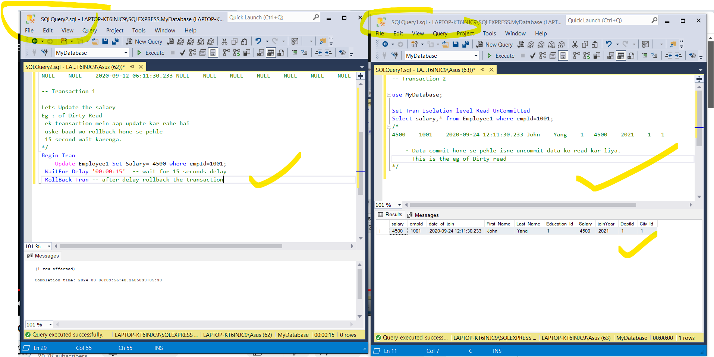
### Ab 1st window ka transaction 15 second delay hone ke baad roll back ho gya, yadi hum phir se Read Uncommitted wala command cahlaye tab.
```sql
-- Transaction 2

use MyDatabase;

Set Tran Isolation level Read UnCommitted
Select salary,* from Employee1 where empId=1001;
/*
3000	1001	2020-09-24 12:11:30.233	John	Yang	1	3000	2021	1	1

Ab ye commit hone ke baad - data proper de raha hai
*/
```

### No Lock ye bhi Read Uncommitted ka kam kar deta.
```sql
-- Transaction 2

use MyDatabase;


Select salary,* from Employee1(NoLock) where empId=1001;
/*

4500	1001	2020-09-24 12:11:30.233	John	Yang	1	4500	2021	1	1

or
Abhi hum isolation level committed kar rahe hai
 yani aap window 1 ka transaction jab commit honga tab ye output denga
work with NoLOck
*/
Set Tran Isolation level Read Committed
Select salary,* from Employee1(NoLock) where empId=1001;
/*
4500	1001	2020-09-24 12:11:30.233	John	Yang	1	4500	2021	1	1

koyi delay nahi
*/
```
#### Window 1 ke query same hai

- ye bhi dirty read hai
- rollback hone ke baad normal execute karnege


# 32. ACID properties
### What is transaction?
- group of sql statement jo ki as a single unit of work consider hoti hai.
- agar sari statement chal padi to data commit & trnasaction success.
- yadi 1 bhi statement fail hue to data rollback & transaction fail.


### Properties of a transaction:

### 1 Automicity
- means all or nothing
- sari unit or statements aapki sahi se execute hue to transition success and data commit.
- yadi 1 bhi statement has issue then vice versa.
- refer dig


### 2 Consitency
- aap jab bhi koyi multiple transaction karte hai,to ek transaction ke baad mein
- uska jo state change hona chaiye db mein save/commit hona chaiye.
- aur dusri transaction ko tabhi visible ho jab uska state commit  ho. 
### or
- aap jab bhi koyi multiple transaction karte hai,
to ek transaction ke baad mein 
- uska state ye commit/save hona chaiye db mein
- dusre transaction pehle transaction ka state commit hone ke baad mein dikhe.


- eg 
- Cust A ne Cust B ko 200 rs diye
- So A ka state pehle 800 tha abhi 600 ho gya 
- and B ka 500 tha abhi 700 ho gya.
- ab aapko 300 transfer karna hia, so cust B ko aapka abhi bal 600 visible hai.
### 3 isoloation
- multiple transaction ek mek ko disturb nhi karna chaiye.

### 4. Durability

# 33. Sql Cursor
### What is result Set?
- query fire karne ke baad
- i.e Select * from student_details
- jis format mein hume sari info display hoti hai
- usse hum result set kehte hai
- see dig.
- result set hamara row and col format mein hota hai.
- is result set mein student ki sari info hai.
### Now we have a requirement?
- hume marksheet display karni hai student ki
- hume 1 by 1 student ka data fetch karna honga
- uske marks ka total karna honga
- Based on that create Percentage and Grade
- So in order to traverse the result set we requre cursor.
- ***Remember :*** Cursor aapki system memory mein run hota hai
- boleto kafi sari memory occupie kar leta hai
- avoid it other wise performance issue.


### What is Cursor?
- Select query ke sath jo result set aata hai wo cursor ke sath map ho jata hai called as Active data set.


### Types of Cursor

- Implicit Cursor mein sab kaam automatic ho jata hai (open and close)


- static cursor => active data set ko cache mein rakhta hai, wahi se har row ko pic or process karta hai; Has Feture Current row to next/previous row.
- fast forward => refer dig
- dynamic => Jo bhi addition or deltion karte hai uska reflection db mein aa jata hai.
- for eg, yadi dusra user same table ko use kar raha hai, wo aapke changes dekh sakta hai.
- Keyset => opposite to dynamic. reflction db mein nhi aavenga.


```sql
use MyDatabase;

create table Student_details
(
	rollNo Int Not Null,
	student_name Varchar(100) not null,
	class varchar(10) null,
	marks_science int not null,
	marks_maths int not null,
	marks_eng int not null
)

Insert Into Student_details Values(1,'Anil','5th',34,78,54);
Insert Into Student_details Values(2,'Sunil','7th',78,43,87);
Insert Into Student_details Values(3,'Ajay','5th',45,32,78);
Insert Into Student_details Values(4,'Vijay','4th',36,78,32);
Insert Into Student_details Values(5,'Manoj','5th',12,22,67);
Insert Into Student_details Values(6,'Geeta','8th',21,65,43);
Insert Into Student_details Values(7,'Sita','4th',34,78,54);
Insert Into Student_details Values(8,'Reeta','9th',89,78,54);
Insert Into Student_details Values(9,'Arvind','12th',78,78,54);
Insert Into Student_details Values(10,'Kumar','11th',22,56,54);

Select * from Student_details;
/*
1	Anil	5th		34	78	54
2	Sunil	7th		78	43	87
3	Ajay	5th		45	32	78
4	Vijay	4th		36	78	32
5	Manoj	5th		12	22	67
6	Geeta	8th		21	65	43
7	Sita	4th		34	78	54
8	Reeta	9th		89	78	54
9	Arvind	12th	78	78	54
10	Kumar	11th	22	56	54

With Total mark, percentage and Grade
*/
Declare @RollNo Int,
		@Student_name Varchar(100),
		@Mark_Science Int,
		@Marks_Eng Int,
		@Marks_Math Int;

Declare @Marks_Total Int,
		@Percentage Int;

-- Create a cursor
/*
	Is query se Select  rollNo,student_name,marks_science,marks_maths,marks_eng 
				    from Student_details;
	  jo bhi result set avenga
	us par Cursor create karo

	so finally,
	 ye jo map hoke cursor ke sath result set mila usse hum 
	  Active data set kahenge.
*/
Declare student_cursor Cursor for 
                  Select  rollNo,student_name,marks_science,marks_maths,marks_eng 
				    from Student_details;

--Open cursor
Open student_cursor;

/*
 apka pointer abhi Null par hai.
	Ab aap 1st record fetch karne jaa rahe hai
 Null se aage 1st record hai
   so Command is Fetch next
			from cursor Name

   Ab hum jo cursor se data lenge 
     wo apne variable mein rakhenge/map karenge
sequence proper ho	 
*/
Fetch Next from student_cursor 
		Into @RollNo,@Student_name,@Mark_Science,@Marks_Math,@Marks_Eng

/*
	@@FETCH_STATUS ye apna global variable hai
	  ye hume status batata hai
	  yadi -1 status then there is no record in Active data set
	  - if 0 then record exist in active data set
*/
While @@FETCH_STATUS=0
	Begin
		Print Concat('Name: ',@Student_name);
		Print Concat('Roll No: ',@RollNo);
		Print Concat('Science: ',@Mark_Science);
		Print Concat('Maths: ',@Marks_Math);
		Print Concat('English : ',@Marks_Eng);

		Set @Marks_Total = @Mark_Science + @Marks_Eng  + @Marks_Math;
		Print Concat('Total marks : ',@Marks_Total);

		Set @Percentage = @Marks_Total /3;
		Print Concat('Percentage : ',@Percentage);

		If @Percentage > 80
			Begin
				Print 'Grade-A';
			End
		Else If @Percentage > 60 And @Percentage < 80
			Begin
				Print 'Grade-B';
			End
		 Else 
			Begin
				Print 'Grade-C';
			End
			Print '============================'

	-- agian re-fetch
	Fetch Next from student_cursor 
		Into @RollNo,@Student_name,@Mark_Science,@Marks_Math,@Marks_Eng	 

	End  -- end of while loop

-- close and deallocate cursor from memory
Close student_cursor;

Deallocate student_cursor;
/*
Name: Anil
Roll No: 1
Science: 34
Maths: 78
English : 54
Total marks : 166
Percentage : 55
Grade-C
============================
Name: Sunil
Roll No: 2
Science: 78
Maths: 43
English : 87
Total marks : 208
Percentage : 69
Grade-B
============================
Name: Ajay
Roll No: 3
Science: 45
Maths: 32
English : 78
Total marks : 155
Percentage : 51
Grade-C
============================
Name: Vijay
Roll No: 4
Science: 36
Maths: 78
English : 32
Total marks : 146
Percentage : 48
Grade-C
============================
Name: Manoj
Roll No: 5
Science: 12
Maths: 22
English : 67
Total marks : 101
Percentage : 33
Grade-C
============================
Name: Geeta
Roll No: 6
Science: 21
Maths: 65
English : 43
Total marks : 129
Percentage : 43
Grade-C
============================
Name: Sita
Roll No: 7
Science: 34
Maths: 78
English : 54
Total marks : 166
Percentage : 55
Grade-C
============================
Name: Reeta
Roll No: 8
Science: 89
Maths: 78
English : 54
Total marks : 221
Percentage : 73
Grade-B
============================
Name: Arvind
Roll No: 9
Science: 78
Maths: 78
English : 54
Total marks : 210
Percentage : 70
Grade-B
============================
Name: Kumar
Roll No: 10
Science: 22
Maths: 56
English : 54
Total marks : 132
Percentage : 44
Grade-C
============================
*/
```
# 34. CTE in Sql 


### Why to apply CTE:
- yadi aap window function use karna chahte hai CTE is best approach
- Yadi aapka View complex hai, so you can manage by CTE.


### Types of CTE
- ***NON recursive*** mein aap single/ multiple CTE create kar sakte
- usse ek temprary result set create hota hai; jaha aap DML statement apply kar sakte ho.


### CTE Anatomy
- ye col name (Id,Name) optional hai,but if you specify then it should map properly/sequentially in Select statement 


### Via query
```sql
use MyDatabase;

create table Student4
(
	rollNo Int Not Null,
	name Varchar(100) not null,
	class varchar(10) null,
	science int not null,
	math int not null,
	eng int not null
)

Insert Into Student4 Values(1,'Anil','5th',34,78,54);
Insert Into Student4 Values(2,'Sunil','7th',78,43,87);
Insert Into Student4 Values(3,'Ajay','5th',45,32,78);
Insert Into Student4 Values(4,'Vijay','4th',36,78,32);
Insert Into Student4 Values(5,'Manoj','5th',12,22,67);
Insert Into Student4 Values(6,'Geeta','8th',21,65,43);
Insert Into Student4 Values(7,'Sita','4th',34,78,54);
Insert Into Student4 Values(8,'Reeta','9th',89,78,54);
Insert Into Student4 Values(9,'Arvind','12th',78,78,54);
Insert Into Student4 Values(10,'Kumar','11th',22,56,54);

Select * from Student4;
/*
1	Anil	5th		34	78	54
2	Sunil	7th		78	43	87
3	Ajay	5th		45	32	78
4	Vijay	4th		36	78	32
5	Manoj	5th		12	22	67
6	Geeta	8th		21	65	43
7	Sita	4th		34	78	54
8	Reeta	9th		89	78	54
9	Arvind	12th	78	78	54
10	Kumar	11th	22	56	54

Target-
    - har student ke marks ka total karna hai
	- unki percentage
	- fhir grading
*/

-- 1) Using query
Select rollNo,name,science,math,eng,
	(science + math + eng) as Total,
	(science + math + eng) / 3 as Average,

	Case 
		When ((science + math + eng) / 3) > 70 Then 'A'
		When ((science + math + eng) / 3) > 40 And ((science + math + eng) / 3) < 70 Then 'B'
		Else 'F'
	 End as Grade

from Student4;
/*
Rno Name  Sc   Ma  En  Tot Avg Grade
1	Anil	34	78	54	166	55	B
2	Sunil	78	43	87	208	69	B
3	Ajay	45	32	78	155	51	B
4	Vijay	36	78	32	146	48	B
5	Manoj	12	22	67	101	33	F
6	Geeta	21	65	43	129	43	B
7	Sita	34	78	54	166	55	B
8	Reeta	89	78	54	221	73	A
9	Arvind	78	78	54	210	70	F
10	Kumar	22	56	54	132	44	B
*/
```
### via CTE
```sql
/*
	The above query is little complex.
		We can do same thing via CTE
*/

With  ctTotal 
As
 (
	Select rollNo,(science + math + eng) as Total from Student4
 ),
  ctAvg 
  As
 (
	Select rollNo,(science + math + eng) / 3 as Average from Student4
 ),
 ctGrade
 As
 (
  Select rollNo,
	CASE
		When ((science +  math + eng) / 3) > 70 Then 'A'
		When ((science + math + eng) / 3) > 40 And ((science + math + eng) / 3) < 70 Then 'B'
		Else 'F'
	 End  as Grade
			from Student4
 )
 Select sd.rollNo,
			science,
			math,
			eng,
			ctot.Total,
			cAvg.Average,
			cGrade.Grade
    from Student4 sd 
			Inner Join 
		ctTotal ctot On (sd.rollNo = ctot.rollNo)
			Inner Join 
		ctAvg cAvg On (sd.rollNo = cAvg.rollNo)
			Inner JOin
		ctGrade cGrade on (sd.rollNo = cGrade.rollNo);
/*
1	34	78	54	166	55	B
2	78	43	87	208	69	B
3	45	32	78	155	51	B
4	36	78	32	146	48	B
5	12	22	67	101	33	F
6	21	65	43	129	43	B
7	34	78	54	166	55	B
8	89	78	54	221	73	A
9	78	78	54	210	70	F
10	22	56	54	132	44	B

CTE ka approach hota hai  
 - divide and conquer

 Humne 3 Cte banaye namely ctTotal,ctAvg,ctGrade 
   iske 3 result set banege.
 &
  humne iNNErjoin lagake 
    sara result le aaya

Benefit:
  divie into simple result set
  maintaince & readability improves.
*/	
```

### Recursive CTE
- jab hum kisi task ko repeatedly execute karna chahte hai, 1 condition ke sath mein.
- hamare pass mein data hai jo hierachical format mein hai,  1 column like PK kisi dusre column like FK ko refer kar raha hai; waha use kar sakte.


- cte_query_defiination also called base query/result ek baar execute hoti 
```sql
-- Hum cte bana rahe hai 
   -- uska name hai cteRecursive
     -- uske andar field hai jiska name hai col1

With cteRecursive(col1)
 As 
	(
		Select 1    -- This is the base query which execute only once
		            -- Here First time col1 = 1  after that it is ignored

			Union All  -- This will join Base query result + repeated query result

		Select col1 + 1 from cteRecursive    -- another cte which is running 
						   where col1 < 10      -- till condition valid
	)
Select col1 from cteRecursive;
/*
col1
1
2
3
4
5
6
7
8
9
10

	- Hamara output 1 se lekar 10 tak aaya
*/
```
### One more CTE Eg
```sql
use MyDatabase;

Create table Employee6
(
	EmployeeId Int,
	FirstName Varchar(100),
	ManagerId Int
)

Insert Into Employee6 Values (101,'ken',Null);
Insert Into Employee6 Values (102,'Terri',101);
Insert Into Employee6 Values (103,'Roberto',101);
Insert Into Employee6 Values (104,'Rob',102);
Insert Into Employee6 Values (105,'Gail',102);
Insert Into Employee6 Values (106,'Jossef',103);
Insert Into Employee6 Values (107,'Dylan',103);
Insert Into Employee6 Values (108,'Diane',105);
Insert Into Employee6 Values (109,'Gigi',105);
Insert Into Employee6 Values (110,'Michael',106);

Select * from Employee6;
/*
Eid Name   ManId
101	ken		NULL
102	Terri	101
103	Roberto	101
104	Rob		102
105	Gail	102
106	Jossef	103
107	Dylan	103
108	Diane	105
109	Gigi	105
110	Michael	106

EmployeeId ye managerId ko refer karta hai
  EmployeeId Pk hai humen time being nhi liye
  and MangerId FK hai

Target :  Hume Employee name ke sath uske manager ka name bhi nikalna hia
*/

With cteReports
 As
 (
	Select EmployeeId,FirstName,ManagerId  from Employee6 
										where ManagerId Is Null

				Union all

	 Select e.EmployeeId,e.FirstName,e.ManagerId  from Employee6 e
			Inner Join
		cteReports r 
				On e.ManagerId = r.EmployeeId -- table scan ho gyi recursively
 )
 Select EmployeeId,FirstName as FullName,cteReports.ManagerId,
		(Select FirstName from Employee6 where EmployeeId=cteReports.ManagerId) as Manager
			From cteReports 
				order by cteReports.ManagerId
/*
Eid Ful		Mid   Manager
101	ken		NULL	NULL
102	Terri	101		ken
103	Roberto	101		ken
104	Rob		102		Terri
105	Gail	102		Terri
106	Jossef	103		Roberto
107	Dylan	103		Roberto
108	Diane	105		Gail
109	Gigi	105		Gail
110	Michael	106		Jossef
*/
```
### via self join
```sql
/*
	Same issue is resolved by Self Join
	memory jayda leta, since 2 copy bana jati hai
*/

Select emp1.employeeId as 'EmpId', emp1.firstName as 'EmpName',
		emp2.employeeId as 'ManagerId', emp2.firstName as 'ManagerName'
from  Employee6 emp1,Employee6 emp2
	where emp1.managerId = emp2.employeeId

/*
102	Terri	101	ken
103	Roberto	101	ken
104	Rob		102	Terri
105	Gail	102	Terri
106	Jossef	103	Roberto
107	Dylan	103	Roberto
108	Diane	105	Gail
109	Gigi	105	Gail
110	Michael	106	Jossef

 but yaar 101 nhi aaya.
   dekhna padengo
iska answer hai hum compare kya kar rahe  
emp1.managerId = emp2.employeeId 
  jab Null ManagerId ki koyi EmployeeId mili hi nhi
  That's why wo data fetch hua hi nhi..
*/
```
# 35. SQl Parameter Sniffing
- jab aap stored procedure create karte hai, uske andar query ko write karte hai
- then procedure ko aap compile karte hai and then execute karte hai
- to uska ek process hota hai
- Sql optimizer sabse pehele aapke stored procedure ke andar jo parameter hai uska analysis karta hai
- and then based on that parameter analysis it will create a plan.(also called as execution plan)
- us plan ko wo cache ke andar store kar deta hai
- This process is called as paramete sniffing.


### How store procedure compile
- Jab store procedure first time jab create and execute karte hai.
- tab following process hoti hai

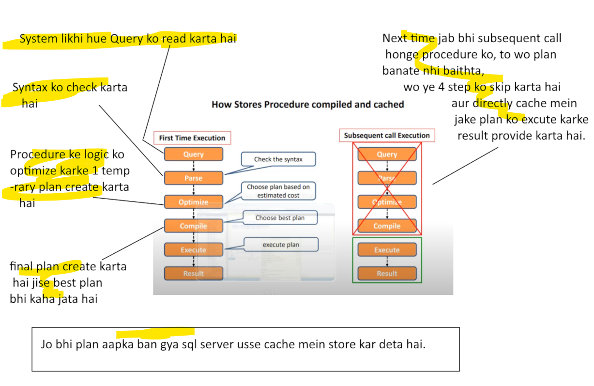
### Problem with Parameter snnifing

### When to use Parameter snnifing.


- Note: hamare isme index scan hi aa raha hai, baad mein check karna padenga.

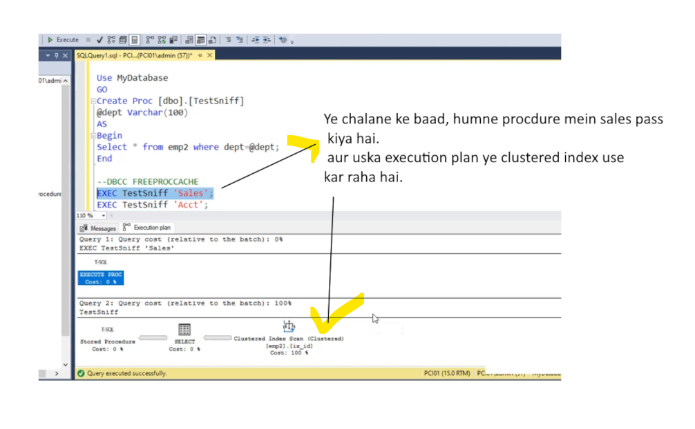
- jab aapne procedure ko parameter diya, Sales
- to ek plan create hua procedure ke basis par isse kehte hai parameter sniffing. 
- aur ye plan ab cache mein store hai.


- ye account ka data bahut kam hai, individually isne Index seek use kiya tha.
- and index seek ye index scan se fast hai.
### Fir se humne cache ko clear kar diya.Free ProcCache command use karke aur 

### How to stop parameter snifiing
#### Disable Parameter sniffing prop(not recommend)

### With Recompile

- Recompile ye cost effective hai, aapka time jyada lagenga.
#### Hum chahte hai, ki ek particualr value ke liye plan ko optimize karde
### Optimize for variable value

- wo particular value ke liye plan ko optimize kar denga.
### Optimize for Unknown

- ye aisa plan create karnega, jo sabhi parameter ke liye suite ho.
# 36. Sql User defined function

```sql
use MyDatabase;
/*
	System Defined / Pre-Defined Functions
*/

-- Fetch current date
Select GETDATE();
-- 2024-03-09 08:26:57.087  Fetch the cyrrent date  with  current time (server ka)

-- Current App Name
Select APP_NAME();
-- Microsoft SQL Server Management Studio - Query

--Current User
Select CURRENT_USER
-- dbo

/*
	Coal - esce ()  ye ek parameterize function hai
	 isme hum hamesha 2 value pass karenge
	  ye check karenga
	yadi 1st value null hai
	  to 2nd value aapke output mein print kar denga.
*/

Declare @Fname Varchar(50);
Select Coalesce(@Fname,'Smith');
--Smith

--Now we provide value to @Fname
Declare @Fname Varchar(50);
set @Fname = 'Aditya';
Select Coalesce(@Fname,'Smith');
-- Aditya
```
### Sql User Defined Function
- Also called as ***Custom function***
- aap function create karte waqt hi decide kar sakte ki iss particualr function mein parmeter dena hai ya nahi.
- Generally ye single value ie Scalar value return kar sakta hai
- ya table bhi return kar sakta hai
- ***Benefit :***
- Function ek tarah ka sub-routine hota hai
- jo compile hokar cache mein rehta hai
- isse network traffic reduce hota hai.

 ----------
```sql
use MyDatabase;
/*
User Defined Function (UDF)
	Scalar Function :
	  It will return a single value

	Creating Scalar Function:-

	Syntax ==>
	Create Function Function_Name (Parameter Optional)
	Returns return_type
	As 
	 Begin
		Statement-1
		Statement-2
		Statement-n
		Return return_value (Datatype must be same as you defined above)
	 End
*/

Create Function AddDigit(@num1 Int,@num2 Int)
RETURNS Int
AS
	Begin
		Declare @result Int;
		Set @result = @num1 + @num2;
		return @result;
	End

-- For calling this function use Select
Select AddDigit(1,3);
-- 'AddDigit' is not a recognized built-in function name.

-- Use scehama
Select dbo.AddDigit(1,3);
--4

Select dbo.AddDigit();
--An insufficient number of arguments were supplied for the procedure or function dbo.AddDigit.

Select dbo.AddDigit('abc',3);
--Conversion failed when converting the varchar value 'abc' to data type int.
```

#### Other Eg
```sql

Select * from Student_marks;
/*
RNo Sci Mat Eng
1	34	78	54
2	78	43	87
3	45	32	78
4	36	78	32
5	12	22	67
6	21	65	43
7	34	78	54
8	89	78	54
9	76	78	54
10	22	56	54

Target : HUme in sabki marks ka total nikalna hai
  rollno ke base se

  So create a function for that
*/
Create Function GetTotal(@RollNo Int)
Returns Int
As
	Begin
		Declare @Result Int;
		-- yaha ek column lena hai to Select
		Select @Result = (science + math + eng) from Student_marks where RollNo = @RollNo;
		return @result
	End

Select dbo.GetTotal(3);
--155

select rollno,science,eng,math,dbo.getTotal(rollno) as Total 
                         from student_marks;
/*
RNo Sci Eng Mat Total
1	34	54	78	166
2	78	87	43	208
3	45	78	32	155
4	36	32	78	146
5	12	67	22	101
6	21	43	65	129
7	34	54	78	166
8	89	54	78	221
9	76	54	78	208
10	22	54	56	132

Select statement mein jitni bhi row execute hoti hai
 wo har ek row ke liye GetTotal() function  ye call ho riya hai

 Similarly you can calculate Avg
*/
Create Function GetAvg(@RollNo Int)
Returns Int
As
	Begin
		Declare @result int
		Select @result = (science + math + eng) / 3 from Student_marks where RollNo = @RollNo
		return @result
	End

Select Rollno,Eng,science,math,GetAvg(RollNo) as Avg from Student_marks;
--'GetAvg' is not a recognized built-in function name.

Select Rollno,Eng,science,math,dbo.GetAvg(RollNo) as Avg from Student_marks;
/*
1	54	34	78	55
2	87	78	43	69
3	78	45	32	51
4	32	36	78	48
5	67	12	22	33
6	43	21	65	43
7	54	34	78	55
8	54	89	78	73
9	54	76	78	69
10	54	22	56	44
*/

Select Rollno,Eng,science,math,dbo.GetTotal(RollNo) as Total,dbo.GetAvg(RollNo) as Avg
			from Student_marks;
/*
1	54	34	78	166	55
2	87	78	43	208	69
3	78	45	32	155	51
4	32	36	78	146	48
5	67	12	22	101	33
6	43	21	65	129	43
7	54	34	78	166	55
8	54	89	78	221	73
9	54	76	78	208	69
10	54	22	56	132	44
*/
```
### Table valued Function
####   1) Inline table Valued Function
```sql
/*
User Defined Function(UDF)
  Table Valued Function
	- It returns a table.

	Inline Table Valued Function : ==>
		It contains single statement
		  and that must be select Statement

	Note: There is no need for Begin-End block in an in-line table valued function.

Target :
	Get student-list along with marks having total marks greater than 150
*/
Create Function GetStudentList(@total Int)
Returns Table
 As
  return Select * from Student_Marks where (science + math + eng) > @total;

Select dbo.GetStudentList(150);
/*
Cannot find either column "dbo" or the user-defined function
	or aggregate "dbo.GetStudentList", or the name is ambiguous.

Ye function ek table ko return kar raha hai
  so jaise table ko call karte waise call kare.
*/

Select * from dbo.GetStudentList(150);
/*
1	34	78	54
2	78	43	87
3	45	32	78
7	34	78	54
8	89	78	54
9	76	78	54

Ye wo bande hai, jinki total 150 se upar hai
*/
```
#### 2) Multi-Statement table Valued Function
```sql
/*
User Defined Function(UDF)
  Table Valued Function
	- It returns a table.

	Multi-Statement Table Valued Function : ==>
	 - It contains multiple Sql Statements
		 enclosed in Begin-End blocks.

	Rules : 
	 - In this the return value is declared as a table variable
			which include full structure of table to be return
	 - Return statement is there but without a value
*/

Select * from Student;
/*
Ro stName  City
1	Anil	Delhi
2	Sunil	Delhi
3	Ajay	NCR
4	Vijay	Pune
5	Manoj	Faridabad
6	Geeta	Noida
7	Sita	Noida
8	Reeta	New Delhi
9	Arvind	Faridabad
10	Kumar	Delhi

Hamare pass Student table hai 
  jo ki rollNo stname and City return kar rahi hai
*/

Select * from Student_Marks;
/*
Ro Sci Math Eng
1	34	78	54
2	78	43	87
3	45	32	78
4	36	78	32
5	12	22	67
6	21	65	43
7	34	78	54
8	89	78	54
9	76	78	54
10	22	56	54

Yaha rollNo aur marks return ho rahe hai.
*/

Create Function MultiStatementGetAllStudent(@RollNo Int)
Returns @Marksheet Table(stName Varchar(50),RollNo int,Eng int,Math Int,
		Science Int,Average Decimal(4,2))
/*
	Yaha ek variable liya @Marksheet jo table type ka hai
*/
As
 Begin
	Declare @Per Decimal(4,2);
	Declare @StName Varchar(100);

	Select @StName = student_Name from student where RollNo = @RollNo;
	Select @Per = ((Eng + Math + Science) / 3) from Student_Marks where RollNo = @RollNo;

	--Now fill the marksheet
	Insert Into @Marksheet(stName,RollNo,Eng,Math,Science,Average) 
		Select @StName,RollNo,Eng,Math,Science,@Per from student_marks where RollNo=@RollNo;

	Return
 End

 Select * from dbo.MultiStatementGetAllStudent(1)
 /*
 sName Ro  Eng  Mat Sci Average
 Anil	1	54	78	34	55.00
 */
```
# 37. Sql Views
- It's an database object.
- jab bhi aap view ko create karte hai, ye aapke db mein store ho jata hai.
- Also called as Virtual table.
- Isme khudka kuch data nhi hota, jo actual table hai waha se data fetch karke lata hai.
- aap view single/multiple table se bhi create kar sakte
- usme aap where aur join statement bhi use kar sakte hai.


```sql
use MyDatabase;
/*
	How to create a View?
		We can create a View using create view Statement.
		A view can be created from single or multiple table.
*/
Create table Student1
(
	rollNo Int,
	studentName nVarchar(100),
	city nVarchar(50)
)

Insert Into Student1 Values(1,'Smith','London');
Insert Into Student1 Values(2,'John','Bangor');
Insert Into Student1 Values(3,'Lucy','Delhi');
Insert Into Student1 Values(4,'Dean','Calcutta');
Insert Into Student1 Values(5,'Brain','Banglore');
Insert Into Student1 Values(6,'Keet','Noida');
Insert Into Student1 Values(7,'Suzan','Noida');
Insert Into Student1 Values(8,'Keep','Faridabad');
Insert Into Student1 Values(9,'Lovely','NCR');
Insert Into Student1 Values(10,'Linda','New Delhi');

Select * from Student1;
/*
1	Smith	London
2	John	Bangor
3	Lucy	Delhi
4	Dean	Calcutta
5	Brain	Banglore
6	Keet	Noida
7	Suzan	Noida
8	Keep	Faridabad
9	Lovely	NCR
10	Linda	New Delhi

Target -Create a view from this table
*/
Create View vwStudent1
As
Select * from Student1;

--Fetch data from the view
Select * from vwStudent1;
/*
1	Smith	London
2	John	Bangor
3	Lucy	Delhi
4	Dean	Calcutta
5	Brain	Banglore
6	Keet	Noida
7	Suzan	Noida
8	Keep	Faridabad
9	Lovely	NCR
10	Linda	New Delhi

Target : Check the defination of the view.
*/
sp_helptext vwStudent1;
/*
Create View vwStudent1  
As  
Select * from Student1;

Observation:
  Internally  ye query 
		Select * from Student1; 
		 fire hue hai
	View ka apna koyi data nhi hota hai.

Target: Modify the view
          Hume display mein keval 2 col hi dikhana hai 
*/
Alter View vwStudent1
As
Select rollNo,studentName from Student1;

Select * from vwStudent1;
/*
1	Smith
2	John
3	Lucy
4	Dean
5	Brain
6	Keet
7	Suzan
8	Keep
9	Lovely
10	Linda

Target: Drop a view
*/
Drop view vwStudent1;
Select * from vwStudent1;
/*
	Invalid object name 'vwStudent1'.
*/
```
### Creating view from multiple table.
```sql
/*
	How to create a view using Multiple table.
*/
Select * from Student_Marks;
/*
1	34	78	54
2	78	43	87
3	45	32	78
4	36	78	32
5	12	22	67
6	21	65	43
7	34	78	54
8	89	78	54
9	76	78	54
10	22	56	54
*/
Select * from Student1;
/*
1	Smith	London
2	John	Bangor
3	Lucy	Delhi
4	Dean	Calcutta
5	Brain	Banglore
6	Keet	Noida
7	Suzan	Noida
8	Keep	Faridabad
9	Lovely	NCR
10	Linda	New Delhi

Hamare pass 2 table hai,
 - in dono mein rollNo wali column common hai
 - so hum in dono ke sath view create karenge.
*/
Create view vwStudentMultiple
As
Select st.RollNo,st.studentName,st.city,sm.Eng,sm.Math,sm.Science
		from Student1 st
	Join
		Student_Marks sm
    On st.RollNo = sm.RollNo;

Select * from vwStudentMultiple;
/*
1	Smith	London		54	78	34
2	John	Bangor		87	43	78
3	Lucy	Delhi		78	32	45
4	Dean	Calcutta	32	78	36
5	Brain	Banglore	67	22	12
6	Keet	Noida		43	65	21
7	Suzan	Noida		54	78	34
8	Keep	Faridabad	54	78	89
9	Lovely	NCR			54	78	76
10	Linda	New Delhi	54	56	22

Benefit :
   - Yaha apne jo join lagakar complex query likhi hai
		 wo complexity yaha hide ho chuki hai, view ke andar.
	- Aap View par DML command laga sakte hai.
*/
```
### Update the metadata of the sql view
```sql
/*
	How the update the metadata of the sql view.
		iski defination kaise update kare.

		- suppose ek table mein kuch column add hua 
		- but wo view mein nhi dikh padengo
		- hume view ki defination ko update karno padengo
*/
Select * from Student1;
/*
1	Smith	London
2	John	Bangor
3	Lucy	Delhi
4	Dean	Calcutta
5	Brain	Banglore
6	Keet	Noida
7	Suzan	Noida
8	Keep	Faridabad
9	Lovely	NCR
10	Linda	New Delhi

Target : Isse hum view create karte hai.
*/
Create view  vwStudent
As
Select * from Student1;

Select * from vwStudent;
/*
1	Smith	London
2	John	Bangor
3	Lucy	Delhi
4	Dean	Calcutta
5	Brain	Banglore
6	Keet	Noida
7	Suzan	Noida
8	Keep	Faridabad
9	Lovely	NCR
10	Linda	New Delhi

Suppose aapke Student1 table mein
 - koyi naya col add ho gya
*/
Alter table student1
	Add  country varchar(100);

Select * from Student1;
/*
1	Smith	London		NULL
2	John	Bangor		NULL
3	Lucy	Delhi		NULL
4	Dean	Calcutta	NULL
5	Brain	Banglore	NULL
6	Keet	Noida		NULL
7	Suzan	Noida		NULL
8	Keep	Faridabad	NULL
9	Lovely	NCR			NULL
10	Linda	New Delhi	NULL
*/

Select * from vwStudent;
/*
1	Smith	London
2	John	Bangor
3	Lucy	Delhi
4	Dean	Calcutta
5	Brain	Banglore
6	Keet	Noida
7	Suzan	Noida
8	Keep	Faridabad
9	Lovely	NCR
10	Linda	New Delhi

Observation:
	- aapke student1 table mein to col add hua
	- but view mein reflect nhi ho raha 
	- jo isse create hai.
Solution is use window command
*/
exec sp_refreshview vwStudent;

Select * from vwStudent;
/*
1	Smith	London		NULL
2	John	Bangor		NULL
3	Lucy	Delhi		NULL
4	Dean	Calcutta	NULL
5	Brain	Banglore	NULL
6	Keet	Noida		NULL
7	Suzan	Noida		NULL
8	Keep	Faridabad	NULL
9	Lovely	NCR			NULL
10	Linda	New Delhi	NULL
*/
```
### Schema binding view
```sql
/*
	How to create a Schema binding sql view.
*/
Create view vwStudentList
As
Select * from Student1;

Select * from vwStudentList;
/*
1	Smith	London		NULL
2	John	Bangor		NULL
3	Lucy	Delhi		NULL
4	Dean	Calcutta	NULL
5	Brain	Banglore	NULL
6	Keet	Noida		NULL
7	Suzan	Noida		NULL
8	Keep	Faridabad	NULL
9	Lovely	NCR			NULL
10	Linda	New Delhi	NULL

 - aapne ek table(Student1) se view create kiya
 - aur baad mein aapne ussi table se koyi particualr
 - col delete kar diya.
*/
Alter table Student1 
	drop column country;

Select * from student1;
/*
1	Smith	London
2	John	Bangor
3	Lucy	Delhi
4	Dean	Calcutta
5	Brain	Banglore
6	Keet	Noida
7	Suzan	Noida
8	Keep	Faridabad
9	Lovely	NCR
10	Linda	New Delhi
*/
select * from vwStudentList;
/*
Error:
View or function 'vwStudentList' has more column names specified than columns defined.

	- view ki defination mein 4 col the
	- aur humne original table se 1 col drop kar diya.
	- That's why aapke view ka execution fail ho gya.

To protect such kind of scenarion use the concept of Schema binding.
	- ek baar bind ho gya col view ke sath
	- to na col ko drop kar sakte
	- na change kar sakte hai (col ki defination ko)
*/
Create view vwStudentListWithSchemaBinding
With SchemaBinding
As
Select rollNo,studentName,city from dbo.Student1;

/*
	Kya hum SchemaBinding se view create karne ke baad
		table ke kisi column ko ko drop kar sakte.
*/
Alter table Student1 
	drop column city;
/*
Error :
The object 'vwStudentListWithSchemaBinding' is dependent on column 'city'.
Msg 4922, Level 16, State 9, Line 318
ALTER TABLE DROP COLUMN city failed because one or more objects access this column.

Observation:
  Schema Binding ke baad aap kisi col ko drop nhi kar sakte

Q) Kya hum 
	kisi col ke defination change kar sakte hai
*/
Alter table Student1 
	alter column studentName Varchar(200);
/*
The object 'vwStudentListWithSchemaBinding' is dependent on column 'studentName'.
Msg 4922, Level 16, State 9, Line 332
ALTER TABLE ALTER COLUMN studentName failed because one or more objects access this column.

Observation:
  - Bind hone ke baad
  - us col ko nahi change kar sakte / aur nahi drop
*/
```
### Usage of View
- Hide the complexity of query from user.
- Row level security
- Column level security
#### Row Level Security
```sql
/*
	How to Use View?
		1) Row level Security

	- Hum kisi user ko aisa view provide karna chahte hai
		jisme 5 ke upar wale roll num  display/access ho sake.
*/
Create view vwRowLevel
As
Select * from Student1 where rollNo > 5;

Select * from vwRowLevel;
/*
6	Keet	Noida
7	Suzan	Noida
8	Keep	Faridabad
9	Lovely	NCR
10	Linda	New Delhi

Wohi data show ho raha hai
 jiska rollno 5 se bada hai

is tarah se diff row level seurity apply kar ke
	aap customer ko view cater kar sakte.
*/
```
#### Column Level Security
```sql
/*
	How to Use View?
		1) Row level Security

	- Hum kisi user ko aisa view provide karna chahte hai
		jisme 5 ke upar wale roll num  display/access ho sake.
*/
Create view vwRowLevel
As
Select * from Student1 where rollNo > 5;

Select * from vwRowLevel;
/*
6	Keet	Noida
7	Suzan	Noida
8	Keep	Faridabad
9	Lovely	NCR
10	Linda	New Delhi

Wohi data show ho raha hai
 jiska rollno 5 se bada hai

is tarah se diff row level seurity apply kar ke
	aap customer ko view cater kar sakte.
*/
---------------------------------------
/*
  Usage of View:
	2)Column Level Security
	
	- Hume kisi particular coloumn(Let say city) ko hide karna hai.
*/
Create view vwColumnLevel
As
Select rollNo,studentName from Student1;

Select * from vwColumnLevel;
/*
1	Smith
2	John
3	Lucy
4	Dean
5	Brain
6	Keet
7	Suzan
8	Keep
9	Lovely
10	Linda
*/
```
### Apply DML statements on View
- Aap jab bhi dml statement apply karte hai,
	- uska reflection physical table par hota hai.  
	- kyuki view ka apna data hai hi nahi
- So first physical table mein change honga data  
    - aur phir view waha se refresh honga.
```sql
/*
	Apply DML statements on view
	1) Insert Into view
	2) Delete Into view
	3) Updating views
		Rules for Updation:
			- Create a view via single table only.
				U can't apply Update operation if view is created via multiple table.
			- View  should not contain Group by, Having & distinct Clauses.
			- It should not also contain subquery,
				we cannot use a subquery in a view
			- View should not contain Set operators.

			Yadi aapne view mein in 4 condition me se 1 bhi condition use kari hai
			  so view aapka non updatable ho javenga.
*/
Create view vwDemo
As
Select * from Student1;

Select * from vwDemo;
/*
1	Smith	London
2	John	Bangor
3	Lucy	Delhi
4	Dean	Calcutta
5	Brain	Banglore
6	Keet	Noida
7	Suzan	Noida
8	Keep	Faridabad
9	Lovely	NCR
10	Linda	New Delhi

Target: Let's Insert a record
*/
Insert into vwDemo(rollNo,studentName,city) values(11,'New Name','New City');
Select * from vwDemo;
/*
1	Smith		London
2	John		Bangor
3	Lucy		Delhi
4	Dean		Calcutta
5	Brain		Banglore
6	Keet		Noida
7	Suzan		Noida
8	Keep		Faridabad
9	Lovely		NCR
10	Linda		New Delhi
11	New Name	New City

Observation : 
   Inserting data via view

Target : We use Delete query on view
*/
Delete from vwDemo where rollNO =2;

Select * from vwDemo;
/*
1	Smith		London
3	Lucy		Delhi
4	Dean		Calcutta
5	Brain		Banglore
6	Keet		Noida
7	Suzan		Noida
8	Keep		Faridabad
9	Lovely		NCR
10	Linda		New Delhi
11	New Name	New City

Now updating view
*/
Update vwDemo set studentName='New_Name' where rollNo=1;

Select * from vwDemo;
/*
1	New_Name	London
3	Lucy	Delhi
4	Dean	Calcutta
5	Brain	Banglore
6	Keet	Noida
7	Suzan	Noida
8	Keep	Faridabad
9	Lovely	NCR
10	Linda	New Delhi
11	New Name	New City
*/
```
### With Check Option
```sql
/*
	With Check Option
	 - It is applicable to a updatable view.
	 - if the view is not updatable then there is no meaning to it.
	 - This clause is used to prevent the insertion of rows in a view 
			based on the condition; 
			 If condition is satisfied then Insertion happen. Otherwise nothing happen.

Target:
	Hum chahte hai ki aisa view display hojave
	 jiski city keval Noida ho
	aur us view mein aisa hi data insert ho jiski city keval Noida hai.
*/
Create view vwWithCheckOptionDemo
As
Select * from Student1 where city='Noida'
With Check Option;

Select * from vwWithCheckOptionDemo;
/*
6	Keet	Noida
7	Suzan	Noida
*/

Insert into vwWithCheckOptionDemo(rollNo,studentName,city) values(12,'Thor','Dc Washington');
/*
Error:
The attempted insert or update failed because the target view either specifies WITH CHECK OPTION
or spans a view that specifies WITH CHECK OPTION and one or more rows resulting from the operation did not qualify 
under the CHECK OPTION constraint.

*/

Insert into vwWithCheckOptionDemo(rollNo,studentName,city) values(12,'Thor','Noida');

Select * from vwWithCheckOptionDemo;
/*
12	Thor	Noida
6	Keet	Noida
7	Suzan	Noida
*/
```
# 38. Indexed  View in ms sql
- view ek tarah ka virtual table hota hia               
    - usme apna koyi data to hota nhi hai.
    - View ka actual data access db se hota hai.
- Jitni baar aap view ko use karte hai,
    - utni baar aapki query db ko hit karti hai. 


### Disadvantage of standard view

- view create karte samay,
    - yadi aap multiple table use karte hai, 
    - mulitple join use karte hai 
    - or Koyi complex query use karte hai.
- and us case mein view ka use frequently hota hai, then it leads to performance issue.
    - sql query ka access time badh sakta hai
    - sql query ki performance degrade ho sakti hai
### How to boost the performance

- Yadi view ke andar multiple tables, multiple joins aur complex query hai so to boost performance we have the concept of Indexed view.
- Index view ye ek materialized view ke saman hota hai.
- Jab aap standard view create karte hai, tab uska data koyi db mein store nhi hota.  
  - Mane jo bhi aapki calculation hoti hai, wo ussi time calculate hoti hai jab aap access karte hai.
- On the contrary, index/materized view ka data ye db ke andar table ke format mein store hota hai.
  - so jab bhi aap index/materilized view se data access karte to wo pre-stored result set hai db mein table ke format mein waha se data lake deta. lambi chowdi calculation/processing nhi lagata. So performance increase.
### Diff between standard and index view.
  
  - Standard view mein hamara result set kahi bhi store nhi hota hai, so jo data access hota hai wo db se direct hota hai.
  - Index view  create karte  hai in 2 step  
    1) pahle ek view create karte hai schema binding ke sath
    2) then uske baad  1 unique cluster index create karte hai. Jo ki table ke form mein db mein store ho jata hai.
- so jab bhi aapka view fire honga toh data aapka unique clustered index se aavenga.Update/delete/insert sab isme mein he aavenga.
### How to create an index view

- ye index view materizied view ki tarh hi kaam karta.
- ek baar create ho gya to query hit materized view ko jati instead of db.
```sql
use MyDatabase;

Create table emp
(
	empId Int Primary key,
	empCode Int,
	empSalary decimal(8,2),
	deptId Int
)

Insert into emp Values(1,1,2000,2);

Insert into emp Values(2,2,1500,5);
Insert into emp Values(3,3,2000,3);
Insert into emp Values(4,4,6500,2);
Insert into emp Values(5,5,8500,4);
Insert into emp Values(6,6,4500,5);
Insert into emp Values(7,7,2000,2);
Insert into emp Values(8,8,1500,5);
Insert into emp Values(9,9,2000,3);
Insert into emp Values(10,10,6500,2);
Insert into emp Values(11,11,8500,4);
Insert into emp Values(12,12,4500,5);

Create table empDept
(
	deptId Int,
	deptName Varchar(200)
)

Insert into empDept Values(1,'Sales');
Insert into empDept Values(2,'Marketing');
Insert into empDept Values(3,'Purchase');
Insert into empDept Values(4,'Account');
Insert into empDept Values(5,'HR');

Create table empDetails
(
	empCode Int,
	empName Varchar(200),
	empAge Int,
	empAddress Varchar(200)
)

Insert Into empDetails values(1,'Ramesh',32,'Ahmedabad');
Insert Into empDetails values(2,'Khilan',25,'Delhi');
Insert Into empDetails values(3,'Kaushik',23,'Kota');
Insert Into empDetails values(4,'Chaitali',25,'Mumbai');
Insert Into empDetails values(5,'Hardik',27,'Bhopal');
Insert Into empDetails values(6,'Komal',22,'MP');
Insert Into empDetails values(7,'Suresh',32,'Ahmedabad');
Insert Into empDetails values(8,'Ram',25,'Delhi');
Insert Into empDetails values(9,'Shyam',23,'Kota');
Insert Into empDetails values(10,'Meenu',25,'Mumbai');
Insert Into empDetails values(11,'Patel',27,'Bhopal');
Insert Into empDetails values(12,'Kamal',22,'MP');

select * from emp;
/*
1	1	2000.00	2
2	2	1500.00	5
3	3	2000.00	3
4	4	6500.00	2
5	5	8500.00	4
6	6	4500.00	5
7	7	2000.00	2
8	8	1500.00	5
9	9	2000.00	3
10	10	6500.00	2
11	11	8500.00	4
12	12	4500.00	5
*/

Select * from empDept;
/*
1	Sales
2	Marketing
3	Purchase
4	Account
5	HR
*/

select * from empDetails;
/*
1	Ramesh		32	Ahmedabad
2	Khilan		25	Delhi
3	Kaushik		23	Kota
4	Chaitali	25	Mumbai
5	Hardik		27	Bhopal
6	Komal		22	MP
7	Suresh		32	Ahmedabad
8	Ram			25	Delhi
9	Shyam		23	Kota
10	Meenu		25	Mumbai
11	Patel		27	Bhopal
12	Kamal		22	MP
*/
```
### Create index view
```sql
/*
	Creating index view
		Step-1
			Create a view with Schema Binding option
		Step-2
			Create an unique index on view.

Target : Hume sare table join karke 
			complex query ke liye Index view create karna hai
       sath  hi Hume salary mein 1k add karke ek naya col diplay karna hai
*/

Create  View vwEmp
	With SchemaBinding
As
 Select e.empId,e.empCode,e.empSalary,dp.deptName,(e.empSalary + 1000) As 'New Salary'
	From dbo.emp e
		Inner Join
	dbo.empDept dp On (e.deptId = dp.deptId)
		Inner Join
	dbo.empDetails ed On(e.empCode = ed.empCode)

-- Check Statics
SET STATISTICS IO ON

Select * from vwEmp
/*
eId eCo  eSal    deptName  New Salary
1	1	2000.00	Marketing	3000.00
2	2	1500.00	HR			2500.00
3	3	2000.00	Purchase	3000.00
4	4	6500.00	Marketing	7500.00
5	5	8500.00	Account		9500.00
6	6	4500.00	HR			5500.00
7	7	2000.00	Marketing	3000.00
8	8	1500.00	HR			2500.00
9	9	2000.00	Purchase	3000.00
10	10	6500.00	Marketing	7500.00
11	11	8500.00	Account		9500.00
12	12	4500.00	HR			5500.00

Observation:
 3 table se join karke data hamare view mein aaya hai

 Now check statatics in Message
Table 'Workfile'. Scan count 0, logical reads 0, physical reads 0, page server reads 0, read-ahead reads 0, page server read-ahead reads 0, lob logical reads 0, lob physical reads 0, lob page server reads 0, lob read-ahead reads 0, lob page server read-ahead reads 0.
Table 'Worktable'. Scan count 0, logical reads 0, physical reads 0, page server reads 0, read-ahead reads 0, page server read-ahead reads 0, lob logical reads 0, lob physical reads 0, lob page server reads 0, lob read-ahead reads 0, lob page server read-ahead reads 0.
Table 'emp'. Scan count 1, logical reads 2, physical reads 0, page server reads 0, read-ahead reads 0, page server read-ahead reads 0, lob logical reads 0, lob physical reads 0, lob page server reads 0, lob read-ahead reads 0, lob page server read-ahead reads 0.
Table 'empDept'. Scan count 1, logical reads 1, physical reads 0, page server reads 0, read-ahead reads 0, page server read-ahead reads 0, lob logical reads 0, lob physical reads 0, lob page server reads 0, lob read-ahead reads 0, lob page server read-ahead reads 0.
Table 'empDetails'. Scan count 1, logical reads 1, physical reads 0, page server reads 0, read-ahead reads 0, page server read-ahead reads 0, lob logical reads 0, lob physical reads 0, lob page server reads 0, lob read-ahead reads 0, lob page server read-ahead reads 0.


 - Ye abhi ek Normal view ke tarah kaam kar raha hai
	 jo ki sabhi tables ko access kar raha hai
 - ab ye query agar baar baar hit hoti rahi
	 to performance issue create honga
*/
```
### Now check execution plan

### Step -2

- hamare ispar execute nhi ho raha 

- ye keval enterprize option par kaam karta hai

### Drop index

# 39. Sql Trigger Dml After Insert/update/delete

- It is a special type of stored procedure.
	- aapka koyi bhi trigger ho(DML /DDL) ye event ke upar he depend hota hai.
	- trigger ko aap manualy execute nhi kar sakte, isiliye isko special type of procedure kaha jata hai.
- Data ko validate karne ke liye hum rules banate hai, hum trigger ke sahare usse enforce kar sakte hai.
- hum dml trigger ke andar data ko rollback bhi kar sakte hai.
	- aapne koyi rule banaya hai trigger mein, aur aap data insert karne jaa rahe hai, yadi wo rules ke hisab se fit nhi baitha; to data insert nhi ho pavenga matlab rollback ho javenga.
### Types of DML trigger

- After/for trigger mein
	- data ki update/insert/merge/etc ye query pehle chalbe fir trigger fire honga.
### Syntax
 
- replicate 
	- ==>  to repeat or duplicate (as an experiment)
### Query==> After insert Trigger

```sql
use MyDatabase;

-- Create an Employee table 

Create table dbo.Employee7
(
	Emp_ID Int Identity(1,1) Primary key,
	Emp_name Varchar(100) Not Null,
	Emp_Sal decimal(10,2) Not Null,
	Emp_DOB datetime Not Null,
	Emp_Experience Int Not null,
	Record_Datetime datetime Not Null
)

-- Create trigger on that table for insertion
Create Trigger dbo.trgAfterInsert On dbo.Employee7
After Insert -- Pehle data insert honga, fhir trigger fire honga.
As
Declare @emp_dob Varchar(20);
Declare @Age Int;					--Taking local variables
Declare @Emp_Experience Int;

Select @emp_dob = i.Emp_DOB from inserted i;
/*
	- Inserted table se value nikal kar,
		local variable mein daal rahe hai
	- Inserted ye ek logical table hai, 
		jo ki sql server trigger ke andar create karta
	- Is table mein wo data hota hai,
		jo aapne insert query chalayi hai, uska data iss logical table mein hota hai
	 - Aur hum column ke through uski value
			is table se nikal sakte
*/
Select @Emp_Experience = i.Emp_Experience from inserted i;

/*
Now Business Rule 
	1) Employees age must not above 25 years.
*/
Set @Age = YEAR(GETDATE()) - YEAR(@emp_dob);

if @Age > 25
   Begin
		Print 'Not Eligible: Age is greater than 25'
		RollBack
   End 
/*
Now Business Rule 
	2) Employees should have more than 5 year of experience
*/
Else If @Emp_Experience < 5
	 Begin
		Print 'Not Eligible: Experience is less than 5 years'
		RollBack
   End 
Else
 Begin
		Print 'Employee details inserted successfully';
   End 

Insert Into Employee7(Emp_name,Emp_Sal,Emp_DOB,Emp_Experience,Record_Datetime)
Values ('Smith',5000,'1990-01-03',4,GETDATE());
/*
Error:
Not Eligible: Age is greater than 25
*/

Insert Into Employee7(Emp_name,Emp_Sal,Emp_DOB,Emp_Experience,Record_Datetime)
Values ('Smith',5000,'2000-01-03',4,GETDATE());
/*
Error:
Not Eligible: Experience is less than 5 years
*/
Insert Into Employee7(Emp_name,Emp_Sal,Emp_DOB,Emp_Experience,Record_Datetime)
Values ('Smith',5000,'2000-01-03',6,GETDATE());
/*
Employee details inserted successfully
*/

Select * from Employee7
/*
4	Smith	5000.00	2000-01-03 00:00:00.000	6	2024-03-13 11:22:53.773
*/
```
### After Update Trigger

- jab bhi company kisi record ko update karti hai
- to hume alag table banani hongi
- so that hum diff kar paye. ki purana data konsa tha aur naya konsa
```sql
/*
	Is table mien hum wo sari history rakhenge
	 jo data aapka change hua hai
*/
Create table dbo.Employee7History
(
	Emp_Id Int Not Null,
	field_name varchar(100) Not Null, -- kya chnage hua name/salary/etc
	old_value varchar(100) Not Null,
	new_value varchar(100) Not Null,
	Record_Datetime datetime Not Null
)

Create Trigger dbo.trgAfterUpdate On dbo.Employee7
After Update
As
Declare @emp_id Int;
Declare @emp_name Varchar(100);
Declare @old_emp_name Varchar(100);
declare @emp_sal decimal(10,2);
declare @old_emp_sal decimal(10,2);
/*
	Hume yaha data maintain karna hai
		Value change hone ke pehle
		Value change hone ke baad
*/

Select @emp_id =i.Emp_ID  from inserted i;
Select @emp_name = i.Emp_name  from inserted i;
Select @old_emp_name = d.Emp_name from deleted d;
Select @emp_sal =i.Emp_Sal from inserted i;
Select @old_emp_sal =d.Emp_Sal from deleted d;
/*
	- Jo data change hoke aa raha hai
		wo inserted(ye wale logical table) mein avvenga
	- Trigger waise
	    insert ke case mein inserted ye logical table create karta
		delete ke case mein trigger deleted ye logical tab create karta
		update ke case mein trigger dono i.e inserted and deleted ye logical tab create karta
			kyuki update mie pehele data delete hota 
			uske baad data change hota
		to hum deleted table se wo data nikal rahe hai 
		   jo change hone se pehle tha
*/
if UPDATE(Emp_Name)
Begin
	Insert Into dbo.Employee7History(Emp_Id,field_name,old_value,new_value,Record_Datetime)
	Values (@emp_id,'Emp_Name',@old_emp_name,@emp_name,GETDATE());
End
-- field name mien humne hardcoded value di hai
if UPDATE(Emp_Sal)
Begin
	Insert Into dbo.Employee7History(Emp_Id,field_name,old_value,new_value,Record_Datetime)
	Values (@emp_id,'Emp_Sal',@old_emp_sal,@emp_sal,GETDATE());
End

Select * from Employee7
-- 4	Smith	5000.00	2000-01-03 00:00:00.000	6	2024-03-13 11:22:53.773

Update Employee7 Set emp_name= 'King' where emp_id=4;

Select * from Employee7
--4	King	5000.00	2000-01-03 00:00:00.000	6	2024-03-13 11:22:53.773

Select  * from Employee7History
-- 4	Emp_Name	Smith	King	2024-03-13 12:01:46.747
```
### After delete Trigger

- jo record delete hua hai, uska backup backup-table mein hona mangta.
```sql
Create table dbo.Employee7Backup
(
	Emp_Id Int Not Null,
	Emp_Name Varchar(100) Not Null,
	Emp_Sal decimal(10,2) Not Null,
	Emp_DOB datetime Not Null,
	Emp_Experience Int NUll,
	Record_Datetime datetime Not Null
)

Create Trigger dbo.trgAfterDelete On dbo.Employee7
After Delete
As
Declare @emp_id Int;
Declare @emp_name Varchar(100);
Declare @emp_sal decimal(10,2);
Declare @emp_dob varchar(20);
Declare @age Int;
Declare @emp_experience Int;

Select @emp_id =d.Emp_ID from deleted d;
Select @emp_name =d.Emp_name from deleted d;
Select @emp_sal =d.Emp_Sal from deleted d;
Select @emp_dob =d.Emp_DOB from deleted d;
Select @emp_experience = d.Emp_Experience from deleted d;

Insert Into Employee7Backup(Emp_Id,Emp_Name,Emp_Sal,Emp_DOB,Emp_Experience,Record_Datetime)
Values (@emp_id,@emp_name,@emp_sal,@emp_dob,@emp_experience,GETDATE())

Print 'Employee details inserted successfully'

--Before Delete
Select * from Employee7
--4	King	5000.00	2000-01-03 00:00:00.000	6	2024-03-13 11:22:53.773

Select * from Employee7Backup
-- Empty row (query execute successfully)

-- Now let's delete data form Employee7 table
delete from Employee7 where Emp_ID=4;

--After delete
Select * from Employee7
-- Empty row (query execute successfully)

Select * from Employee7Backup
--4	King	5000.00	2000-01-03 00:00:00.000	6	2024-03-13 12:21:41.087
```
# 40. Sql Trigger Dml InsteadOf

- Aapne Instead of Trigger use kiya hai kisi table par
	- and us table par, yadi aap data manipulate karte hai (insert/update/delete)
	- to wo operation aapka kabhi honga hi nhi
- AApko trigger ke andar sari sql statements deni hai.


### Scenario

- new Employee ki info   ko insert karna hai  with deptId
- lekin ye deptId hamari dusri table mein hai
- hume validate karna deptId ko deptMaster table se
- hume alag alag dept ke hisab se uska data maintain karna hia.
### Instead of Insert Trigger

- hum inserted(logical table se) data fetch karenge
- then check further condition
```sql
use MyDatabase;


Create table depts2
(
	dept_id Int,
	dept_name Varchar(100)
)

insert into depts2 Values(1,'HR');
insert into depts2 Values(2,'Account');
insert into depts2 Values(3,'IT');
insert into depts2 Values(4,'Sales');
insert into depts2 Values(5,'Admin');

Create table employee9
(
	Emp_Id Int Identity(1,1),
	Emp_name Varchar(100),
	Emp_Sal decimal(10,2),
	dept_id Int
)


Create table hr_employee9
(
	Emp_Id Int,
	Emp_name Varchar(100),
	Emp_Sal decimal(10,2),
	dept_id Int
)

Create table act_employee9
(
	Emp_Id Int,
	Emp_name Varchar(100),
	Emp_Sal decimal(10,2),
	dept_id Int
)

Select * from depts2;
/*
1	HR
2	Account
3	IT
4	Sales
5	Admin
*/

Select * from employee9;
Select * from hr_employee9;
Select * from act_employee9;
/*
	Query executed but data is not available
	All are empty
*/

Create trigger trdAddEmployee9
On employee9
Instead of Insert -- jb aap employee8 table mein insert karenge tab ye trigger fire honga.
as
Begin
	Declare @dept_Id Int;
	Declare @emp_Id Int;

	Select @dept_Id = i.dept_id from inserted i; -- ye logical table hai

	-- yaha hum master table mein deptId check kar rahe hai
	If Not Exists(Select dept_id from depts2 where dept_id=@dept_Id)
	Begin
		Raiserror('Invalid department id. Statement Terminated Ok',16,1);
		return
	End
	--Yadi id exist karti hai tab insert
	Insert into employee9(Emp_name,dept_id,Emp_Sal)
		Select i.Emp_name,i.dept_id,i.Emp_Sal from inserted i;
	  -- Trigger ke body ke andar ye sql query chalaengi

	  set @emp_Id = SCOPE_IDENTITY();
	  /*ye emp_id employee9 table ke andar
	     auto increment hai
		 to hume last inserted id nikalna hai uar usse local variable mein assign 
		 karna hai*/

	  If @dept_Id =1
	  Begin
			Insert into hr_employee9(Emp_Id,Emp_name,dept_id,Emp_Sal)
			Select @emp_Id,i.Emp_name,i.dept_id,i.Emp_Sal from inserted i;
	  End

	   If @dept_Id =2
	  Begin
			Insert into act_employee9(Emp_Id,Emp_name,dept_id,Emp_Sal)
			Select @emp_Id,i.Emp_name,i.dept_id,i.Emp_Sal from inserted i;
	  End
End

drop trigger trdAddEmployee9

Select * from depts2;
/*
1	HR
2	Account
3	IT
4	Sales
5	Admin
*/

--Aisa deptId insert karte jo exist nhi karta
Insert Into employee9(Emp_name,Emp_Sal,dept_id)
Values('King',3333.0,7);
/*
Our Trigger runs and provide error
Invalid department id. Statement Terminated Ok
*/

--Change deptId to 1
Insert Into employee9(Emp_name,Emp_Sal,dept_id)
Values('Alice',3333.0,1);

select * from employee9;
--4	Alice	3333.00	1

Select * from hr_employee9;
--4	Alice	3333.00	1

Select * from act_employee9
-- empty row but query executed.

--Now change dept id=2
Insert Into employee9(Emp_name,Emp_Sal,dept_id)
Values('Smith','655',2);

select * from employee9;
/*
4	Alice	3333.00	1
5	Smith	655.00	2
*/

Select * from hr_employee9;
--4	Alice	3333.00	1

Select * from act_employee9
--5	Smith	655.00	2
```
### Instead of UpdateTrigger

- yadi aap employee table ko update karte samay uski id hi change kar rahe ho tab error thorw karenga..
	- since update aap particular employee ko karonge who has certain id.
- yadi upadate mein empid nhi liya to update operation successfull.


```sql

create trigger trgUpdateEmployee
 on employee9
Instead of Update
as
Begin 
	Declare @emp_id Int;
	Declare @emp_name Varchar(100);
	Declare @emp_sal decimal(10,2);

	Select @emp_id =i.Emp_Id, @emp_name=i.Emp_name, @emp_sal=i.Emp_Sal  from inserted i;

	If UPDATE(Emp_Id)
	 Begin
		Raiserror('emp_id cannot be changed. Statement terminated OK',16,1);
		return
	 End
	Else
	 Begin
		Update employee9
		 set Emp_name=@emp_name,
		     Emp_Sal=@emp_sal
			 where Emp_Id = @emp_id;		 
	 End
End

select * from employee9;
/*
eid enam  esal     deptid
4	Alice	3333.00	1
5	Smith	655.00	2
*/

-- aap employeeId update karne jaa rahe hai
     -- trigger hamara error dena mangta
Update employee9 set Emp_Id=9,
	Emp_name='Corner', Emp_Sal=4500
	where Emp_Id=4;
-- emp_id cannot be changed. Statement terminated OK
     -- badhiya trigger error mara

select * from employee9;
/*
4	Alice	3333.00	1
5	Smith	655.00	2
*/

--Now we remove empId
Update employee9 set
	Emp_name='Corner', Emp_Sal=4500
	where Emp_Id=4;

select * from employee9;
/*
4	Corner	4500.00	1
5	Smith	655.00	2

Ye update keval employee9 ke liye hi chalenga
  kyuki humne wohi table specify kiya hai.
*/
```
### Instead of DeleteTrigger

- hum future refrence ke liye ek history table ko maintain karenge
- jisme deleted data store honga
- ye data hume deleted logical table se mil javenga.
- eg
 	- hum yaha jo bhi data delete karegne wo EmployeeHistory mein store ho javenga
 	 - but wo original table se delete nhi karenge.
```sql
Create table Employee9History
(
	Emp_Id Int,
	Emp_name Varchar(100),
	Emp_Sal decimal(10,2),
	dept_id Int
)


create trigger dbo.trgDeleteEmployee
 on dbo.employee9
Instead of Delete
as
 Begin
	Insert Into Employee9History(Emp_Id,Emp_name,Emp_Sal,dept_id)
	Select d.Emp_Id,d.Emp_name,d.Emp_Sal,d.dept_id from deleted d;
 End

 select * from employee9;
 /*
4	Corner	4500.00	1
5	Smith	655.00	2
 */

select * from Employee9History;
-- nothing is there

delete from employee9 where Emp_Id=4;

 select * from employee9;
 /*
4	Corner	4500.00	1
5	Smith	655.00	2
 */

select * from Employee9History;
--4	Corner	4500.00	1
```
# 41. Sql DDL trigger


### Create a new Database

```sql
use MyDatabase1;

-- Creating a table
Create table test
(
	Id Int
)

/*
Ab hum yaha security lagana chahte hai
	ki koyi bhi user is db mein table create na kar sake

DDL Trigger which will restrict creating a new table 
			on a speciic db
*/
Use MyDatabase1   --hum is db ke liye Trigger create kar rahe hai
Go
Create Trigger TrgPreventCreateTable
 ON Database                -- This line deciding the scope of trigger which db(Mydb1)
For Create_Table  -- This is an event
As
 Begin
	Print 'YOU cannot create table in this database'
	Rollback Transaction
 End
 --Createed successfully

use MyDatabase1
Go
Create table test2
(
	Id Int
)
/*
Error:
YOU cannot create table in this database

Ab aap nayi table is db mein create nhi kar sakte
   jab tak trigger hai
*/
```

### Multiple events in Trigger
```sql
--Trigger with Multiple events
Use MyDatabase1   
Go
Alter Trigger TrgPreventCreateTable
 ON Database                
For CREATE_TABLE,ALTER_TABLE,DROP_TABLE  
As
 Begin
	Print 'YOU cannot CREATE OR ALTER OR DROP a table in this database'
	Rollback Transaction
 End

Drop table test;
/*
Message : 
YOU cannot CREATE OR ALTER OR DROP a table in this database
*/
```
### DDL Events Group

- Aapne individual events use kiye, but isme list aapki badh sakti hai
- so instead of this use groups of events.
```sql
-- Use of Event Group in Trigger
Use MyDatabase1   
Go
Create Trigger TrgEventGroup
 ON Database                
For DDL_TABLE_EVENTS  --It contain group of individual events(Create,Alter & delete)
As
 Begin
	Print 'Use of EventGroup: YOU cannot CREATE OR ALTER OR DROP a table in this database'
	Rollback Transaction
 End

Use MyDatabase1   
Go
Drop table test;
-- Use of EventGroup: YOU cannot CREATE OR ALTER OR DROP a table in this database


Create table test2
(
	Id Int
)
--Use of EventGroup: YOU cannot CREATE OR ALTER OR DROP a table in this database

Alter table test
	add email varchar(100)
--Use of EventGroup: YOU cannot CREATE OR ALTER OR DROP a table in this database
```
### Use of Event Group on Server level

- Create a new Database namely db1,db2 & db3 
```sql
--Use of Event Group on Server level
                            -- U won't use stuff like MyDatabase1 
							-- since it is server level trigger
Create Trigger TrgServerAll
 ON ALL SERVER                
For DDL_TABLE_EVENTS 
As
 Begin
	Print 'Use of EventGroup Server Level: YOU cannot CREATE OR ALTER OR DROP a table in ANY database'
	Rollback Transaction
 End
/*
command executed

observation: 
   Server level ke liye 
    aapne koyi database use nhi kiya 
	jo generally hum DDl trigger bante samay use karte the.
*/

 Use db1
 Go
 Create table Test
 (
	Id Int
 )
 --Use of EventGroup Server Level: YOU cannot CREATE OR ALTER OR DROP a table in ANY database


 Use db2
 Go
 Create table Test
 (
	Id Int
 )
 --Use of EventGroup Server Level: YOU cannot CREATE OR ALTER OR DROP a table in ANY database

 Use db3
 Go
 Create table Test
 (
	Id Int
 )
 --Use of EventGroup Server Level: YOU cannot CREATE OR ALTER OR DROP a table in ANY database


 drop trigger TrgServerAll
 ON ALL SERVER  
 ```
 ### Track Schema changes event
 
 - Ye Audit Trigger hota hai.
  	- suppose aapko apne db ke upar activity record karni hai
	- aapko check karna hai, ki kon aapke db ke upar table create/alter/delete kar raha hai
	- user ka name, uska date time kya tha
- Ye sab activity aap track kar sakte, for that we have EVENTDATA()  name ka inbuild function hota hai
- jab bhi koyi activity hoti hai, is funciton mein sql server xml format mein sari entry fill kar deta.
- waha se aap isko utha ke use kar sakte
```sql
Use db1   -- kis db mein table create kiya
 Go
 Create table TableAudit
 (
	DatabaseName nvarchar(250),
	TableName nvarchar(250),
	EventType nvarchar(250),
	LoginName nvarchar(250),
	SqlCommand nvarchar(2500),
	AuditDateTime datetime
 )

 Create Trigger trgAuditTableChangesInAllDatabase
  ON All Server										--Server level par track karenge
For Create_Table,Alter_Table,Drop_Table
As
 Begin
	Declare @EventData Xml
	Select @EventData = EVENTDATA()

	Insert Into db1.dbo.TableAudit(DatabaseName,TableName,EventType,LoginName,SqlCommand,AuditDateTime)
	Values(  
	@EventData.value('(/EVENT_INSTANCE/DatabaseName)[1]','NVARCHAR(250)'), 
	@EventData.value('(/EVENT_INSTANCE/ObjectName)[1]','NVARCHAR(250)'),
	@EventData.value('(/EVENT_INSTANCE/EventType)[1]','NVARCHAR(250)'),
	@EventData.value('(/EVENT_INSTANCE/LoginName)[1]','NVARCHAR(250)'),
	@EventData.value('(/EVENT_INSTANCE/TSQLCommand)[1]','NVARCHAR(2500)'),
	GETDATE()
	)
 End

 drop trigger trgAuditTableChangesInAllDatabase
  ON All Server	
 
 Use db2
 Go
 Create table Test2
 (
	Id Int
 )

 Use db1
 Go
 Create table Test3
 (
	Id Int
 )


 Select * from db1.dbo.TableAudit;
 /*
db2	Test2	CREATE_TABLE	LAPTOP-KT6INJC9\Asus	Create table Test2   (   Id Int   )	2024-03-14 13:47:06.930
db1	Test3	CREATE_TABLE	LAPTOP-KT6INJC9\Asus	Create table Test3   (   Id Int   )	2024-03-14 13:47:34.647
 */
```
### Another way to find table

# 42. Sql trigger LogOn


### Practical
```sql

/*
 We need some info, jiske basis par hum logon trigger create kar sake.

  - yaha hum dm_exec_sessions ek view use karenge
  - ye aapka inbuild view hai
  - is view ke through hum connection ki info nikal sakte
*/

select original_login_name, is_user_process, status,* from
	sys.dm_exec_sessions where
	 is_user_process=1 order by login_time desc;
/*
original_login_name				 is_user status
NT Service\SQLTELEMETRY$SQLEXPRESS	1	sleeping	53	2024-03-16 07:09:29.770	LAPTOP-KT6INJC9	SQLServerCEIP									5988	7	.Net SqlClient Data Provider		0x0106000000000005500000002C4559766DEF9A2F8E23EA83AE7C7F71254CB2CC	NT SERVICE\SQLTELEMETRY$SQLEXPRESS	NT SERVICE		SQLTELEMETRY$SQLEXPRESS	sleeping	0x	47		4	238		254		2	2024-03-16 07:09:29.770	2024-03-16 07:09:30.023	72		0	1145	1	-1			us_english	mdy	7	1	0	1	0	1	1	1	1	2	-1	-10	0	0	0x0106000000000005500000002C4559766DEF9A2F8E23EA83AE7C7F71254CB2CC	NT Service\SQLTELEMETRY$SQLEXPRESS	NULL	NULL	NULL	1	1	1	0	0	NULL
LAPTOP-KT6INJC9\Asus				1	running		52	2024-03-16 07:06:49.767	LAPTOP-KT6INJC9	Microsoft SQL Server Management Studio - Query	15596	7	Framework Microsoft SqlClient Da	0x010500000000000515000000354DB934FAF99AE66988FEB8E9030000			LAPTOP-KT6INJC9\Asus				LAPTOP-KT6INJC9	Asus					running		0x	0		4	6		6		2	2024-03-16 07:14:27.140	2024-03-16 07:06:50.090	0		0	0		1	2147483647	us_english	mdy	7	1	1	1	0	1	1	1	1	2	-1	0	1	0	0x010500000000000515000000354DB934FAF99AE66988FEB8E9030000			LAPTOP-KT6INJC9\Asus				NULL	NULL	NULL	1	10	1	0	0	NULL
LAPTOP-KT6INJC9\Asus				1	sleeping	62	2024-03-13 10:16:56.930	LAPTOP-KT6INJC9	Microsoft SQL Server Management Studio			15596	7	Framework Microsoft SqlClient Da	0x010500000000000515000000354DB934FAF99AE66988FEB8E9030000			LAPTOP-KT6INJC9\Asus				LAPTOP-KT6INJC9	Asus					sleeping	0x	1420	5	3446	4250	2	2024-03-14 13:49:49.517	2024-03-14 13:49:49.780	2398	76	192493	1	-1			us_english	mdy	7	1	0	1	0	1	1	1	1	2	-1	0	1	0	0x010500000000000515000000354DB934FAF99AE66988FEB8E9030000			LAPTOP-KT6INJC9\Asus				NULL	NULL	NULL	1	10	1	0	0	NULL

- Yaha aapke 3 connection suru hai
- 2 sleeping hai 1 running
	 - running kahe to current window mein humne jo execute kiya hai
*/	
```
#### Ab hum yadi nayi query/window crate kare aur fhir se query execute kare

```sql
select original_login_name, is_user_process, status,session_id from
	sys.dm_exec_sessions where
	 is_user_process=1 order by login_time desc;
/*
original_login_name				 is_user		status	session_id	
NT Service\SQLTELEMETRY$SQLEXPRESS	1			sleeping	51
LAPTOP-KT6INJC9\Asus				1			sleeping	70
LAPTOP-KT6INJC9\Asus				1			running		52
LAPTOP-KT6INJC9\Asus				1			sleeping	62

- query mein * use kiye toh pura detail description de deta.
*/
```
### Create a Logon trigger
##### Target : More than 5 connection/new query is not allowed
```sql
/*
	Create Trigger TriggerName
	  Provide Trigger Scope i.e ON db/all server
		Event type (for what  Login/or for other)
*/

Create Trigger CheckLogin5Times   
 On All Server			
	For Logon   -- jab bhi login Activity hongi, ye trigger fire honga
As
 Begin
	Declare @login Nvarchar(100)   -- local variable
	Set @login = ORIGINAL_LOGIN();  --  inbuild function, ye login info i.e User ka name 
	          -- is local variable mein store kar denga.

	If(Select COUNT(*) From sys.dm_exec_sessions where is_user_process=1 And
					original_login_name=@login) > 5
	  Begin
		Print 'More than 5 connection is not allowed - Connection By ' + @login + 'Failed'
		RollBack
	  End	
 End
 ```
 ##### trigger location
 
 ##### If you fire new query you  got this error message
 
 # 43. Table Scan, Index Scan and Index Seek


 ### Practical of Table Scan
 ```sql
 
use MyDatabase1;

create table test
(
	Id Int,
	Product Varchar(100)
)

Insert Into test Values(1001,'Pen');
Insert Into test Values(1010,'Mouse');
Insert Into test Values(1003,'Pad');
Insert Into test Values(1001,'Keyboard');
Insert Into test Values(1004,'Pen');
Insert Into test Values(1001,'Mouse');
Insert Into test Values(1006,'CPU');

Select * from test;
/*
1001	Pen
1010	Mouse
1003	Pad
1001	Keyboard
1004	Pen
1001	Mouse
1006	CPU
*/

/*
	Hume physical read and logical reads 
	  ke count ko check karna hai so
	Set Statistics IO ON
*/

Set Statistics IO ON
Select * from test;
/*
Message tab :==
Table 'test'. Scan count 1, logical reads 1, physical reads 1,
	page server reads 0, read-ahead reads 0, page server read-ahead reads 0,
		lob logical reads 0, lob physical reads 0, lob page server reads 0, l
			ob read-ahead reads 0, lob page server read-ahead reads 0.

Scan count 1, logical reads 1, physical reads 1
-Yadi aap pehle baar execute kar rahe ho
 - to data db se read hua => physical reads 1
 - phir cache mein store hua ==>logical reads 1
*/

Set Statistics IO ON
Select * from test where Id=1001;
/*
Message tab:
Table 'test'. Scan count 1, logical reads 1, physical reads 0,

jab condition check hue,
   tab cache se hi data bjeha gya na ki db ko hit kiya
*/

Set Statistics IO ON
Select * from test;
/*
Table 'test'. Scan count 1, logical reads 1, physical reads 0
 
 -- same here also as we see in above reason.

 Data ka size small hia.

Target:  Hume check karna hai ispar koyi index hai ya nahi
	use system procedure/ sys function/inbuild function
*/
exec sp_helpindex 'test';
/*
 Message
  - Bahut kuch display kiya
  - but last line
  The object 'test' does not have any indexes, or you do not have permissions.

    it confirms that this test table does not contain index.
*/
```
#### Now we check execution plan

- U can use Ctr + L shortcut for execution plan
### Now index scan and index seek
```sql
Create table test2
(
	Id int,
	FName Varchar(100)
)

DECLARE @first AS INT = 1

WHILE(@first <= 800000)
BEGIN
    INSERT INTO test2 VALUES(@first,Concat('Lotus',@first))
    SET @first += 1
END

select * from test2
/*
1	Lotus1
2	Lotus2
3	Lotus3
4	Lotus4
5	Lotus5
6	Lotus6

800000 data will be inserted successfully.
*/

--Truncate table test2;

-- We need to check kya is test2 table par koyi index hai
exec sp_helpindex 'test2'
-- The object 'test2' does not have any indexes, or you do not have permissions.

--We need to check statics abhi kaha se fetch kar raha hai
Set Statistics IO On
Select * from test2;
/*
Table 'test2'. Scan count 1, logical reads 2895, physical reads 0,

- db par nhi jaa raha hai ==>physical reads 0
- ye cache se hi read kar riya hai ==>logical reads 2895
    mane sara data aapk 2895 in block mein divide hai.
800K data ko itne 2895  blocks mein divide kar diya  jise data pages bhi kaha jata hai	
*/
```
#### Check execution plan of it

- Abhi bhi table scan hi use kar raha hai, kyuki iske upar koyi bhi index nahi hai
#### Table scan kab use hota hai
- 1) table ka size chota
- 2) table par  koyi bhi index nhi laga hona chaiye.
### Now let's create an index and check
```sql
Create Clustered Index id_parts_id
on test2(id);

--Check index is created or not
exec sp_helpindex 'test2';
/*
indexName    Index_desc                     index_keys  
id_parts_id	clustered located on PRIMARY	Id

Now execute query and check it execution plan
*/
set statistics IO ON
Select * from test2;
/*
Table 'test2'. Scan count 1, logical reads 2968, physical reads 0
 Data cache se aaya hai ==>	logical reads 2968
*/
```
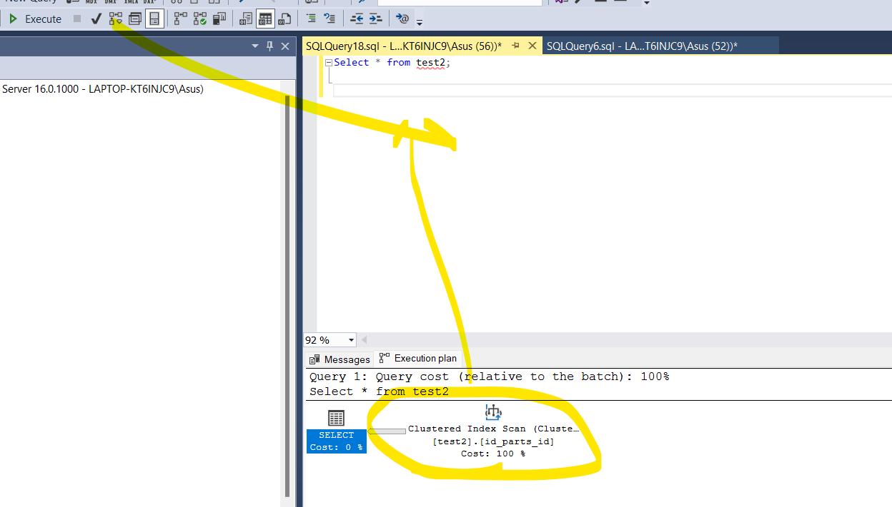
- Ye use kar raha hai Clustered scan
- Optimizer check karta hai, yadi table k upar koyi index laga hai, tab usse Optimizer use karta hai.
### for index seek
##### ab yadi hum koyi condition lagate hai & check Execution plan

- AAp koyi condition laga rahe hai, tab aap apne result ko narrow/filter kar rahe hai
- aur apne us col par index laga rakha hai, is case mein index seek use honnga.
### Diff
#### Index Scan
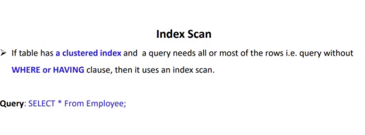
- aapne having aur where clause use nhi kiya, aur index lagaya hua hai
- tab aap index scan use kar rahe hai


#### Index Seek

- vice vera is seek


### Dif

- agar table ka data 90,100% lana hai tab use Index scan/table scan
- limited data lana hai,tab index seek
- yadi table ke upar index laga rakha hai, tab index scan vice versa table scan
- table scan se fast index scan aur index scan se fast index seek.
# 44. Sql query: Pivot/Convert data from row to column


### Practical
```sql
use MyDatabase1;

Create table Sales
(
	id Int,
	Year Int,
	product Varchar(100),
	sales int
)

Insert Into Sales Values(1,2021,'Pen',89);
Insert Into Sales Values(3,2022,'Pen',88);
Insert Into Sales Values(3,2022,'Pencil',67);
Insert Into Sales Values(4,2021,'Mouse',68);
Insert Into Sales Values(5,2020,'CPU',65);
Insert Into Sales Values(6,2022,'CPU',78);
Insert Into Sales Values(7,2021,'Pencil',76);
Insert Into Sales Values(8,2022,'Mouse',56);
Insert Into Sales Values(9,2022,'CPU',78);
Insert Into Sales Values(10,2021,'Pen',100);
Insert Into Sales Values(11,2020,'Pen',11);
Insert Into Sales Values(12,2020,'Pencil',90);
Insert Into Sales Values(13,2021,'Pen',89);
Insert Into Sales Values(14,2022,'Pen',88);
Insert Into Sales Values(15,2022,'Pencil',67);
Insert Into Sales Values(16,2021,'Mouse',68);
Insert Into Sales Values(17,2020,'CPU',65);
Insert Into Sales Values(18,2022,'CPU',78);
Insert Into Sales Values(19,2023,'Pencil',76);
Insert Into Sales Values(20,2022,'Mouse',56);
Insert Into Sales Values(21,2022,'CPU',78);

select * from Sales;
/*
id	year	prod	sales
1	2021	Pen		89
3	2022	Pen		88
3	2022	Pencil	67
4	2021	Mouse	68
5	2020	CPU		65
6	2022	CPU		78
7	2021	Pencil	76
8	2022	Mouse	56
9	2022	CPU		78
10	2021	Pen		100
11	2020	Pen		11
12	2020	Pencil	90
13	2021	Pen		89
14	2022	Pen		88
15	2022	Pencil	67
16	2021	Mouse	68
17	2020	CPU		65
18	2022	CPU		78
19	2023	Pencil	76
20	2022	Mouse	56
21	2022	CPU		78
*/

Select * from Sales order by Year,product;
/*
5	2020	CPU		65
17	2020	CPU		65
11	2020	Pen		11
12	2020	Pencil	90

16	2021	Mouse	68
4	2021	Mouse	68
1	2021	Pen		89
10	2021	Pen		100
13	2021	Pen		89
7	2021	Pencil	76

9	2022	CPU		78
6	2022	CPU		78
18	2022	CPU		78
21	2022	CPU		78
20	2022	Mouse	56
8	2022	Mouse	56
3	2022	Pen		88
14	2022	Pen		88
15	2022	Pencil	67
3	2022	Pencil	67

19	2023	Pencil	76

Target: Hume reporting karni hai
 year mein total sales kitni hue hai
	2020 mein CPU ki total sales kitni

For this use concept of Pivot
*/
```
### Explore
```sql

Select * from Sales
Pivot(
		Sum([sales])   -- aggregate function (sales ke upar aggrgate karna hai)
		For [product]   -- Product hamara pivot col hai
		             -- is column ke base par hamara row column mein convert honga.
		In(
			[Pen],           -- this are products
			[Pencil],
			[Mouse],
			[CPU]
		)
	) As PivotTable    -- temprary ResultSet
/*
id Year    Pen     Pencil  Mouse    CPU
5	2020	NULL	NULL	NULL	65
11	2020	11		NULL	NULL	NULL
12	2020	NULL	90		NULL	NULL
17	2020	NULL	NULL	NULL	65

1	2021	89		NULL	NULL	NULL
4	2021	NULL	NULL	68		NULL
7	2021	NULL	76		NULL	NULL
10	2021	100		NULL	NULL	NULL
13	2021	89		NULL	NULL	NULL
16	2021	NULL	NULL	68		NULL

3	2022	88		67		NULL	NULL
6	2022	NULL	NULL	NULL	78
8	2022	NULL	NULL	56		NULL
9	2022	NULL	NULL	NULL	78
14	2022	88		NULL	NULL	NULL
15	2022	NULL	67		NULL	NULL
18	2022	NULL	NULL	NULL	78
20	2022	NULL	NULL	56		NULL
21	2022	NULL	NULL	NULL	78

19	2023	NULL	76		NULL	NULL

Observation:
  Jiasa socha tha viase result nhi aa raha
kyu
  kyuki iske andar id hai
  id unique hai har row ke andar
   karke har row ka ek group ban raha hai.

So you have to use derived table syntax for Pivot.
Derived basically wo col nikal kar denga
  jiske sath khelna hai
 Basically derived table apni outer query ko 
	result set lakar deta jiki usse jarurat hai.
Aur hum reporting result set par hi bana rhe hai.
*/
```
### Using derived sytax
```sql
Select * from 
(Select year,product,sales from Sales) ResultSet  -- ye resultSet outer query ko jake fhir pivot chalbe
Pivot(
		Sum([sales])   
		For [product]  		            
		In(
			[Pen],          
			[Pencil],
			[Mouse],
			[CPU]
		)
	) As PivotTable    
/*
Year  Pen     Pencil Mouse CPU
2020	11		90	NULL	130
2021	278		76	136		NULL
2022	176		134	112		312
2023	NULL	76	NULL	NULL
*/

-- Yai hum column name change kar de
Select * from 
(Select year,product,sales from Sales) ResultSet  -- ye resultSet outer query ko jake fhir pivot chalbe
Pivot(
		Sum([sales])   
		For [product]  		            
		In(
			[Penis],          
			[Pencil]			
		)
	) As PivotTable    
/*
Year  Penis   Pencil
2020	NULL	90
2021	NULL	76
2022	NULL	134
2023	NULL	76

col Penis ke andar apko null mila
  Make sure col ke name col value se match karne ko hona
*/
```

#### year aur product ke hisab se grouping ho rahi hai.
### Dynamic Pivot Table
- product remove ya add hota hia, tab aapko query ke andar change marna honga
- since col name sare hardcoded hai.
```sql

Create Proc TestPivot
@PivtCol Varchar(100),
@PivtColList Varchar(200)
As 
 Begin
	Declare @Qry Varchar(4000);
	Set @Qry = 'Select * from 
			  (Select year,product,sales from Sales) ResultSet  
			  Pivot(
				Sum([sales])   
				For ['+ @PivtCol +']  		            
				In('+@PivtColList+')
				) As PivotTable'
 End
 Exec(@Qry) 

 --drop proc TestPivot

TestPivot @PivtCol='product',@PivtColList='Pen'
/*
2020	11
2021	278
2022	176
2023	NULL
*/

TestPivot @PivtCol='product',@PivtColList='Pen,Pencil'
/*
2020	11		90
2021	278		76
2022	176		134
2023	NULL	76
*/
```
### Unpivot table
- Unpivot table aapka reverse hota hai, jo ki aapke columns ko row mein convert karta hai.
```sql
use MyDatabase1;

--Let's create temprary table
Declare  @Ptab  table    -- Here Declare temprary table
(
	[Year] int,
	Pen Varchar(100),
	Pencil Varchar(100),
	CPU Varchar(100),
	Mouse Varchar(100)
)
Insert Into @Ptab
 Select * from
  (Select YEAR,product,sales from Sales) ResultSet
 Pivot(
		Sum([sales])
		For [product]
		IN(
			[Pen],
			[Pencil],
			[CPU],
			[Mouse]
		)
	) as PivotTable

Select * from @Ptab 
UNPIVOT
(
	Sales For Name IN(Pen,Pencil,CPU,Mouse)
)As Tab2

/*
Year  Sales Name
2020	11	Pen
2020	90	Pencil
2020	130	CPU

2021	278	Pen
2021	76	Pencil
2021	136	Mouse

2022	176	Pen
2022	134	Pencil
2022	312	CPU
2022	112	Mouse

2023	76	Pencil

ek particular year mein,
  particular product
   ka sales kitna hua tha.. 
basically columns ko row mein convert kiya
*/
```
# 45. Sql Sequence


### Practical
```sql
use MyDatabase1;

/*
	Suppose School hai
	 usme multiple classes hai
	  jisme hume student ki entry karni hai
*/
Create table Class_A
(
	RollNo Int Identity(1,1),    -- autoincrement, explicitly insert nhi kar sakte.
	Enrollment_No Int Not Null,
	FName Varchar(100)
)

Create table Class_B
(
	RollNo Int Identity(1,1),
	Enrollment_No Int Not Null,
	FName Varchar(100)
)

Insert Into Class_A(Enrollment_No,FName) Values(1000,'Tina');
Insert Into Class_B(Enrollment_No,FName) Values(1000,'Sion');

Select * from Class_A;
--1	1000	Tina

Select * from Class_B;
-- 1	1000	Sion

/*
Observation :
  Alag alag class mien roll no same ho sakte hai.

  But,
  Enrollment number aapka pure school mein unique hota hia

  Enrollment number yadi generate karte hai identity col se
   so usko dusri table ke sath share nahi kar sakte
*/
```
### Solution via Sequence

```sql

Create sequence enrol_seq
Start With 1000
Increment By 1
Minvalue 1000
Maxvalue 1005
Cycle

Truncate Table Class_A;
Truncate Table Class_B;

Insert Into Class_A(Enrollment_No,FName) Values(Next Value FOR enrol_seq,'Tina');
Insert Into Class_B(Enrollment_No,FName) Values(Next Value FOR enrol_seq,'Sion');

Select * from Class_A;
--1	1000	Tina

Select * from Class_B;
--1	1001	Sion

-- If u execute multiple times
Insert Into Class_A(Enrollment_No,FName) Values(Next Value FOR enrol_seq,'A');
Insert Into Class_B(Enrollment_No,FName) Values(Next Value FOR enrol_seq,'B');
Insert Into Class_A(Enrollment_No,FName) Values(Next Value FOR enrol_seq,'C');
Insert Into Class_B(Enrollment_No,FName) Values(Next Value FOR enrol_seq,'D');
Insert Into Class_A(Enrollment_No,FName) Values(Next Value FOR enrol_seq,'E');
Insert Into Class_B(Enrollment_No,FName) Values(Next Value FOR enrol_seq,'F');
Insert Into Class_A(Enrollment_No,FName) Values(Next Value FOR enrol_seq,'G');
Insert Into Class_B(Enrollment_No,FName) Values(Next Value FOR enrol_seq,'H');
/*
For Class A
1	1000	Tina
2	1002	A
3	1004	C
4	1000	E
5	1002	G

For Calss B
1	1001	Sion
2	1003	B
3	1005	D
4	1001	F
5	1003	H

cycle hone ke wajah se enrollment number reapeat ho rahe hai
*/
```
### Explore
```sql
Create sequence enrol_seq2
Start With 1000
Increment By 1
Minvalue 1000
Maxvalue 10000
NO Cycle

Truncate Table Class_A;
Truncate Table Class_B;

Insert Into Class_A(Enrollment_No,FName) Values(Next Value FOR enrol_seq2,'Tina');
Insert Into Class_B(Enrollment_No,FName) Values(Next Value FOR enrol_seq2,'Sion');
Insert Into Class_A(Enrollment_No,FName) Values(Next Value FOR enrol_seq2,'A');
Insert Into Class_B(Enrollment_No,FName) Values(Next Value FOR enrol_seq2,'B');
Insert Into Class_A(Enrollment_No,FName) Values(Next Value FOR enrol_seq2,'C');
Insert Into Class_B(Enrollment_No,FName) Values(Next Value FOR enrol_seq2,'D');
Insert Into Class_A(Enrollment_No,FName) Values(Next Value FOR enrol_seq2,'E');
Insert Into Class_B(Enrollment_No,FName) Values(Next Value FOR enrol_seq2,'F');
Insert Into Class_A(Enrollment_No,FName) Values(Next Value FOR enrol_seq2,'G');
Insert Into Class_B(Enrollment_No,FName) Values(Next Value FOR enrol_seq2,'H');

Select * from Class_A;
Select * from Class_B;
/*
For class A
1	1000	Tina
2	1002	A
3	1004	C
4	1006	E
5	1008	G

For class B
1	1001	Sion
2	1003	B
3	1005	D
4	1007	F
5	1009	H
*/
```
 # 46. Dynamic Sql


 ### Practical
 ```sql
 use MyDatabase1;

Create Table empAcct
(
	empId Int,
	empName Varchar(100),
	deptId Varchar(50),
	salary Int,
	joinYear Int
)

Insert Into empAcct Values(1001,'John','Acct',3000,2021);
Insert Into empAcct Values(1002,'Smith','Acct',4000,2020);
Insert Into empAcct Values(1003,'King','Acct',6000,2019);
Insert Into empAcct Values(1004,'Milia','Acct',5500,2021);
Insert Into empAcct Values(1005,'Linda','Acct',5500,2022);
Insert Into empAcct Values(1006,'Tony','Acct',5500,1990);
Insert Into empAcct Values(1007,'Joshep','Acct',7800,2020);
Insert Into empAcct Values(1009,'Alice','Acct',2100,2021);

Create Table empHr
(
	empId Int,
	empName Varchar(100),
	deptId Varchar(50),
	salary Int,
	joinYear Int
)

Insert Into empHr Values(1001,'John','HR',3000,2021);
Insert Into empHr Values(1002,'Smith','HR',4000,2020);
Insert Into empHr Values(1003,'King','HR',6000,2019);
Insert Into empHr Values(1004,'Milia','HR',5500,2021);
Insert Into empHr Values(1005,'Linda','HR',5500,2022);
Insert Into empHr Values(1006,'Tony','HR',5500,1990);
Insert Into empHr Values(1007,'Joshep','HR',7800,2020);
Insert Into empHr Values(1009,'Alice','HR',2100,2021);

Create Table empSales
(
	empId Int,
	empName Varchar(100),
	deptId Varchar(50),
	salary Int,
	joinYear Int
)

Insert Into empSales Values(1001,'John','Sales',3000,2021);
Insert Into empSales Values(1002,'Smith','Sales',4000,2020);
Insert Into empSales Values(1003,'King','Sales',6000,2019);
Insert Into empSales Values(1004,'Milia','Sales',5500,2021);
Insert Into empSales Values(1005,'Linda','Sales',5500,2022);
Insert Into empSales Values(1006,'Tony','Sales',5500,1990);
Insert Into empSales Values(1007,'Joshep','Sales',7800,2020);
Insert Into empSales Values(1009,'Alice','Sales',2100,2021);

select * from empAcct;
/*
1001	John	Acct	3000	2021
1002	Smith	Acct	4000	2020
1003	King	Acct	6000	2019
1004	Milia	Acct	5500	2021
1005	Linda	Acct	5500	2022
1006	Tony	Acct	5500	1990
1007	Joshep	Acct	7800	2020
1009	Alice	Acct	2100	2021
*/
select * from empHr;
/*
1001	John	HR	3000	2021
1002	Smith	HR	4000	2020
1003	King	HR	6000	2019
1004	Milia	HR	5500	2021
1005	Linda	HR	5500	2022
1006	Tony	HR	5500	1990
1007	Joshep	HR	7800	2020
1009	Alice	HR	2100	2021
*/
select * from empSales;
/*
1001	John	Sales	3000	2021
1002	Smith	Sales	4000	2020
1003	King	Sales	6000	2019
1004	Milia	Sales	5500	2021
1005	Linda	Sales	5500	2022
1006	Tony	Sales	5500	1990
1007	Joshep	Sales	7800	2020
1009	Alice	Sales	2100	2021

Target:
Hume ek aise query design karni hai
 jisse hum apni requirement ke hisab se 
  kisi bhi table ka data fetch kar saku.
*/

Use MyDatabase1
Go
Declare @table varchar(100)      --declare variables
Declare @ColList Varchar(100)
Declare @Query Varchar(400)
Set @table='empAcct';                  -- Yaha humne assign kiya empAcct
set @ColList='empId,empName,deptId,salary,joinYear';
Set @Query= CONCAT('Select ',@ColList,' from ',@table);
Print @Query
Exec (@Query)
--Execute (@Query)
/*
Result:
1001	John	Acct	3000	2021
1002	Smith	Acct	4000	2020
1003	King	Acct	6000	2019
1004	Milia	Acct	5500	2021
1005	Linda	Acct	5500	2022
1006	Tony	Acct	5500	1990
1007	Joshep	Acct	7800	2020
1009	Alice	Acct	2100	2021

Message
Select empId,empName,deptId,salary,joinYear from empAcct
*/

Use MyDatabase1
Go
Declare @table varchar(100)     
Declare @ColList Varchar(100)
Declare @Query Varchar(400)
Set @table='empHr';                 
set @ColList='empId,empName,deptId,salary,joinYear';
Set @Query= CONCAT('Select ',@ColList,' from ',@table);
Print @Query
Exec (@Query)
/*
Result:
1001	John	HR	3000	2021
1002	Smith	HR	4000	2020
1003	King	HR	6000	2019
1004	Milia	HR	5500	2021
1005	Linda	HR	5500	2022
1006	Tony	HR	5500	1990
1007	Joshep	HR	7800	2020
1009	Alice	HR	2100	2021

Message:
Select empId,empName,deptId,salary,joinYear from empHr

Hum requirement apni kam bhi kar sakte hai
*/
Use MyDatabase1
Go
Declare @table varchar(100)     
Declare @ColList Varchar(100)
Declare @Query Varchar(400)
Set @table='empHr';                 
set @ColList='empId,empName,deptId';
Set @Query= CONCAT('Select ',@ColList,' from ',@table);
Print @Query
Exec (@Query)
/*
Result:
1001	John	HR
1002	Smith	HR
1003	King	HR
1004	Milia	HR
1005	Linda	HR
1006	Tony	HR
1007	Joshep	HR
1009	Alice	HR

Message:
Select empId,empName,deptId from empHr
*/
```
### More Explore- Create Stored Procedure
```sql
Use MyDatabase1
Go
Create Proc Test3
 @table varchar(100),         -- Observation: Procedure mein variables ko declare nhi karte. Cross check
 @ColList Varchar(100)              -- comma se separate karte hai
	/*Oh, Basically ye 2 paramaeter hai is Test1 procedure ke
	   mane jab bhi aap Test1 proc call karonge
	     so aapko ye 2 parameter bhi dene honge.*/			
As
 Begin
	Declare @Query Varchar(400)     -- block ke andar declare karna padta
	Set @Query= CONCAT('Select ',@ColList,' from ',@table);
	Print @Query
	Exec (@Query)
 End


-- Calling procedure
Test3 @table='empAcct',@ColList='empId,empName,deptId,joinYear,salary';
/*
Result:
1001	John	Acct	2021	3000
1002	Smith	Acct	2020	4000
1003	King	Acct	2019	6000
1004	Milia	Acct	2021	5500
1005	Linda	Acct	2022	5500
1006	Tony	Acct	1990	5500
1007	Joshep	Acct	2020	7800
1009	Alice	Acct	2021	2100

Message:
Select empId,empName,deptId,joinYear,salary from empAcct
*/

Test3 @table='empHr',@ColList='empId,empName,deptId';
/*
Result:
1001	John	HR
1002	Smith	HR
1003	King	HR
1004	Milia	HR
1005	Linda	HR
1006	Tony	HR
1007	Joshep	HR
1009	Alice	HR

Message:
Select empId,empName,deptId from empHr
*/


Test3 @table='empSales',@ColList='empId,deptId,empName,salary,joinYear';
/*
Result:
1001	Sales	John	3000	2021
1002	Sales	Smith	4000	2020
1003	Sales	King	6000	2019
1004	Sales	Milia	5500	2021
1005	Sales	Linda	5500	2022
1006	Sales	Tony	5500	1990
1007	Sales	Joshep	7800	2020
1009	Sales	Alice	2100	2021

Message:
Select empId,deptId,empName,salary,joinYear from empSales
*/
```
### Some more modifications:
```sql
Use MyDatabase1
Go
Alter Proc Test3
 @table varchar(100),         
 @ColList Varchar(100),   
 @Ename Varchar(100)
As
 Begin
	Declare @Query Varchar(400)    
	Set @Query= CONCAT('Select ',@ColList,' from ',@table,' where empName=',@Ename);
	Print @Query
	Exec (@Query)
 End

Test3 @table='empSales',@ColList='empId,deptId,empName,salary,joinYear',@Ename='John';
/*
Result:
	 Invalid column name 'John'.  -->Yaha Error aa gya

Message:
Select empId,deptId,empName,salary,joinYear from empSales where empName=John

Kyuki John ye single quote mein nhi hai.
*/

--Add 4 single quote
Use MyDatabase1
Go
Alter Proc Test3
 @table varchar(100),         
 @ColList Varchar(100),   
 @Ename Varchar(100)
As
 Begin
	Declare @Query Varchar(400)    
	Set @Query= CONCAT('Select ',@ColList,' from ',@table,' where empName=',''''+@Ename+'''');
	Print @Query
	Exec (@Query)
 End

Test3 @table='empSales',@ColList='empId,deptId,empName,salary,joinYear',@Ename='John';
/*
Result:
1001	Sales	John	3000	2021

Message:
Select empId,deptId,empName,salary,joinYear from empSales where empName='John'
*/
```
### Adressing Multiple quote problem
```sql

Use MyDatabase1
Go
Alter Proc Test3
 @table varchar(100),         
 @ColList Varchar(100),   
 @Ename Varchar(100)
As
 Begin
	Declare @Query NVarchar(400)    
	Set @Query= CONCAT('Select ',@ColList,' from ',@table,' where empName=@empName');
	Print @Query
	
	Exec sp_executesql @Query,N'@empName Varchar(100)',@empName=@Ename
	/* 
	sp_executesql:
	Ye aapka ek extended procedure hai
	     Iske andar aap parameter ko define kar sakte
		  ye map kar denga parameter ko query-parameter ke sath*..		   
	
	Exec command mein ye possible nhi tha,
	 hum waha concat use kar rahe the

	 Yadi hum chate hai, ki query ke andar hi  parameter ko defined karke
		 usse map kar diya jave..
		  so use sp_executesql stored procedure

	Exec sp_executesql @Query,N'@empName Varchar(100)',Parmeter mein value assign karna
	*/
 End


 Test3 @table='empSales',@ColList='empId,deptId,empName,salary,joinYear',@Ename='John';
 /*
 Result:
 1001	Sales	John	3000	2021

 message:
 Select empId,deptId,empName,salary,joinYear from empSales where empName=@empName
 */
 ```
 # 47. Find nth highest salary.


 ### Practical
 ```sql
 use MyDatabase1
Go
Create Table employee
(
	empId Int,
	salary Int
)

Insert Into employee Values(1, 3000);
Insert Into employee Values(2, 2345);
Insert Into employee Values(3, 7666);
Insert Into employee Values(4, 3000);
Insert Into employee Values(5, 7666);
Insert Into employee Values(6, 5000);
Insert Into employee Values(7, 6000);

Select * from employee;
/*
Result:
1	3000
2	2345
3	7666
4	3000
5	7666
6	5000
7	6000

Target:
	Ab yadi hum highest salary ko top par lana chahte hai..
	 use concept of order by  with desending
*/
Select * from employee order by salary desc;
/*
3	7666
5	7666
7	6000
6	5000
4	3000
1	3000
2	2345

Target : 
   Same via Max function
    ye maximum value retrun karta hai
*/
Select MAX(salary) from employee;
--7666

--via Top
Select Top 1 * from employee order by salary desc;
/*
3	7666
*/
```
## Using Advance function, find highest sal
### Via Subquery

- subquery ko inner query,nested query or child query bhi kehte hai
	- main query ke body ke andar dusri query hoti hai jise inner query bhi kehte hai.
	- child query ye paranthesis mein likhi jati hai.
```sql
/*
	Using - Subquery
	Find the 2nd highest salary 
*/

Select MAX(salary) from employee where salary 
  < (Select MAX(salary) from employee);
 /*
 6000

 Cross check is this 2nd highest salary
 */
 Select * from Employee order by salary desc;
 /*
 3	7666
5	7666
7	6000
6	5000
4	3000
1	3000
2	2345

Target :
	To find 3rd highest salary.
 */

 Select MAX(salary) from employee where salary 
  < (Select MAX(salary) from employee  where salary
   < (Select MAX(salary) from employee));
-- 5000
```
### Via Set operator

- hum except operator ko use karke db se ek subset create kar sakte.
- Humne Max salary alag kar diya result set se, aur ek salary ka set mil gya
	- bus wahi se max salary fetch kar di wo ho gyi 2nd highest salary
```sql
/*
	2nd highest salary  via set operator in sub query
*/
Select Max(salary) from employee where salary In
	(Select salary from employee EXCEPT 
							Select Max(salary) from employee);	
/*
6000

Except operator ye main dataset se ek subset aapka create kar devenga.
Cross check
*/
Select * from Employee order by salary desc;
/*
3	7666
5	7666
7	6000
6	5000
4	3000
1	3000
2	2345
*/
```
### via correlated subquery

- Main query mein aapki 10 rows hai, aur usse  1 value pass hoti hai subquery mein
- to subquery usko 10 time process karengi
- phir 2nd value pass hue main query se, again subquery process them 10 times.


```sql
/*
	2nd highest salary using correlated subquery
*/

Select salary from employee pq where 2=
  (select count(Distinct salary) from Employee cq 
		where pq.salary <= cq.salary);
/*
6000
*/
```


### via CTE and dense rank function

- CTE mein dense function ke through aap kisi bhi position ki salary nikal sakte.
- read slide
```sql
/*
	3rd highest salary via CTE
*/
With ctResult 
As
(
	Select empId,Salary,Dense_Rank() Over (Order by salary desc) As SalaryRank
	 from employee
)
Select Top 1 empId,salary from ctResult where SalaryRank= 3;
--6	5000

-- Requrie 2nd highest salary
With ctResult 
As
(
	Select empId,Salary,Dense_Rank() Over (Order by salary desc) As SalaryRank
	 from employee
)
Select Top 1 empId,salary from ctResult where SalaryRank= 2;
--7	6000

Select empId,Salary,Dense_Rank() Over (Order by salary desc) As SalaryRank
	 from employee
/*
Id sal    SalaryRank
3	7666	1
5	7666	1
7	6000	2
6	5000	3
4	3000	4
1	3000	4
2	2345	5

	Dense_Rank() function har row ko rank deta hai
	 but ye data partition i.e group par kam karta hai
	 Over ke sath kam karta hai
	  Over(order by sal)

	  Mane salary ka group banake usse descending order mein arrange kar
	   rahe and then uspar rank laga rahe hai
*/
```
# 49. Sql Server Profile.
### What is sql profiler?

- ye db ki har activity ko trace/record karta hai
- aapki query ko bahut dhire chal rahi hai, ya db mein kahi lock aa gya hai.. us case mein aap isse istemal kar sakte
### when to use ?

- Advisible Not to use sql profiler always, kyuki memory bahut leta hai
### Points to remember

- isko remote server par run kariye
### Practical

#### Trace properties

- jab save file par click kiya


- ab db mein jake query ko fire karta hu


- ab suppose hum isse stop karte hai & file me check karte hai

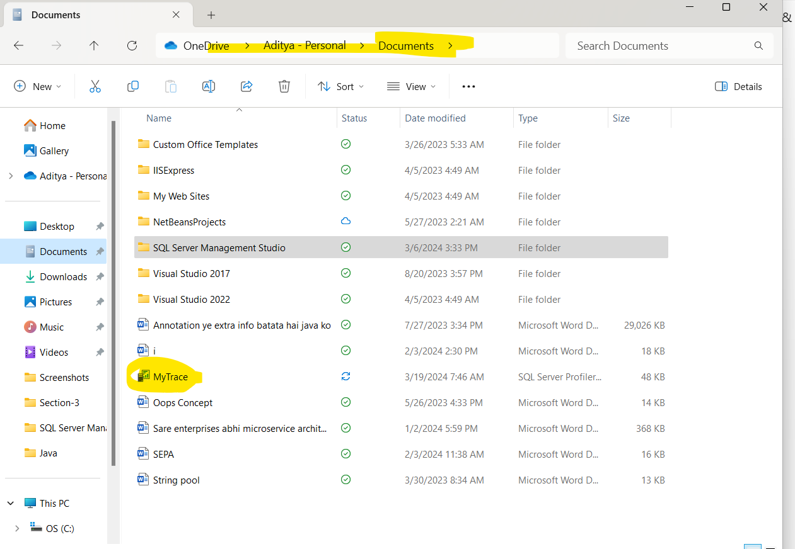
- Right clk and Open to profiler mein khul gyai
- Humen table mein bhi data save kiya tha.Ab table data check karte hai.
##### Go to MyDatabase -> tabel -> MyTrace

- so ye pura structure profile ne create kiya.
### Now about template
- Template aapka ek group hota hai, jisme predefined event classes aur column hote hai;
	- later on aap unko modify kar sakte hai.
- Go to event selection 


### Create a new template
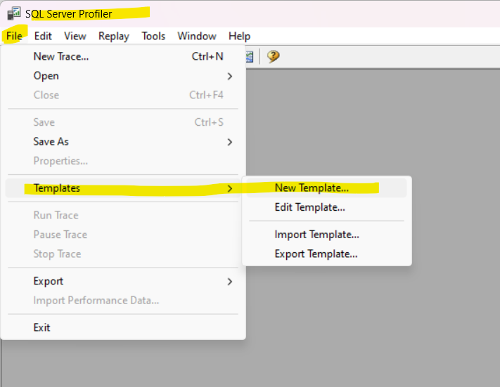
- is tarh se aap apna template create kar saakte.
### About Event Selection

- Template ke andar event classes hoti hai and col hote hai.
- jab bhi koyi event hoti hai, like procedure call etc. tab wo trace hoti hai.
- RPC completed - Remote procedure call completed.
- More than 150 events are there
- Multiple T-SQL as a batch execute karenga.
- Audit login ==> User login info
### About column

- Event classes ki info ye cols ke format mein aati hai.
- Aapne query fire kari, event hua to usme data kya tha, ye TextData col specify karta.
- Jisne procedure ko execute kiya, uska login name ye login_name col info provide karta.
- read slide
- More than 60 data columns 


- ye query chalayi and trace check kiya


### Next Target: Hume keval MyDatabase ke upar ki activity monitor karni hai na ki other db.
- so apply filter for that


- Now fire query


### Hume keval particular Table ko trace karna hai.
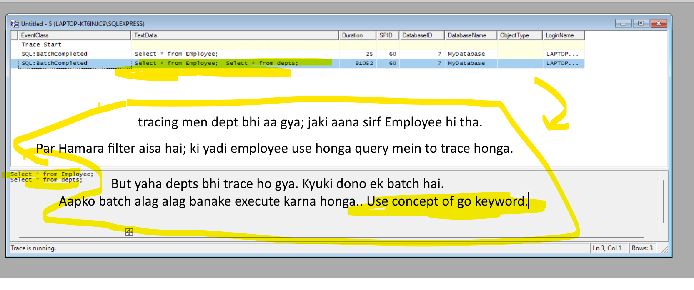
### Duration of query
- apki query kitna samay le rahi hai.


- Hume keval us query ko trace karna hai jiska duration 3k milliseconds se jayada ho.


### Duration of qeury

# 50. Sql database schema

### What is sql dbo user?
- Jab bhi aap First time db create karte,
	- so by defualt uska User create hota hia
	- plus (+) schma bhi create hota hai.
	- uska name hota hai dbo(database owner)
	- It has all privelage
	- it has role of system admin
	- It acts as a permanant user, mane aap isko delete nhi kar sakte.
	- aap khud se user bana sakte hai and usko delete bhi kar sakte hai.

### Practical: Jab bhi aap database create karte ho; to by default uska User  dbo aur uska schema i.e dbo create hota hai

- jab bhi naya db create karte hai to same name se i.e dbo se uska user aur scheama create hote hai.
- Aur jab bhi aap database object eg table,view etc ye sab schema ke andar store hote hai.
- Schema also called as db collection object.
- Schema ka owner hota hai dbo.
- aap yadi dusri schema nhi create karte hai, to by defualt dbo schema aapke sare objects ko hold karti hai.
```sql

Create Database DemoSchema;

/*
 Apke db mein kon konsi schema hai.
*/
Select s.name As Schema_Name, u.name As Schema_Owner
 from sys.schemas s 
       Inner Join
	  sys.sysusers  u  on u.uid = s.principal_id  
	    order by s.name;
/*
Schema_Name          Schama_Owner

db_accessadmin		db_accessadmin
db_backupoperator	db_backupoperator
db_datareader		db_datareader
db_datawriter		db_datawriter
db_ddladmin			db_ddladmin
db_denydatareader	db_denydatareader
db_denydatawriter	db_denydatawriter
db_owner			db_owner
db_securityadmin	db_securityadmin

dbo					dbo

guest				guest
INFORMATION_SCHEMA	INFORMATION_SCHEMA
sys					sys
*/
```


### Hum diff schema kyu create kare.
- Create separate logical group i.e Schema, jaise HR, Accounts,Sales. 
	- ab yadi hume Accounts mein data search karna hai, toh different logical group mein search nhi karenga wo.
	- sirf accounts ke group men data search karegna.
	- So our performance will increase.
- database table aap same name se create nhi kar sakte.
	- but diff schema mein same name se table create karte aata
	- eg. PTS.User in SMV 
- Security, yadi sales schema ka data bahut confidential hai, to aap us particular schama par jyada security apply kar sakte.
- Naye user create karke aap usse ye schema alot kar sakte
	- jaise naye user create hua, usko aap sirf account schema dena chahte, aap usse HR aur Sales schema nhi dena chahte
	- so you can map it with new user.
### Practical

- Yadi humne koyi schema use nhi kiya, to by defualt schema honga dbo.
##### Ab yadi hum isi table ko dubara create kare.
```sql
use DemoSchema;
Go
Create Table Emp
(
	Id Int,
	FName Varchar(100)
)

-- Try to create one more time
Create Table Emp
(
	Id Int,
	FName Varchar(100)
)
/*
Error
There is already an object named 'Emp' in the database.
*/
```
##### Observation: Db ke andar same name se dusra object create nhi ho sakta.
### Create a schema 

```sql
Create Schema Account;
Create Table Account.Emp
(
	Id Int,
	FName Varchar(100)
)

Create Schema Sales;
Create Table Sales.Emp
(
	Id Int,
	FName Varchar(100)
)

Create Schema HR;
Create Table HR.Emp
(
	Id Int,
	FName Varchar(100)
)

-- Inserting Values in diff schema
Insert Into Emp Values(1,'dbo defualt Value');
/*
	Yaha hume Emp table ke samne koyi schema name nhi likha
	 so by defualt vo dbo schema mein javenga.
*/
Select * from Emp;
-- 1	dbo defualt Value


Insert Into Account.Emp Values(1,'Account related Value');
Select * from Account.Emp;  -- Also called as fully qualified name Account.Emp
-- 1	Account related Value

Insert Into Sales.Emp Values(1,'Sales related Value');
Select * from Sales.Emp;
-- 1	Sales related Value

Insert Into HR.Emp Values(1,'HR related Value');
Select * from HR.Emp;
-- 1	HR related Value
```
### Humne jo schema create kiye hai Account,Sales etc uska owner kon hai.
- by defualt db ke andar ek hi user hai i.e DBo
	-  so dbo hi unka owner honga by defualt.


#### aap search button par jakar dusre schama ko ye user i.e dbo assign kar sakte hai.(NO Prac for this also not require)
- same for other schemas.
# 51. Sql Blocking Query

```sql
use DemoSchema;

Create Table TableA
(
	Id Int,
	Name NVarchar(50)
)

Insert Into TableA Values(101,'John');
Insert Into TableA Values(102,'Mike');

--Truncate Table TableA
Select * from TableA;
/*
101	John
102	Mike

Target:
  - Ab hume MIke ka jo name hai wo change karna hai.
*/
Begin Transaction
	Update TableA Set Name='Mke Tailor' where Id=102

/*
Message:
 1 row affected

Observation:
 - Abi humne yaha par Nahi Commit kiya
 - or na RollBack
 - Par aapki Transaction open hai i.e beginTransaction.

Yadi hum Naye connection open karke 
  Select * from TableA kare tab kya result aavenga.
*/
```

- aise case mein dusra connection aapke table ko access nhi kar sakta.
- since your transaction is open.
### how to find out block query?
#### via system stored procedure.

####  via execution request
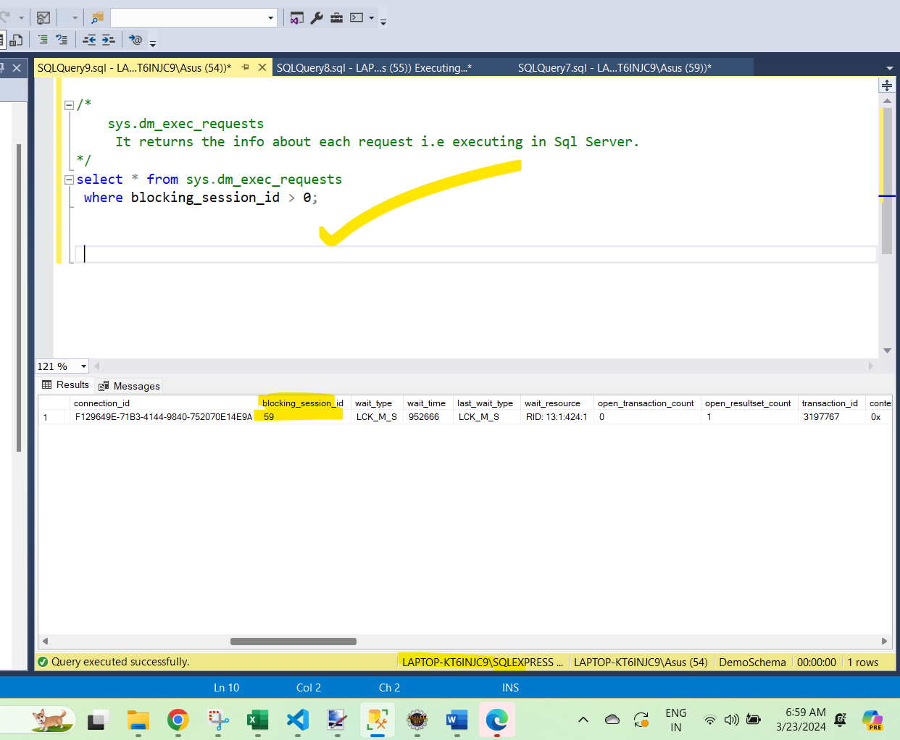
#### via Activity monitor
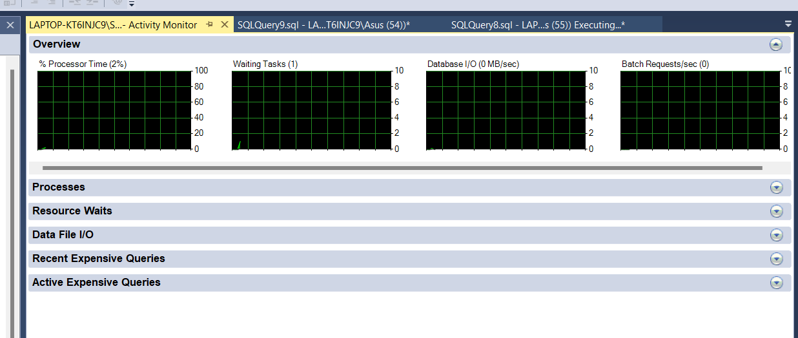
#### via Reports

### How to kill this blocking session.
#### via Activity Monitor

#### via committing the transaction
```sql
use DemoSchema;

Select * from TableA;
/*
101	John
102	Mike
*/

Begin Transaction
 Update TableA set Name='Mike Update' where id=102
Commit

Select * from TableA;
/*
101	John
102	Mike Update
*/
```
***Open  new window and fetch this same transaction***

#### via kill process in new window
```sql

Begin Transaction
 Update TableA set Name='Mike Again Update1' where id=102

Select * from TableA;
/*
101	John
102	Mike Again Update1


Here we are Updating the transaction without committing it
  so when any new window approach this
   it is in blocking state.
*/
```

# 52. Creating Job in sql server.

# 53. How to write complex sql query.

```sql
use DemoSchema;

Create table transactions
(
	trans_id Int,
	userId  Varchar(10),
	trans_date date,
	productId Varchar(100),
	quantity Int
)

Insert Into transactions Values(1,'U1','2021-11-11','Mouse',20);
Insert Into transactions Values(2,'U2','2020-12-16','Keyboard',5);
Insert Into transactions Values(3,'U1','2021-11-11','CPU',8);
Insert Into transactions Values(4,'U4','2020-12-16','Pen',9);
Insert Into transactions Values(5,'U2','2020-12-17','Pencil',8);
Insert Into transactions Values(6,'U2','2020-12-17','Pad',8);
Insert Into transactions Values(7,'U4','2020-12-18','Hard Disk',7);
Insert Into transactions Values(8,'U3','2020-12-19','Software',8);
Insert Into transactions Values(9,'U3','2020-12-19','Stand',10);

Select * from transactions;
/*
1	U1	2021-11-11	Mouse		20
2	U2	2020-12-16	Keyboard	5
3	U1	2021-11-11	CPU			8
4	U4	2020-12-16	Pen			9
5	U2	2020-12-17	Pencil		8
6	U2	2020-12-17	Pad			8
7	U4	2020-12-18	Hard Disk	7
8	U3	2020-12-19	Software	8
9	U3	2020-12-19	Stand		10

Target: 
 Hume un users ki list nikalni hai jinhone multiple days par
   shopping kari hai.
*/
Select COUNT(userId) from transactions
 Having COUNT(Distinct trans_date) > 1;

/*

Hume Unique date nikalni hai  
  user ki 
jisse pata lage ki multiple date ke upar shopping ki hai.
Note: Where clause ke sath aggregate function ko use nhi kar sakte.

Result:
9

Analysis:
  Having clause hamesha group by ke sath chalta hai. 
    mane group ke upar wo count karta hai.
*/
Select COUNT(userId) from transactions
-- 9 

Select COUNT(userId) from transactions
Group by userId
Having COUNT(Distinct trans_date) > 1;
/*
3   -- ek user ne 3 baar shopping kari hai
2    -- ek ne 2 bar
*/

Select userId,COUNT(userId) from transactions
Group by userId
Having COUNT(Distinct trans_date) > 1;
/*
U2	3
U4	2

Target: 
 Hume keval user ka count nikalna hai
  use the concept of derived query
*/

Select COUNT(userId) from 
(
	Select userId from transactions
	Group by userId
	Having COUNT(Distinct trans_date) > 1 -- ye hamare table create karke denga jisme 2 
				 -- row hai and fhir hum 2 row ko count karenge.
)  As DerivedTab
--2
```
# 54. Sql pivot Complex query
 
 ### Practical-Format-1
 ```sql
 use DemoSchema;

Create Table Product
(
	Id Int,
	companyName Varchar(100),
	productName Varchar(100),
	price Int
)

Insert Into Product Values(1,'James','Fridge',897);
Insert Into Product Values(2,'Cosmos','Cabel',200);
Insert Into Product Values(3,'York','CPU',8000);
Insert Into Product Values(4,'Vita','Car',2000);
Insert Into Product Values(5,'Setu','VCD',10000);

Select * from Product;
/*
Id  ComName ProdName Price
1	James	Fridge	897
2	Cosmos	Cabel	200
3	York	CPU		8000
4	Vita	Car		2000
5	Setu	VCD		10000

Target:
  Ye jo ProductName col hai wo hamara row mein convert ho jave.

Hume Pivot table ke andar 
  ek temprary resultSet ko supply karna honga.

*/

Select
	 [companyName],
	 [productName],
	 [price]
	from Product
/*
James	Fridge	897
Cosmos	Cabel	200
York	CPU		8000
Vita	Car		2000
Setu	VCD		10000

Ye temprary result set hum Pivot ko denge
*/

Select * from
(
	Select
	 [companyName],
	 [productName],
	 [price]
	from Product
) As Result
Pivot(
	Sum([price])
	 For [productName]   -- wo col name jise row/col mein convert karna hai
	In (
		[Fridge],
		[Cabel],
		[CPU],
		[Car],
		[VCD]
	)
) As PivotTable
/*
comName	Fridge Cabel	CPU		Car		VCD

Cosmos	NULL	200		NULL	NULL	NULL
James	897		NULL	NULL	NULL	NULL
Setu	NULL	NULL	NULL	NULL	10000
Vita	NULL	NULL	NULL	2000	NULL
York	NULL	NULL	8000	NULL	NULL
*/
```
### Practical -Format-2
```sql
/*
Target:
  Null ki bajaye ek custom value ko display karna hai

Sol Analysis:
  Pivot sirf convert karta row to col 
 So data hamara result set i.e temprary table se hi aa riya hai.
*/
Select companyName,
 Case When Fridge IS Null Then 'NA' else Fridge End As Fridge,
 Cabel,CPU,Car,VCD from
(
	Select
	 [companyName],
	 [productName],
	 [price]
	from Product
) As Result
Pivot(
	Sum([price])
	 For [productName]   
	In (
		[Fridge],
		[Cabel],
		[CPU],
		[Car],
		[VCD]
	)
) As PivotTable
/*
Error
Message
Conversion failed when converting the varchar value 'NA' to data type int.

 kyuki Fridge ki value Int mein aavengi..
  Usee Hume Varchar mein convert karna honga.
*/
Select companyName,
 Case When Fridge IS Null Then 'NA' else Cast(Fridge As varchar(100)) End As Fridge,
 Cabel,CPU,Car,VCD from
(
	Select
	 [companyName],
	 [productName],
	 [price]
	from Product
) As Result
Pivot(
	Sum([price])
	 For [productName]   
	In (
		[Fridge],
		[Cabel],
		[CPU],
		[Car],
		[VCD]
	)
) As PivotTable
/*
Cosmos	NA	200		NULL	NULL	NULL
James	897	NULL	NULL	NULL	NULL
Setu	NA	NULL	NULL	NULL	10000
Vita	NA	NULL	NULL	2000	NULL
York	NA	NULL	8000	NULL	NULL
*/
Select companyName,
 Case When Fridge IS Null Then 'NA' else Cast(Fridge As varchar(100)) End As Fridge,
 Case When Cabel IS Null Then 'NA' else Cast(Cabel As varchar(100)) End As Cabel,
 Case When CPU IS Null Then 'NA' else Cast(CPU As varchar(100)) End As CPU,
 Case When Car IS Null Then 'NA' else Cast(Car As varchar(100)) End As Car,
 Case When VCD IS Null Then 'NA' else Cast(VCD As varchar(100)) End As VCD       from
(
	Select
	 [companyName],
	 [productName],
	 [price]
	from Product
) As Result
Pivot(
	Sum([price])
	 For [productName]   
	In (
		[Fridge],
		[Cabel],
		[CPU],
		[Car],
		[VCD]
	)
) As PivotTable
/*
ComNam Frid Cabe Cpu	Car		VCD
Cosmos	NA	200	NA		NA		NA
James	897	NA	NA		NA		NA
Setu	NA	NA	NA		NA		10000
Vita	NA	NA	NA		2000	NA
York	NA	NA	8000	NA		NA
*/
```
### Practical Format 3
```sql
/*
Target:
  Yadi aapka Price Greter than 500 hai to 10% less ho jave

SA(Solution Analysis):
 Use concept of Nested Case statement
*/
Select companyName,
 Case When Fridge IS Null Then 'NA' else 
	Case When Fridge > 500 Then Cast((Fridge - ((Fridge*10)/100)) As varchar(100)) Else Cast(Fridge As varchar(100)) End
 End As Fridge,
 Case When Cabel IS Null Then 'NA' else  
	Case When Cabel > 500 Then Cast((Cabel - ((Cabel*10)/100)) As varchar(100)) Else Cast(Cabel As varchar(100)) End
 End As Cabel,
 Case When CPU IS Null Then 'NA' else 
  Case When CPU > 500 Then Cast((CPU - ((CPU*10)/100)) As varchar(100)) Else Cast(CPU As varchar(100)) End
 End As CPU,
 Case When Car IS Null Then 'NA' else 
  Case When Car > 500 Then Cast((Car - ((Car*10)/100)) As varchar(100)) Else Cast(Car As varchar(100))  End
 End As Car,
 Case When VCD IS Null Then 'NA' else  
  Case When VCD > 500 Then Cast((VCD - ((VCD*10)/100)) As varchar(100)) Else Cast(VCD As varchar(100))  End
 End As VCD       from
(
	Select
	 [companyName],
	 [productName],
	 [price]
	from Product
) As Result
Pivot(
	Sum([price])
	 For [productName]   
	In (
		[Fridge],
		[Cabel],
		[CPU],
		[Car],
		[VCD]
	)
) As PivotTable
/*
companyName Fridge  Cabel  CPU    Car      VCD
Cosmos		NA		200		NA		NA		NA
James		808		NA		NA		NA		NA
Setu		NA		NA		NA		NA		9000
Vita		NA		NA		NA		1800	NA
York		NA		NA		7200	NA		NA
*/
```
# 55. Diff between Execute And Sp_ExceuteSQl

- Sp_ExecuteSql or Execute ye dono ka same purpose hota hai,
	- kisi bhi query ko run time par construct karke usse run(execute) karna
- Sp_ExecuteSql 
	- isme parameter strongly typed hota hai, to sql execution ki probability nhi hoti hai.
	- 1 execution plan create karta hai, aur usse diff parameter ke liye reuse karta hai.
- Execute
	- isme parameter defined/typed nhi hote, isiliye sql injection ki probability high hoti hai.
	- Har baar naya execution plan create karta, so there will be  diff execution plan for diff parameter.

```sql
use MyDatabase;
select * from Employee1;
/*
empId	 date_of_join			FName  LName	EId		Salary	JoinYe DeptId	CityId
1001	2020-09-24 12:11:30.233	John	Yang	1		3000	2021	1		1
1002	2020-04-11 11:12:35.233	Smith	Ting	2		4000	2020	3		2
1003	2020-03-03 09:11:30.233	King	Amaze	4		6000	2019	2		4
1004	2020-02-22 09:11:30.233	Millia	King	7		5500	2021	5		8
1005	2020-01-15 12:11:30.233	Linda	Reina	4		5500	2022	5		6
1006	2020-05-09 09:11:30.233	Tony	Blele	2		5500	1990	3		4
1007	2020-09-12 12:11:30.233	Joshep	Desuja	5		7800	2020	4		8
1009	2020-09-11 06:11:30.233	Alice	Rocky	6		2100	2021	6		3
1009	2020-09-12 05:11:30.233	Mangu	Desa	6		2200	2022	8		7
1010	2020-09-12 04:11:30.233	David	Kulum	7		1100	2022	2		7
NULL	2020-09-12 06:11:30.233	NULL	NULL	NULL	NULL	NULL	NULL	NULL
*/

-- Run via Execute statement

Declare @Qry As NVarchar(1000)
Set @Qry = 'Select * from Employee1'
Execute(@Qry); -- Execute statement 1 single parameter demand karta hai
               -- jiske andar query assign hai
Print @Qry
/*
Result:
1001	2020-09-24 12:11:30.233	John	Yang	1	3000	2021	1	1
1002	2020-04-11 11:12:35.233	Smith	Ting	2	4000	2020	3	2
1003	2020-03-03 09:11:30.233	King	Amaze	4	6000	2019	2	4
1004	2020-02-22 09:11:30.233	Millia	King	7	5500	2021	5	8
1005	2020-01-15 12:11:30.233	Linda	Reina	4	5500	2022	5	6
1006	2020-05-09 09:11:30.233	Tony	Blele	2	5500	1990	3	4
1007	2020-09-12 12:11:30.233	Joshep	Desuja	5	7800	2020	4	8
1009	2020-09-11 06:11:30.233	Alice	Rocky	6	2100	2021	6	3
1009	2020-09-12 05:11:30.233	Mangu	Desa	6	2200	2022	8	7
1010	2020-09-12 04:11:30.233	David	Kulum	7	1100	2022	2	7
NULL	2020-09-12 06:11:30.233	NULL	NULL	NULL	NULL	NULL	NULL	NULL

Message:
Select * from Employee1
*/
```
### Next Part
```sql
/*
Target :
 Hume isi query mein kisi dynamic data ko search karna hai.
*/
Declare @Qry As NVarchar(1000)
Declare @FName As NVarchar(100)
Set @FName='John'
Set @Qry = 'Select * from Employee1 where First_Name='''+@FName+''''
Execute(@Qry); 
Print @Qry
/*
Result:
1001	2020-09-24 12:11:30.233	John	Yang	1	3000	2021	1	1

Message:
Select * from Employee1 where First_Name='John'
*/
```
### Another one

```sql
/*
 Iss query ke andar serious issue hai 
  usse kehte hai Sql injection 
Mane aap Sql statement inject kar sakte hai
  apne parameter ke andar
*/

Declare @Qry As NVarchar(1000)
Declare @FName As NVarchar(100)
Set @FName='''Drop database db3--';
Set @Qry = 'Select * from Employee1 where First_Name='''+@FName+''''
Execute(@Qry); 
Print @Qry
/*
Result:
Empty row is displayed

Message:
Select * from Employee1 where First_Name=''Drop database db3--' 
  Database drop successfully
*/
```
### Via quote Name -Aap iss possibility ko bhi khatm kar sakte ho.

```sql
/*
	Parameter ki value hum single quote mein bhej sakte hai
	 jisse Sql injection khatam ho javenga

	 QuoteName kya karta hai - jo bhi variable hai
	  usse single quote mein wrap karta hai
*/
Declare @Qry As NVarchar(1000)
Declare @FName As NVarchar(100)
Set @FName='''Drop database db2--';
Set @Qry = 'Select * from Employee1 where First_Name='+QuoteName(@FName,'''')+''
Execute(@Qry); 
Print @Qry
/*
Via quoteName ke wajah se  
   drop database ki command ko vo as a value tread karenga 
    na ki command.

Result:
Empty table will be displayed

Message:
Select * from Employee1 where First_Name='''Drop database db2--'
*/
```
### New Execution plan
```sql
/*
Execute statement:
  Jab bhi parameter ki value change hoti hai
   tab wo ek naya execution plan banata hai
*/
-- 2 then this
Declare @Qry As NVarchar(1000)
Declare @FName As NVarchar(100)
Set @FName='John';
Set @Qry = 'Select * from Employee1 where First_Name='+QuoteName(@FName,'''')+''
Execute(@Qry); 
Print @Qry
--1001	2020-09-24 12:11:30.233	John	Yang	1	3000	2021	1	1

-- 1 run this
--DBCC FREEPROCCACHE 

--3rd this
Select cp.usecounts,cp.cacheobjtype, cp.objtype,st.text,qp.query_plan
 From sys.dm_exec_cached_plans As cp
 Cross Apply sys.dm_exec_sql_text(plan_handle) As st
 Cross Apply sys.dm_exec_query_plan(plan_handle) As qp
Order by cp.usecounts DESC
```

#### Phir se 

- Same name ke liye to same plan use kar lenga(check it out)
- but naye name se naye plan use karenga.
### System procedure Execute sql
```sql
Declare @Qry1 As NVarchar(1000)
Set @Qry1 = 'Select * from Employee1 where First_Name=@FName1'
Execute SP_EXECUTESQL @Qry1,N'@FName1 NVarchar(100)',@FName1='John'; 
Print @Qry1
/*
Result:
1001	2020-09-24 12:11:30.233	John	Yang	1	3000	2021	1	1

Message
Select * from Employee1 where First_Name=@FName1
*/
```
- execution plan chal nhi raha go for image.


- same plan for diff parameter name .
# 56. GUID vs UniqueIdentifier

```sql
use DemoSchema;

Create Table ClassA
(
	RollNO Int Primary Key Identity,
	St_Name Varchar(50)
)

Insert Into ClassA Values('Shane');
Insert Into ClassA Values('Jonny');

Create Table ClassB
(
	RollNO Int Primary Key Identity,
	St_Name Varchar(50)
)

Insert Into ClassB Values('Smith');
Insert Into ClassB Values('Kayla');

select * from ClassA;
/*
1	Shane
2	Jonny
*/

select * from ClassB;
/*
1	Smith
2	Kayla

Observation:
2no table mein aapka rollNo primary hai aur unique bhi

 but hamari requirement aisi hai, 
  ki hame sare student ke table ko merge karna hai 
aur naya table create karna hai.
*/
Select * from ClassA
 UNION ALL				-- ye 2 query ke output ko merge karta hai
Select * from ClassB
/*
1	Shane
2	Jonny
1	Smith
2	Kayla

Problem  :
 RollNO duplicate ho gya.

Solution:
 Concept of GUID
*/

Drop Table ClassA;
Drop Table ClassB;
```
### Via uniqueIdentifier
```sql
Create Table ClassA
(
	--NewID() ek value generate karenga aur hamare datatype par value assign karbo
	RollNO UniqueIdentifier Primary Key Default NewId(),
	St_Name Varchar(50)
)

Insert Into ClassA Values(default,'Shane');
Insert Into ClassA Values(default,'Jonny');

Create Table ClassB
(
	RollNO UniqueIdentifier Primary Key Default NewId(),
	St_Name Varchar(50)
)

Insert Into ClassB Values(default,'Smith');
Insert Into ClassB Values(default,'Kayla');

select * from ClassA;
/*
D9D6ADCD-E92C-48CE-B7B6-5D13F78D1221	Jonny
BE52D935-63D0-4D69-927F-64587E2FA787	Shane
*/
select * from ClassB;
/*
E86A21B7-8481-454F-8018-6BC3359F4C32	Kayla
A5DFB698-C60B-4854-A930-A217B104A832	Smith

Observation:
GuId aapka 32 digits ka hai.

Now Merge it
*/
Select * from ClassA
 UNION ALL				
Select * from ClassB
/*
D9D6ADCD-E92C-48CE-B7B6-5D13F78D1221	Jonny
BE52D935-63D0-4D69-927F-64587E2FA787	Shane
E86A21B7-8481-454F-8018-6BC3359F4C32	Kayla
A5DFB698-C60B-4854-A930-A217B104A832	Smith

Observation:
RollNo hamara unique hai
*/
```
### How it will work?
```sql
Declare @GD UNIQUEIDENTIFIER -- yaha datatype declare kiya but value assign 
Select @GD                     -- nahi kari so value is Null
-- NULL

Declare @GD1 UNIQUEIDENTIFIER 
Set @GD1=NEWID()
Select @GD1  
/*
8A178F7E-1E03-4C11-8C78-7A6098389E53

Isko jitne baar execute karonge har baar nayi value generate hongi.

Target:
 Check Identifier ye Null hota hai ya nahi
*/

Declare @GD2 UNIQUEIDENTIFIER 
If @GD2 Is NULL
 Begin
	Print '@GD2 is null'
 End
Select @GD2 
/*
Result:
NULL

Message:
@GD2 is null

How to create Empty GUID
1) via Hexadecimal value
*/
Declare @GD3 UNIQUEIDENTIFIER
Set @GD3 = 0x0;
Select @GD3
/*
Results:
00000000-0000-0000-0000-000000000000

2) via pattern
*/
Declare @GD4 UNIQUEIDENTIFIER
Set @GD4 = '00000000-0000-0000-0000-000000000000';
Select @GD4
/*
Results:
00000000-0000-0000-0000-000000000000
*/

Declare @GD5 UNIQUEIDENTIFIER
Set @GD5 = 0x0;
if @GD5=0x0
 Begin
    Print @GD5
	Print 'GuID is empty'
 End
Else
 Begin
	Print @GD5
	Print 'GuID is not empty'
 End
/*
00000000-0000-0000-0000-000000000000
GuID is empty
*/
Declare @GD6 UNIQUEIDENTIFIER
Set @GD6 = 0x0;
Set @GD6= NEWID()
if @GD6=0x0
 Begin
    Print @GD6
	Print 'GuID is empty'
 End
Else
 Begin
	Print @GD6
	Print 'GuID is not empty'
 End
/*
69FD35C8-E4BD-4F6E-84FE-0F425EEEAF4A
GuID is not empty
*/
```
# 57. Diff bet Sequnce and Identity

```sql
use DemoSchema;
Create Table Color1
(
	Id Int Primary Key Identity(1,1),
	ColorName Varchar(100)
)

Insert Into  Color1 Values('Red');
Insert Into  Color1 Values('Green');
Insert Into  Color1 Values('Yellow');

Select * from Color1;
/*
ID  ColorName
1	Red
2	Green
3	Yellow

Observation:
 Id ki value autogenerated hai 
  iss identity ki value ko hum dusre table mein share nahi kar sakte
*/

--Sequence
Create Sequence MySeq
As Int
Start With 1
Increment By 1

/*
	Ye jo value generate karenge wo 
	 hum multiple table mein share kar sakte.
*/

Create Table Color2
(
	Id Int,
	ColorName Varchar(100)
)

Insert Into Color2 Values(Next Value FOR MySeq,'Red');

Select * from Color2;
/*
1	Red
 
  ab naye table mein sequence ko try karte
*/

Create Table Color3
(
	Id Int,
	ColorName Varchar(100)
)

Insert Into Color3 Values(Next Value FOR MySeq,'Green');

Select * from Color3;
/*
2	Green
*/

Insert Into Color3 Values(Next Value FOR MySeq,'Blue');
Insert Into Color2 Values(Next Value FOR MySeq,'White');

Select * from Color2;
/*
1	Red
4	White
*/
Select * from Color3;
/*
2	Green
3	Blue

Observation:
 So sequence ki value ko hum multiple table mein 
  Share kar sakte.
Jabki identity col ki value ye table specific
*/
```
### Diff 3
```sql
/*
Diff-3
 The value for the Identity property cannot be reset to 
  it's initial value
  vice-versa for sequence.
*/
Create Sequence MySeq1
As Int
Start With 1
Increment By 1
MINVALUE 1
MAXVALUE 3
CYCLE

Truncate Table Color2;

Select * from Color2; -- empty now

Insert Into Color2 Values(Next Value FOR MySeq1,'Megenta');
Insert Into Color2 Values(Next Value FOR MySeq1,'Red');
Insert Into Color2 Values(Next Value FOR MySeq1,'Blue');
Insert Into Color2 Values(Next Value FOR MySeq1,'White');

Select * from Color2;
/*
1	Megenta
2	Red
3	Blue
1	White

Yaha Cycle ke wajah se
 jab MaxValue 3 hue tab sequence ne Id ko reset kar diya
this facility is not available in Identity
*/
```
# 58. MsSql Server Function | String_Agg

```sql
use DemoSchema;

Create Table Employee
(
	FirstName Varchar(100),
	LastName Varchar(100),
	Mail Varchar(200),
	Country Varchar(50),
	Age Int
)

Insert Into Employee Values('Lawrence','Williams','abc.will@123.com','USA',21);
Insert Into Employee Values('Gilbert','Miller','gil.mill@1gm.com','USA',53);
Insert Into Employee Values('Salvador','Rodridous','sal.rod@123.com','Russia',46);
Insert Into Employee Values('Ernest','Jones','ear.jone@123.com','USA',48);
Insert Into Employee Values('Jerome','Garcia',Null,'Russia',46);

Select * from Employee;
/*
Lawrence	Williams	abc.will@123.com	USA		21
Gilbert		Miller		gil.mill@1gm.com	USA		53
Salvador	Rodridous	sal.rod@123.com		Russia	46
Ernest		Jones		ear.jone@123.com	USA		48
Jerome		Garcia		NULL				Russia	46

Target:
 FirstName ko single value mein display karna hai  
   with Separator
*/
Select STRING_AGG(FirstName,'-') as List 
  from Employee;
 /*
 Results:
 List
 Lawrence-Gilbert-Salvador-Ernest-Jerome

 Target:
  yadi Mail dikhana hai to
 */
 Select STRING_AGG(Mail,'-') as MailList 
  from Employee;
/*
Results:
MailList
abc.will@123.com-gil.mill@1gm.com-sal.rod@123.com-ear.jone@123.com

Target:
 Yadi Mulltiple value ko aggregate karna hai
*/
 Select STRING_AGG(FirstName,'-') as FirstNameList,STRING_AGG(Mail,'-') as MailList 
  from Employee;
/*
Results:
FirstNameList							MailList
Lawrence-Gilbert-Salvador-Ernest-Jerome	abc.will@123.com-gil.mill@1gm.com-sal.rod@123.com-ear.jone@123.com

Target:
 Jo value humne join kari hai 
   usse sorting order mein display karana hai
*/
Select STRING_AGG(FirstName,'_') Within Group(Order by FirstName Asc) As ListNames
 From Employee
/*
ListNames
Ernest_Gilbert_Jerome_Lawrence_Salvador

Pehle grouping hoti hai, fhir order by and then aggregate

Target:
 HUme country wise firstName  ko concat karna hai
*/
Select Country,STRING_AGG(FirstName,'_') Within Group(Order by FirstName Asc) As ListNames
 From Employee
 Group By Country
/*
Results:
Country			ListNames
Russia			Jerome_Salvador
USA				Ernest_Gilbert_Lawrence
*/
```
# 48. Sql Normalization

### So here we use concept of Normalization to reduce this anamoly
```sql
use DemoSchema;

Create Table emp
(
	id Int Not NUll,
	name Varchar(50) Not Null,
	address Varchar(50) Not Null,
	dept Varchar(50) Not Null	
)

Insert Into Emp Values(101,'rick','delhi','sales');
Insert Into Emp Values(101,'rick','delhi','Purchase');
Insert Into Emp Values(102,'Maggie','Agra','Accounts');
Insert Into Emp Values(105,'John','London','IT');
Insert Into Emp Values(105,'John','London','sales');

Select * from Emp;
/*
id  name   address  dept
101	rick	delhi	sales
101	rick	delhi	Purchase
102	Maggie	Agra	Accounts
105	John	London	IT
105	John	London	sales

Target:
 Naye emp ki info add karni par
  but hame nhi pata ki uska dept konsa rahenga
*/
--Insert
Insert Into emp(id,name,address) Values(16,'King','DC');
/*
Message: Error
Cannot insert the value NULL into column 'dept', table 
   'DemoSchema.dbo.emp'; column does not allow nulls. 
INSERT fails.

This is called Insert Anamoly

Target:
  Update it
*/
Update emp set dept='IT' where id=101;
-- 2 row updated
Select * from emp;
/*
101	rick	delhi	IT
101	rick	delhi	IT
102	Maggie	Agra	Accounts
105	John	London	IT
105	John	London	sales

Ideally aapka 1 row update hona chaiye
 but yaha 2 row update ho gye.

This is called Update anamoly.

Target:
 Delte it
*/
Delete emp where id=101;
-- 2 row deleted
Select * from emp;
/*
102	Maggie	Agra	Accounts
105	John	London	IT
105	John	London	sales

1 row delete hona chaiye tha
 2 row delete ho gye

this is called delete anamoly.

We use concept of Normalization
  to remove this anamoly.
*/
```
### Types of normalization

### 1st Normal form

- table ke kisi col mein multiple value nhi honi chaiye.
- atomic bole toh jisko hum furthur divide nhi kar sakte.
	- It should hold only atomic value
	- Mobile No ko hum divide kar sakte hai comma(,) k baad
- Each record should be unique.
	- combination ke basis par bhi unique banta


### 2nd Normal form

- Multiple col ko mila kar jab aap uniqueness maintain karte hai usse kehte hai ***composite key***
- should be satisfied all conditions of 1st normal form
- all non key attribute are dependent on primary key not on composite key.
- ab yadi age nikal ni hai upar ke table se so query chalake(slect age from table where id= sth)
	- to 2 age aa gyi i.e not standard


### Let check table emp

```sql

Insert Into emp1 Values('111','Btech',38);
Insert Into emp1 Values('111','MA',38);
Insert Into emp1 Values('222','MCA',38);
Insert Into emp1 Values('333','MBA',40);
Insert Into emp1 Values('333','MS',40);

select * from emp1;
/*
111	Btech	38
111	MA		38
222	MCA		38
333	MBA		40
333	MS		40

Target:
 Hum MA ko dobara enter karte hai

Insert It
*/
Insert Into emp1 Values('111','MA',38);
/*
Message Error:
Violation of PRIMARY KEY constraint 'PK_emp1'. 
  Cannot insert duplicate key in object 'dbo.emp1'. 
	The duplicate key value is (111, MA).

Target:
 Now modified insert statement
*/
Insert Into emp1 Values('111','MA1',38);
--  1 row inserted

Select * from emp1;
/*
111	Btech	38
111	MA		38
111	MA1		38
222	MCA		38
333	MBA		40
333	MS		40

Problem kaha hai:
 Ab yadi age nikalni hai
*/
select age from emp1 where emp_id=111;
/*
Results:
age
38
38
38

3 rows display ho rahe hai age ke
 This is not the standard
*/
```
### Solutions is

### 3rd Normal form

- It should complete criteria for 1st and 2nd normal form
- Transitive functional dependency
	- City ye Zip par dependent hai(yadi zip ko change karonge to city change ho javengi)
	- aur zip ye emp_id ke upar dependent hai
	- so city indirectly dependent hai emp_id par
	- this indirect depedency called as Transitive functional dependency
- So there should be no transitive functional dependency
### Solution

### BCNF

- Dig explain
	- 1 student multiple subject le sakta hai
	- 1 professor 1 subject padhata hai, aur  1 professor multiple student ko bhi padha sakta hai
	- 1 subject ko multiple professor padha sakte hai.
	- Yaha professor dependent hai subject ke upar(yadi subject change to professor change)
### Solution

### 4rth Normalization

- fullfill all criteria from 1st Normaliztion to BCNF
- It has no multivalue dependency
- Dig explain
	- studentId 21 hai uska course hai computer aur hobbby hai dancing.
	- studentId 21 hai uska course hai math aur hobbby hai singing.
	- course dependent hai studentId par, and hobby bhi depdent hai studentId par
### solution

# 59. 1st Normal form

```sql
use DemoSchema;

Insert Into Emp Values(101,'Rick','Delhi','Sales');
Insert Into Emp Values(101,'Rick','Delhi','Purchase');
Insert Into Emp Values(123,'Maggie','Agra','Accounts');
Insert Into Emp Values(166,'John','Jaipur','Sales');
Insert Into Emp Values(166,'John','Jaipur','Purchase');

Select * from Emp;
/*
id name		address dept
101	Rick	Delhi	Sales
101	Rick	Delhi	Purchase
123	Maggie	Agra	Accounts
166	John	Jaipur	Sales
166	John	Jaipur	Purchase

emp table ke sare col not null hai

Target:
 Hume naye employee ki entry karni hai
   jisme hame employee ka dept nhi pata.
*/
Insert Into Emp(Id,name,address) Values(111,'Jingle','London');
/*
Message Error:
Cannot insert the value NULL into column 'dept', 
 table 'DemoSchema.dbo.emp';
  column does not allow nulls. 
	INSERT fails.

Target:
 Update it
*/
Update Emp set dept='Purchase' where Id=101;
--2 row updated
Select * from Emp;
/*
101	Rick	Delhi	Purchase
101	Rick	Delhi	Purchase
123	Maggie	Agra	Accounts
166	John	Jaipur	Sales
166	John	Jaipur	Purchase

1 row update honi chaiye thi,
 but 2 row update hue

Target:
 Delete it
*/
Delete from Emp where Id=101;
--2 row deleted
Select * from Emp;
/*
123	Maggie	Agra	Accounts
166	John	Jaipur	Sales
166	John	Jaipur	Purchase

This is called anamoly
*/
```
### Types of Normalization

```sql
Alter table Emp
 alter column id  varchar(50) Not NUll;

 Truncate table emp;

Insert Into Emp Values('E013','John','Delhi','Account,Sales');
Insert Into Emp Values('E101','Linda','Delhi','Sales');
Insert Into Emp Values('E102','Simon','Paris','Purchase,IT');

Select * from Emp;
/*
id		name	address dept
E013	John	Delhi	Account,Sales
E101	Linda	Delhi	Sales
E102	Simon	Paris	Purchase,IT

Yaha hamara 1 employee 2 dept mein kaam karta hai

Apply 1st normalization
*/
Delete Emp where Id='E013';
Insert Into Emp Values('E013','John','Delhi','Account');
Insert Into Emp Values('E013','John','Delhi','Sales');

Delete Emp where Id='E102';
Insert Into Emp Values('E102','Simon','Paris','IT');
Insert Into Emp Values('E102','Simon','Paris','Purchase');

Select * from Emp;
/*
id      name    address   dept
E013	John	Delhi	Account
E101	Linda	Delhi	Sales
E102	Simon	Paris	IT
E013	John	Delhi	Sales
E102	Simon	Paris	Purchase

This is the result of 1st Normalization
*/
```
# 60. 2nd Normal form

```sql
use DemoSchema; 

Truncate table emp1;

Insert Into emp1 Values('111','Btech',38);
Insert Into emp1 Values('111','MA',38);
Insert Into emp1 Values('222','MCA',38);
Insert Into emp1 Values('333','MBA',40);
Insert Into emp1 Values('333','MS',40);

Select * from Emp1;
/*
111	Btech	38
111	MA		38
222	MCA		38
333	MBA		40
333	MS		40

Remember In earlier video we create Emp1 table
 with composite key

 Target:
  if if insert same primary key for(id & qualification)
*/
Insert Into emp1 Values('111','MA',34);
/*
Message Error:
Violation of PRIMARY KEY constraint 'PK_emp1'. 
 Cannot insert duplicate key in object 'dbo.emp1'. 
  The duplicate key value is (111, MA).

Insert another combo
*/
Insert Into emp1 Values('111','BBA',34);
--1 row inserted
Select * from Emp1;
/*
111	BBA		34
111	Btech	38
111	MA		38
222	MCA		38
333	MBA		40
333	MS		40

Problem:
 Ab yadi hum age set karte hai
*/
Update emp1 set age=50 where emp_id = 111;
-- 3 row affected
Select * from Emp1;
/*
111	BBA		50
111	Btech	50
111	MA		50
222	MCA		38
333	MBA		40
333	MS		40

3 row update ho gye
  jo ki galat hai
Table ka design galat hai
 non key attribute ye ek hi single primary key par dependent hona chaiye.
*/
```
### Solutions
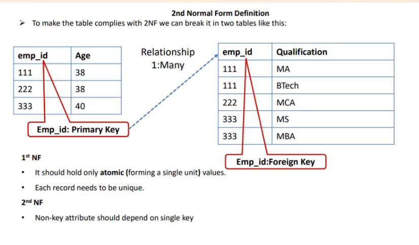
# 61. 3rd Normal form

# 62. BCNF Normal form

#### Remember: Hum jab bhi Advance stage ki aur badhte hai tab Advanced stage previous stage ki sabhi criteria ko fullfill jati hai.

# 63. Diff between view and materialized view


 
 
 


